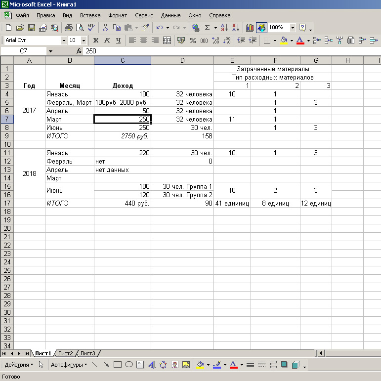

## Вы сможете
- Представить данные в длинном формате с правильным обозначением перменных и пропущенных значений
- Построить простейшие статистические графики с использованием функций из пакета ggplot2
- Настраивать параметры графиков


```{r setup, include = FALSE, cache = FALSE, purl = FALSE}
# output options
options(width = 70, scipen = 6, digits = 3)
library(knitr)
# chunk default options
opts_chunk$set(fig.align='center', tidy = FALSE, fig.width = 7, fig.height = 3, warning = FALSE)
```

```{r libs, echo=FALSE}
library(readxl)
library(ggplot2)
```

# Данные 

## Исходные данные часто приходится приводить в порядок

На подготовку данных к анализу уходит до 80% времени.

Существуют определенные правила предоставления данных.

Данные, построенные в соответствии с этими требованиями, называются **tidy data**, или\ **опрятные данные**.

## Проблемы начинаются уже в электронных таблицах


## Основные ошибки

- Объединенные ячейки
- Отсутствующие заголовки столбцов, вместо них стоят какие-то числа (или ничего не стоит) или слишком длинные имена заголовков
- В одной ячейке находится сразу несколько значений
- Разнородные данные в пределах одного столбца
- Нет стандартного обозначения пропущенных значений
- Разные группы значений кодируются цветовыми выделениями

## Принятые нормы

- Столбцы - переменные (variables)
- Строки - объекты (observations)
- В каждой переменной только один тип данных 
- На месте пропущенных значений стоит специальный знак (в R принят `NA`)

**При работе в Excel не должно быть никаких объединенных ячеек!** 


## Управление данными 

В среде `R` создано несколько удобных пакетов для преобразования данных:

- `reshape2`
- `dplyr`
- `tidyr`

Мы постепенно научимся ими пользоваться

## Два формата представления данных 

- Широкий формат: данные максимально структурированы, каждая строка может нести информацию о многих элементарных объектах

- Длинный формат: данные минимально структурированы, каждая строка характеризует уникальный объект


Из длинного формата легко получить широкий. 

Из широкого формата получить длинный заметно сложнее.

Широкий формат хорош для отчетов, представления обобщенных результатов

Длинный формат хорош для анализа


## Учимся читать внешние данные

```{r}
titanic <- read.table('data/Titanic.csv', 
                      sep = ';', 
                      header = TRUE)
```

## В каком формате представлены данные?

```{r}
head(titanic, 8)

```

## Длинный формат данных


```{r}
library(tidyr)
long_titanic <- uncount(titanic, 
                        weights = Freq)
head(long_titanic, 10)
```


## Данные для визуализации 

Данные взяты из работы   
Tager, I. B., Weiss, S. T., Rosner, B., and Speizer, F. E. (1979). Effect of parental cigarette smoking on pulmonary function in children. American Journal of Epidemiology, 110, 15-26.    

Источник данных: [http://www.statsci.org/data/general/fev.html]
 
Структура данных:   

`Age` --- Возраст    
`FEV` 	 ---  	Объем легких при выдохе (литры) (forced expiratory volume)    
`Height` 	 ---  	Рост (дюймы)   
`Sex` 	 ---  	 пол (Male or Female)    
`Smoker` 	 ---  	некурящие (Non), курящие (Current)    

## Читаем данные

```{r}
library(readxl)
fev <- read_excel("data/fev.xls", 
                  sheet = "tidy_data", 
                  col_names = TRUE, 
                  na = "NA", 
                  skip = 1 )

```


## Анализируем структуру данных

Имена переменных
```{r}
names(fev)

```


## Анализируем структуру данных

Содержание переменных
```{r}
str(fev)

```

## Изменяем формат переменных

Необходимо заменить формат в переменных `fev$Sex` и `fev$Smoker`

```{r}
fev$Sex <- factor(fev$Sex)
fev$Smoker <- factor(fev$Smoker)

```


функция `factor()` превращает числовые или текстовые данные в дискретные факторы

## Пропущенные значения `NA`

Если необходимо убрать объекты, у которых что-то не измерено (NA), то надо произвести "очистку данных". 

НО! не увлекайтесь, иногда можно "вычистить"" важную информацию

В каких строках содержится пропущенная информация?

```{r}
fev[which(!complete.cases(fev)), ] 

```


здесь используется сразу две функции: `which()`, в нее вложена `complete.cases()`    
! - логическая операция "NOT"   
[ , ] - оператор индексации на первом месте строка, на втором - столбец  


## Убираем из датафрейма неполные строки

```{r}
fev <- fev[complete.cases(fev), ]

```

# Визуализация данных

## Три системы визуализации в R

- Base Graphics
- Lattice
- ggplot2

## Система ggplot2

Название пакета происходит от слов "Grammar", "Graphics", "Plot".

В основе подхода, реализованного в пакете, лежит идея **грамматики графиков** "Semiology of Graphics" (Bertin, 1983).

Более позднее обобщение “The Grammar of Graphics” (Wilkinson, Anand and Grossman, 2005).


## Визуализация данных (первый заход)

Задача: построить точечную диаграмму, где по оси OX отложен Age, а по оси OY отложен FEV


```{r}
ggplot(data = fev, aes(x = Age, y = FEV)) + geom_point()

```

## убираем серый фон

```{r}
ggplot(data = fev, aes(x = Age, y = FEV)) + geom_point() + theme_bw()

```


## убираем серый фон

```{r}
ggplot(data = fev, aes(x = Age, y = FEV)) + geom_point() + theme_classic()

```


## убираем серый фон

```{r}
ggplot(data = fev, aes(x = Age, y = FEV)) + geom_point() + theme_minimal()

```

## Устанавливаем понравившуюся тему, как основную.

```{r}
theme_set(theme_bw()) 

```


далее все графики, производимые в данной сессии,  будут использовать именно эту тему


```{r}
ggplot(data = fev, aes(x = Age, y = FEV)) + geom_point()

```


## Изменяем подписи осей

```{r}
ggplot(data = fev, aes(x = Age, y = FEV)) + 
  geom_point() + 
  labs(x = "Возраст", y = "Объем легких")

```

## Создаем верхний заголовок рисунка


```{r}

ggplot(data = fev, aes(x = Age, y = FEV)) + 
  geom_point() + 
  labs(x = "Возраст", y = "Объем легких", 
       title = "Зависимость между \n возрастом и объемом легких")

```


## Делаем заголовок центральным

```{r}
ggplot(data = fev, aes(x = Age, y = FEV)) + 
  geom_point() + 
  labs(x = "Возраст", y = "Объем легких", 
       title = "Зависимость между \n возрастом и объемом легких") + 
  theme(plot.title = element_text(hjust = 0.5))

```


## Меняем размер точек

### Крупнее
```{r}
ggplot(data = fev, aes(x = Age, y = FEV)) + 
  geom_point(size = 3) + 
  labs(x = "Возраст", y = "Объем легких", 
       title = "Зависимость между \n возрастом и объемом легких") + 
  theme(plot.title = element_text(hjust = 0.5))

```


## Меняем размер точек

### Мельче

```{r}
ggplot(data = fev, aes(x = Age, y = FEV)) + 
  geom_point(size = 0.1) + 
  labs(x = "Возраст", y = "Объем легких", 
       title = "Зависимость между \n возрастом и объемом легких") + 
  theme(plot.title = element_text(hjust = 0.5))

```


## Меняем цвет и форму точек

```{r}
ggplot(data = fev, aes(x = Age, y = FEV)) + 
  geom_point(color = "blue") + 
  labs(x = "Возраст", y = "Объем легких", 
       title = "Зависимость между \n возрастом и объемом легких") + 
  theme(plot.title = element_text(hjust = 0.5))

```


## Меняем цвет и форму точек

```{r}
ggplot(data = fev, aes(x = Age, y = FEV)) + 
  geom_point(shape = 22, color = "red", fill = "yellow", size = 2) + 
  labs(x = "Возраст", y = "Объем легких", 
       title = "Зависимость между \n возрастом и объемом легких") + 
  theme(plot.title = element_text(hjust = 0.5))

```


## Сохраняем рисунок в файл 

Создаем рисунок 

```{r}
ggplot(data = fev, aes(x = Age, y = FEV)) + geom_point(shape = 22, color = "red", fill = "yellow", size = 2) + labs(x = "Возраст", y = "Объем легких", title = "Зависимость между \n возрастом и объемом легких") + theme(plot.title = element_text(hjust = 0.5))

```


## Сохраняем рисунок в файл 

Сохраняем текущий рисунок в файл

```{r, eval=FALSE}

ggsave("MyPicture.wmf", plot = last_plot())

```


## Рисунок-переменная

Рисунок можно, и это правильно, поместить в специальную переменную

```{r}
Plot_1 <- ggplot(data = fev, aes(x = Age, y = FEV)) + geom_point(shape = 22, color = "red", fill = "yellow", size = 2)

Plot_1

```


## Далее эту переменную можно модифицировать

```{r}
Plot_1 + labs(x = "Возраст", y = "Объем легких", title = "Зависимость между \n возрастом и объемом легких") + theme(plot.title = element_text(hjust = 0.5))

```


## Далее эту переменную можно модифицировать

```{r, eval=FALSE}
Plot_2 <- Plot_1 + labs(x = "Возраст", y = "Объем легких", title = "Зависимость между \n возрастом и объемом легких") + theme(plot.title = element_text(hjust = 0.5))


ggsave("MyPicture_2.wmf", plot = Plot_2)

```


## Эстетики (Aesthetics)


В философии ggplot эстетики - это та информация (данные), которую можно выразить графиком.

Минимальные эстетики - Положение на OX и положение на OY

Однако наши данные содержат еще и информацию о поле (переменная `fev$Sex`). Если эти данные для нас важны, то мы должны эту информацию выразить на графике

## Отражаем данные о поле с помощью цвета


```{r}
Plot_1 <- ggplot(data = fev, aes(x = Age, y = FEV, color = Sex )) + geom_point(size = 2) + labs(x = "Возраст", y = "Объем легких", title = "Зависимость между \n возрастом и объемом легких") + theme(plot.title = element_text(hjust = 0.5))

Plot_1


```


## Меняеем цвет на тот, который нам нравится


```{r}
Plot_1 <- Plot_1 + scale_color_manual(values = c("pink","blue"))
Plot_1
```


## Меняеем положение легенды 
```{r}
Plot_1  + theme(legend.position =  "bottom")

```


## Меняем положение легенды 
```{r}
Plot_1  + theme(legend.position =  "left")

```


## Меняем положение легенды 
```{r}
Plot_1  + theme(legend.position =  c(0.1, 0.9)) 

```

`c(0.1, 0.9)` координаты указываются в долях от сторон рисунка 


## Отражаем данные о поле с помощью формы точек

```{r}
Plot_1 <- ggplot(data = fev, aes(x = Age, y = FEV, shape = Sex, color = Sex )) +
  geom_point(size = 2) + 
  labs(x = "Возраст", y = "Объем легких", title = "Зависимость между \n возрастом и объемом легких") + 
  theme(plot.title = element_text(hjust = 0.5))

Plot_1

```


## В нашем датафрейме есть еще и данные о курении
Если мы хотим выразить графиком одновременно данные по полу и по курению, то мы должны задать две разные эстетики

```{r}
Plot_1 <- ggplot(data = fev, aes(x = Age, y = FEV, shape = Sex, color = Smoker )) + geom_point(size = 2) + labs(x = "Возраст", y = "Объем легких", title = "Зависимость между \n возрастом и объемом легких") + theme(plot.title = element_text(hjust = 0.5))

Plot_1 

```


в этом трудно разобраться


## Используем фасетирование 

```{r}
Plot_1 + facet_wrap( ~ Smoker) #уже лучше

```


## Используем фасетирование 

```{r}
Plot_1 + facet_grid(Sex ~ Smoker)

```


## Геомы (Geom)

Геомы - это геометрические объекты, которые отражают данные (точки, линии, столбцы, "усы" и т. д.)


Задание: построить гистограмму, отражающую частотное распределение объема легких

Для решений этой задачи не годится применение точечных диаграмм

Нам нужен другой геом

## geom_histogram()
```{r}
ggplot(fev, aes(x = FEV)) + geom_histogram()

```


## Меням ширину класса 

Делаем более широкие классовые интервалы

```{r}
ggplot(fev, aes(x = FEV)) + geom_histogram(binwidth = 1)

```


## Меням ширину класса 

Делаем более узкие классовые интервалы

```{r}
ggplot(fev, aes(x = FEV)) + geom_histogram(binwidth = 0.1)

```


## Семейство Функций `stat` 

Поскольку в основе построения гистограммы лежит статистическая процедура (определение частот), то все тоже самое можно сделать с помощью функций stat_...

```{r, message=FALSE}
ggplot(fev, aes(x = FEV)) + stat_bin(geom = "bar") #Аналогично!

```


## Меняем ширину класса


```{r}
ggplot(fev, aes(x = FEV)) + stat_bin(geom = "bar", binwidth = 0.1)

```

Аналогично применению `geom_histogram(binwidth = 0.1)`

## Используем другой геом

### Частотное распределение можно выразить еще и линией

```{r}
ggplot(fev, aes(x = FEV)) + stat_bin(geom = "line", size = 1, color = "red")

```


## Используем другой геом

### А можно еще и закрашенной областью 

```{r}
ggplot(fev, aes(x = FEV)) + stat_bin(geom = "area", size = 1, color = "red")

```

## Можно еще многими способами.... 

Например, так 
```{r}
ggplot(fev, aes(x = FEV)) + stat_density(geom = "area", size = 1, color = "red", fill = "blue")

```


## Применяем фасетирование
### Но у нас есть еще и данные по полу
### Мы можем отразить частотное распределение с помощью фасетирования 

```{r}
ggplot(fev, aes(x = FEV)) + geom_histogram() + facet_wrap( ~ Sex)

```

## Так удобнее сравнивать
```{r}
ggplot(fev, aes(x = FEV)) + geom_histogram() + facet_wrap( ~ Sex, ncol = 1) 

```


## Отражаем частотное распределение с использованием данных по полу и курению
```{r}
ggplot(fev, aes(x = FEV, fill = Smoker)) + geom_histogram() + facet_wrap( ~ Sex, ncol = 1) 
```


Трудно читать

## Лучше так
```{r}
ggplot(fev, aes(x = FEV, fill = Smoker)) + stat_density(geom = "area", size = 1, color = "red") + facet_wrap( ~ Sex, ncol = 1)

```


# Визуализация данных с использованием простейшей статистической обработки

## Задание: отразить срдний объем легких у разных возрастов
```{r}
ggplot(fev, aes(x = Age, y = FEV)) + 
  stat_summary(fun.y = "mean", geom = "line", size = 2)

```


## Добавляем данные по полу

```{r}
ggplot(fev, aes(x = Age, y = FEV, color = Sex)) + 
  stat_summary(fun.y = "mean", geom = "line", size = 2)

```


## Добавляем данные по курению
```{r}
ggplot(fev, aes(x = Age, y = FEV, color = Sex)) + 
  stat_summary(fun.y = "mean", geom = "line", size = 2) + 
  facet_wrap( ~ Smoker)

```

## Задание: 
### Постройте столбчатые диаграммы, отражающие средний рост у представителей разного пола

## Решение

```{r}
ggplot(fev, aes(x = Sex, y = Height, fill = Sex)) + 
  stat_summary(fun.y = "mean", geom = "bar") 

```


## С помощью функций ggplot можно сразу вписать простые линейные модели и увидеть характер связей

```{r}
ggplot(fev, aes(x = Age, y = FEV, color = Smoker)) + 
  geom_point() + 
  geom_smooth(method = "lm") +  
  facet_wrap( ~ Sex)

```


## Take home messages

>- Для анализа лучше подходит длинный формат
>- Данные должны быть оформлены в соответствии с определнными правилами
>- Пакет ggplot2 позволяет построить практически любой график

## Что почитать
[Cookbook for R](http://www.cookbook-r.com/Graphs/)

