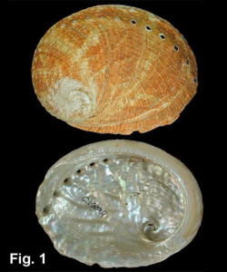
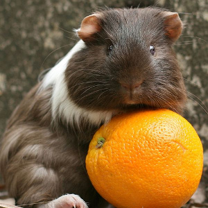

```{r setup, include = FALSE, cache = FALSE}
#-- RUN THE FRAGMENT BETWEEN LINES BEFORE COMPILING MARKDOWN
# to configure markdown parsing
options(markdown.extensions = c("no_intra_emphasis", "tables", "fenced_code", "autolink", "strikethrough", "lax_spacing", "space_headers", "latex_math"))
#------
# output options
options(width = 70, scipen = 6, digits = 3)

# to render cyrillics in plots use cairo pdf
options(device = function(file, width = 7, height = 7, ...) {
  cairo_pdf(tempfile(), width = width, height = height, ...)
  })
library(knitr)
# chunk default options
opts_chunk$set(fig.align='center', tidy = FALSE, fig.width = 7, fig.height = 3.5)
```

```{r libs, echo=FALSE}
library(ggplot2)
library(grid)
library(gridExtra) # to rescale legend
```

## Экономим силы с помощью анализа мощности

  - Статистические ошибки при проверке гипотез
  - Мощность статистического теста
  - *A priori* анализ мощности, оценка величины эффекта
  - *Post hoc* анализ мощности
  - Как влиять на мощность тестов

## Вы сможете

  - дать определение ошибок I и II рода, и графически изобразить их отношение к мощности теста
  - оценивать величину эффекта и необходимый объем выборки по данным пилотного исследования
  - загружать данные из .xls в R
  - строить гистограммы и боксплоты с помощью `ggplot2`
  - сравнивать средние значения при помощи t-критерия, интерпретировать и описывать результаты
  - расчитывать фактическую мощность теста

# Статистические ошибки при проверке гипотез


## Типы ошибок при проверке гипотез

| 	|H0 == TRUE |	H0 == FALSE |
|-----|-----|-----|
| Отклонить H0 	| Ошибка I рода </br>Ложно-положительный результат | 	Верно </br>Положительный результат |
| Сохранить H0 	| Верно </br>Отрицательный результат | Ошибка II рода </br> Ложно-отрицательный результат |

```{r power_data, echo = FALSE, cache=TRUE}
# Power plot using ggplot2
# reworked after
# http://rpsychologist.com/creating-a-typical-textbook-illustration-of-statistical-power-using-either-ggplot-or-base-graphics/

# theme_bw with only x axis
theme_bw_x <- function (base_size = 12, base_family = "")
{
  require(ggplot2)
  theme_bw(base_size = base_size, base_family = base_family) %+replace%
    theme(panel.border = element_blank(),
          axis.line = element_line(colour = "black"),
          panel.grid.major = element_blank(),
          panel.grid.minor = element_blank(),
          axis.line.y = element_blank(),
          axis.text.y = element_blank(),
          axis.ticks.y = element_blank(),
          axis.title.y = element_blank(),
          legend.key = element_blank(),
          legend.key.size = unit(3, "lines"),
          legend.text = element_text(size = 24, hjust = 0.5))
}

# theme_bw without axes and with larger legend
theme_bw_noxy <- function (base_size = 12, base_family = "")
{
  require(ggplot2)
  theme_bw(base_size = base_size, base_family = base_family) %+replace%
    theme(panel.border = element_blank(), axis.line = element_line(colour = "black"),
          panel.grid.major = element_blank(), panel.grid.minor = element_blank(),
          axis.line = element_blank(), axis.text = element_blank(),
          axis.ticks = element_blank(), axis.title = element_blank(),
          legend.key = element_blank(),
          legend.key.size = unit(3, "lines"),
          legend.text = element_text(size = 24, hjust = 0.5))
}

generate_power_data <- function(m1 = 0, sd1 = 7, m2 = 3.5, sd2 = 7, alpha = 0.05, h.type = "equal"){
  # set length of tails
  min1 <- m1-sd1*4
  max1 <- m1+sd1*4
  min2 <- m2-sd2*4
  max2 <- m2+sd2*4
  # create a sequence for x axis including z.crit
  x <- seq(min(min1,min2), max(max1, max2), .01)
  # compute critical value

  switch(h.type,
         greater={
           z.crit <- qnorm(1-alpha, m1, sd1)
           z.critm <- m1 - abs(m1 - z.crit)
         },
         less={
           z.crit <- qnorm(1-alpha, m1, sd1)
           z.critm <- m1 - abs(m1 - z.crit)
         },
         equal={
           z.crit <- qnorm(1-(alpha/2), m1, sd1)
           z.critm <- m1 - abs(m1 - z.crit)
         }
  )
  x[length(x)+1] <- z.crit
  x[length(x)+1] <- z.critm
  x <- sort(x)

  # generate normal distributions
  y1 <- dnorm(x, m1, sd1)
  y2 <- dnorm(x, m2, sd2)
  # combine to data frame
  df1 <- data.frame(x = x, y = y1)
  df2 <- data.frame(x = x, y = y2)
  # compute intervals for polygons
  outside.l <- x <= z.critm
  inside <- (x >= z.critm) & (x <= z.crit)
  outside.r <- x >= z.crit

  switch(h.type,
         greater={
           # Alpha polygon
           if(m1 < m2){
             alph <- data.frame(x = x[outside.r], y = pmin(y1[outside.r], y2[outside.r]))
           } else {
             alph <- data.frame(x = x[outside.r], y = pmax(y1[outside.r], y2[outside.r]))
           }
           alph$y[alph$x == z.crit] <- 0
           # Beta polygon one-tailed
           bet <- data.frame(x = x[outside.l | inside], y = y2[outside.l | inside])
           bet$y[bet$x == z.crit] <- 0
           bet$y[bet$x == z.critm] <- 0
           # power polygon; 1-beta, one-tailed
           pwrd <- data.frame(x = x[outside.r], y = y2[outside.r])
           pwrd$y[pwrd$x == z.crit] <- 0
           alph$id <- 3
           bet$id <- 2
           pwrd$id <- 1
           alph$obj <- 3
           bet$obj <- 2
           pwrd$obj <- 1
           # combine data frames
           poly <- rbind(alph, bet, pwrd)
           poly$id <- factor(poly$id,  labels = c("power","beta","alpha"))
         },
         less={
           # Alpha polygon
           if(m1 < m2){
             alph <- data.frame(x = x[outside.l], y = pmax(y1[outside.l], y2[outside.l]))
           } else{
             alph <- data.frame(x = x[outside.l], y = pmin(y1[outside.l], y2[outside.l]))
           }
           alph$y[alph$x == z.critm] <- 0
           # Beta polygon one-tailed
           bet <- data.frame(x = x[outside.r | inside], y = y2[outside.r | inside])
           bet$y[bet$x == z.crit] <- 0
           bet$y[bet$x == z.critm] <- 0
           # power polygon; 1-beta, one-tailed
           pwrd <- data.frame(x = x[outside.l], y = y2[outside.l])
           pwrd$y[pwrd$x == z.critm] <- 0
           alph$id <- 3
           bet$id <- 2
           pwrd$id <- 1
           alph$obj <- 3
           bet$obj <- 2
           pwrd$obj <- 1
           # combine data frames
           poly <- rbind(alph, bet, pwrd)
           poly$id <- factor(poly$id,  labels = c("power","beta","alpha"))
         },
         equal={
           # alph polygon
           if(m1 < m2){
             alph.r <- data.frame(x = x[outside.r], y = pmin(y1[outside.r], y2[outside.r]))
             alph.l <- data.frame(x = x[outside.l], y = pmax(y1[outside.l], y2[outside.l]))
           } else {
             alph.r <- data.frame(x = x[outside.r], y = pmax(y1[outside.r], y2[outside.r]))
             alph.l <- data.frame(x = x[outside.l], y = pmin(y1[outside.l], y2[outside.l]))
           }
           alph.r$y[alph.r$x == z.crit] <- 0
           alph.l$y[alph.l$x == z.critm] <- 0
           # beta polygon, two-tailed
           bet <- data.frame(x = x[inside], y = y2[inside])
           bet$y[bet$x == z.crit] <- 0
           bet$y[bet$x == z.critm] <- 0
           # two power polygons, two-tailed
           pwrd.l <- data.frame(x = x[outside.l], y = y2[outside.l])
           pwrd.l$y[pwrd.l$x == z.critm] <- 0
           pwrd.r <-data.frame(x = x[outside.r], y = y2[outside.r])
           pwrd.r$y[pwrd.r$x == z.crit] <- 0
           alph.l$id <- 3
           alph.l$obj <- 5
           alph.r$id <- 3
           alph.r$obj <- 4
           bet$id <- 2
           bet$obj <-3
           pwrd.l$id <- 1
           pwrd.l$obj <- 2
           pwrd.r$id <- 1
           pwrd.r$obj <- 1
           # combine data frames
           poly <- rbind(alph.l, alph.r, bet, pwrd.l, pwrd.r)
           poly$id <- factor(poly$id,  labels = c("power","beta","alpha"))
           poly$obj <- factor(poly$obj,  labels = c("powerr","powerl", "beta", "alphar", "alphal"))
         }
  )
  return(list(df1 = df1, df2 = df2, poly = poly, m1 = m1, m2 = m2, h.type = h.type, z.crit = z.crit, z.critm = z.critm))
}

pwr_plot <- function(pwrd, alph = TRUE, bet = TRUE, power = TRUE, ann = TRUE){
  require(ggplot2)
  # initialise filter for the data
  filter <- vector(length = length(pwrd$poly$id))
  # possible values for the scale
  category <- vector()
  lbls <- vector()
  if(alph){
    filter <- pwrd$poly$id == "alpha"
    category <- c(category, "alpha")
    lbls <- c(lbls, bquote(alpha))
  }
  if(bet){
    filter <- filter | pwrd$poly$id == "beta"
    category <- c(category, "beta")
    lbls <- c(lbls, bquote(beta))
  }
  if(power){
    filter <- filter | pwrd$poly$id == "power"
    category <- c(category, "power")
    lbls <- c(lbls, bquote(1 - beta))
  }
  # define colours by type of polygon
  cols <- c("alpha" = "red", "beta" = "blue", "power" = "green")
  if(any(alph, bet, power)){
  p <- ggplot() +
    geom_line(data = pwrd$df1, aes(x, y, linetype = "H0", group = NULL, fill = NULL)) +
    geom_line(data = pwrd$df2, aes(x, y, linetype = "Ha", group = NULL, fill = NULL)) +
    geom_polygon(data = pwrd$poly[filter, ], aes(x, y, fill = id, group = obj), alpha = 0.3) +
    scale_linetype_discrete(name = "Гипотезы") +
    scale_fill_manual(values = cols, limits = category, name = "Вероятности", labels = lbls)
  } else {
    p <- ggplot() +
      geom_line(data = pwrd$df1, aes(x, y, linetype = "H0", group = NULL, fill = NULL)) +
      geom_line(data = pwrd$df2, aes(x, y, linetype = "Ha", group = NULL, fill = NULL)) +
      scale_linetype_discrete(name = "Гипотезы")
  }
  return(p)
}

dat <- generate_power_data(m1 = 0, m2 = 5, sd1 = 10, sd2 = 10, h.type = "equal")
```

### Вероятности гипотез

```{r power_curves, echo = FALSE, fig.height=3}
pwr_plot(pwrd = dat, alph = F, bet = F, power = F) +
  guides(linetype = guide_legend(title = NULL)) +
  theme_bw_noxy(base_size = 18)
```

## Типы ошибок при проверке гипотез

| 	|H0 == TRUE |	H0 == FALSE |
|-----|-----|-----|
| Отклонить H0 	| Ошибка I рода </br>Ложно-положительный результат | 	Верно </br>Положительный результат |
| Сохранить H0 	| Верно </br>Отрицательный результат | Ошибка II рода </br> Ложно-отрицательный результат |

### Ошибки I рода

```{r power_alpha, echo = FALSE, fig.height=3}
pwr_plot(pwrd = dat, alph = T, bet = F, power = F) +
  guides(fill = guide_legend(title = NULL), linetype = guide_legend(title = NULL)) +
  theme_bw_noxy(base_size = 18)
```

## Типы ошибок при проверке гипотез

| 	|H0 == TRUE |	H0 == FALSE |
|-----|-----|-----|
| Отклонить H0 	| Ошибка I рода </br>Ложно-положительный результат | 	Верно </br>Положительный результат |
| Сохранить H0 	| Верно </br>Отрицательный результат | Ошибка II рода </br> Ложно-отрицательный результат |

### Ошибки II рода

```{r power_beta, echo = FALSE, fig.height=3}
pwr_plot(pwrd = dat, alph = T, bet = T, power = F) +
  guides(fill = guide_legend(title = NULL), linetype = guide_legend(title = NULL)) +
  theme_bw_noxy(base_size = 18)
```

## Типы ошибок при проверке гипотез

| 	|H0 == TRUE |	H0 == FALSE |
|-----|-----|-----|
| Отклонить H0 	| Ошибка I рода </br>Ложно-положительный результат | 	Верно </br>Положительный результат |
| Сохранить H0 	| Верно </br>Отрицательный результат | Ошибка II рода </br> Ложно-отрицательный результат |

### Мощность теста - способность выявлять различия $Power = 1 - \beta$

```{r echo = FALSE, fig.height=3, fig.width=10.1}
pwr_plot(pwrd = dat, alph = T, bet = T, power = T) +
  guides(fill = guide_legend(title = NULL), linetype = guide_legend(title = NULL)) +
  theme_bw_noxy(base_size = 18)
```

## Анализ мощности

<div class="columns-2">

<center>*A priori*</center>

- какой нужен объем выборки, чтобы найти различия с разумной долей уверенности?
- различия какой величины мы можем найти, если известен объем выборки?

<center>*Post hoc*</center>

- смогли бы мы найти различия при помощи нашего эксперимента ($\alpha$, $n$), если бы величина эффекта была $X$?

</br>

</div>

# A priory анализ мощности

## Пример: Заповедник спасает халиотисов*

<div class="floatright" style="float:right; margin: 0 0 10px 10px; padding: 10px; ">

<p style="margin-top: 0; margin-bottom: 0; text-align: center;"><em>Haliotis rubra</em></p>
</div>

Лов халиотисов (коммерческий и любительский) запретили, организовав заповедник.

Стало ли больше моллюсков через несколько лет? (Keough, King, 1991)

<div class = "footnote">* - Данные из Quinn, Keough, 2002, Box 9-5, Fig 9-7; фото: Des Beechey - Seashells of New South Wales; bie.ala.org.au</div>

## A priori анализ мощности

<div class="columns-2">

Что нужно

- тест

- уровень значимости

- желаемая мощность теста

- ожидаемая величина эффекта

</br>
</br>
- $t$-критерий

- $alpha = 0.05$

- P = 80%

- ?

</div>

## Величина эффекта

<div class="floatright" style="float:right; margin: 0 0 10px 10px; padding: 10px; ">

<p style="margin-top: 0; margin-bottom: 0; text-align: center;">Яков Коэн</p>
</div>


$d$ Коэна (Cohen's d)

<br />
$$d = \frac{\bar \mu_1 - \bar \mu_2}{\sigma}$$

## Как оценить стандартное отклонение для расчета величины эффекта?

$$d = \frac{\bar \mu_1 - \bar \mu_2}{\sigma}$$

- как среднеквадратичное стандартное отклонение ($d$ Коэна)

$d = \frac {|\bar x_1 - \bar x_2|} { \sqrt {\frac {s_1^2 + s_2^2 } {2} }}$

- как обобщенное стандартное отклонение ($g$ Хеджа)

$g = \frac {|\bar x _{1} - \bar x _{2}|} { \sqrt {\frac {(n_{1} - 1) s_1^2 + (n_{2} - 1) s_{2}^2 }  {n_{1} + n_{2} - 2} } }$

## Как оценить ожидаемую величину эффекта?

$$d = \frac{\bar \mu_1 - \bar \mu_2}{\sigma}$$

> - Варианты:
    - Пилотные исследования
    - Литература
    - Общебиологические знания
    - Технические требования

## Величина эффекта из общих соображений

(Cohen, 1982)

сильные, умеренные и слабые эффекты
```{r }
library(pwr)
cohen.ES(test = "t", size = "large")
```

## Рассчитайте

величину умеренных и слабых эффектов для t-критерия

```{r eval = FALSE}
    library()
    cohen.ES()
```

Подсказка: обозначения можно посмотреть в файлах справки

```{r eval = FALSE}
    help(cohen.ES)
    ?cohen.ES
    cohen.ES # курсор на слове, нажать F1
```

## Величина эффекта из пилотных данных

$$d = \frac{\bar \mu_1 - \bar \mu_2}{\sigma}$$

${\sigma}$ - cтандартное отклонение плотности халиотисов:

> - Плотность крупных халиотисов на $50 м^2$ была $\bar x = 47.5$, $SD = 27.7$

${\bar \mu_1 - \bar \mu_2}$ - cредний вылов халиотисов в год:

> - Масса выловленных коммерческим способом + данные о размерах -> численность -> плотность
    - Предположили, что коммерческий лов и любительский лов равны
    - Коммерческий лов  = 11.6 экз. $м^{-2}$
    - Коммерческий + любительский лов = 23.2 экз. $м^{-2}$

## Данные для анализа мощности собраны

```{r}
alpha <- 0.05
power <- 0.80
sigma <- 27.7 # варьирование плотности халиотисов
diff <- 23.2 # ожидаемые различия плотности халиотисов
effect <- diff/sigma # величина эффекта
effect
```

## Функции для анализа мощности t-критерия

- при одинаковых объемах групп `pwr.t.test()`
- при разных объемах групп `pwr.t2n.test()`

## Считаем объем выборки


```{r}
pwr.t.test(n = NULL, d = effect, power = power, sig.level = alpha,
           type = "two.sample", alternative = "two.sided")
```

> - Чтобы с вероятностью 0.8 выявить различия плотности халиотисов в местах, где лов разрешен и запрещен, нужно обследовать __по 24 места каждого типа__, если мы верно оценили величину эффекта.

## Рассчитайте

сколько нужно обследовать мест, чтобы обнаружить слабый эффект
с вероятностью 0.8, при уровне значимости 0.01

```{r eval = FALSE}
    cohen.ES()
    pwr.t.test()
```

## Решение


```{r}
cohen.ES(test = "t", size = "small")
pwr.t.test(n = NULL, d = 0.2, power = 0.8, sig.level = 0.01,
           type = "two.sample", alternative = "two.sided")
```

## Пример: Поддержание равновесия

<div class="floatright" style="float:right; margin: 0 0 10px 10px; padding: 10px; ">

<p style="margin-top: 0; margin-bottom: 0; text-align: center;">grey bird</p>
</div>

В каком возрасте сложнее поддерживать равновесие, если вы сосредоточены на чем-то другом?

9 пожилых людей (6 мужчин и 3 женщины) и 8 молодых мужчин просили стоять на измерительной платформе. В ответ на неожиданный звук испытуемые должны были как можно быстрее нажать на кнопку. Платформа измеряла в мм насколько человек отклонялся вбок или вперед-назад.

<div class = "footnote">* http://lib.stat.cmu.edu/DASL/Stories/MaintainingBalance.html; фото: grey bird by Angela Vincent on Flickr</div>

## Читаем данные из файла

Не забудте войти в вашу директорию для матметодов, например, так

```{r balance, message = FALSE}
# setwd("C:/Мои\ документы/mathmethR/) # в Windows
# setwd(/home/yourusername/mathmethR/) # в Linux
library(readxl)
bal <- read_excel(path = "data/balance.xlsx", sheet = 1)
```

```{r}
str(bal) # Структура данных
```

## Вспомним, как обращаться с датафреймами

```{r}
head(bal)     # Первые несколько строк файла
bal$side_side[1:3] # Первые три значения переменной side_side
bal[12:14, c(1, 2, 4)] # 12-14 строки, 1, 2 и 4 столбцы
```

## Сделаем age_group фактором

```{r tidy=TRUE}
bal$age_group <- factor(bal$age_group, levels = c("young", "elderly"), labels = c("молодые", "пожилые"))
```

Посмотреть, что получилось, можно так
```{r}
levels(bal$age_group)
```

## Бокс-плот

Геом `geom_boxplot`

```{r echo=FALSE}
theme_set(theme_grey(base_size = 16))
```

```{r message = FALSE}
library(ggplot2)
ggplot(data = bal, aes(x = age_group, y = forward_backward)) + 
  geom_boxplot()
```

> - Установите до конца сеанса другую тему

## Решение

```{r message = FALSE, eval = FALSE, tidy=TRUE}
theme_set(theme_bw())
ggplot(data = bal, aes(x = age_group, y = forward_backward)) + geom_boxplot()
```

```{r echo = FALSE, message=FALSE}
theme_set(theme_bw(base_size = 16))
ggplot(data = bal, aes(x = age_group, y = forward_backward)) + geom_boxplot()
```

## Раскрашиваем график

эстетика `fill` - заливка
эстетика `colour` - контуры

```{r eval=FALSE, tidy=TRUE}
ggplot(data = bal, aes(x = age_group, y = forward_backward, fill = age_group)) + geom_boxplot()

ggplot(data = bal, aes(x = age_group, y = forward_backward, colour = age_group)) + geom_boxplot()
```

```{r echo=FALSE, fig.width=10}
gg_fill <- ggplot(data = bal, aes(x = age_group, y = forward_backward, fill = age_group)) + geom_boxplot()

gg_col <- ggplot(data = bal, aes(x = age_group, y = forward_backward, colour = age_group)) + geom_boxplot()

library(gridExtra)
grid.arrange(gg_fill, gg_col, ncol = 2)
```

## Задание

Добавьте
- подписи осей
- название графика
- название легенды

Сохраните график в переменной

## Решение

```{r tidy=TRUE}
gg_balance <- ggplot(data = bal, aes(x = age_group, y = forward_backward)) +
geom_boxplot(aes(fill = age_group)) +
labs(title = "Баланс тела", x = "Возрастная группа", y = "Движение \nвперед-назад (мм)", fill = "Возрастная \nгруппа")
gg_balance
```

# A priory анализ мощности по данным пилотного исследования

## Представим, что перед нами данные пилотного исследования

Мы хотим сравнить возрастные группы

Нам нужно рассчитать величину эффекта по исходным данным. Для этого понадобится пакет `effsize`

## Величина эффекта по исходным данным

```{r}
library(effsize)
effect <- cohen.d(bal$forward_backward, bal$age_group)
effect
```

>- как добыть значение величины эффекта?

## Как добыть значение величины эффекта?

### 1. Как называется в структуре объекта элемент, где записана величина эффекта?

```{r}
str(effect)
```

## Как добыть значение величины эффекта?

### 2. Обращаемся к этому элементу по имени через `$`

```{r}
effect$estimate
```

### 3. Вычислим модуль, поскольку для pwr.t.test() эффект должен быть положительным

```{r}
effect <- abs(effect$estimate)
```

## Рассчитайте

объем выборки, чтобы показать различия между группами с вероятностью 0.8?

Вам понадобится функция `pwr.t.test`

## Решение

```{r}
library(pwr)
pwr.t.test(n = NULL, d = effect, power = 0.8, sig.level = 0.05, 
           type = "two.sample", alternative = "two.sided")
```

> - Нужна выборка __15 человек в каждой группе__, чтобы с вероятностью 0.8 обнаружить различия амплитуды качания вперед-назад.

# Post hoc анализ мощности

## Пример: Влияние витамина C на рост зубов у морских свинок

<div class="floatright" style="float:right; margin: 0 0 10px 10px; padding: 10px; ">

<p style="margin-top: 0; margin-bottom: 0; text-align: center;"></p>
</div>


20 морским свинкам давали витамин С в виде апельсинового сока или аскорбиновой кислоты и измеряли рост зубов.

<div class = "footnote">* фрагмент данных из McNeil, D. R. (1977) Interactive Data Analysis. New York: Wiley; фото: www.ag.ndsu.edu</div>

## Открываем данные

```{r}
teeth <- read_excel("data/teeth.xlsx", sheet = 1)
str(teeth)
```

## Задание

Проверьте при помощи t-критерия будет ли различаться размер зубов при разных способах употребления

## Решение

```{r}
t.test(len ~ supp, data = teeth)
```

> - Достоверных различий размеров зубов не обнаружено (t-критерий, p > 0.05)

## Post hoc анализ - когда различий не нашли

Какова была реальная величина эффекта?

Хватило ли нам мощности, чтобы выявлять такие незначительные различия?

### Для post hoc анализа нужно знать

- тест ($H _0$ отвергнута!) — t-критерий
- уровень значимости — α = 0.01
- фактический объем выборки — 10
- фактическая величина эффекта — ?
- реальная мощность теста - ?

## Сделаем post hoc анализ мощности

```{r}
effect_real <- cohen.d(teeth$len, teeth$supp)
effect_real <- abs(effect_real$estimate)
pwr.t.test(n = 10, d = effect_real,
           power = NULL, sig.level = 0.01,
           type = "two.sample",
           alternative = "two.sided")
```

> - Для выявления слабых эффектов (d = 0.02) мощность оказалась недостаточной (P = 0.01)

# Как влиять на мощность теста?

## Мощность зависит


- от объема выборки
- от величины эффекта
- от уровня значимости

## Чем больше объем выборки—тем больше мощность


```{r pwr_vs_n, echo = FALSE, cache = TRUE, warning = FALSE, message = FALSE, fig.width = 10, fig.height = 5}
# Plots of power vs. sample size etc.
# Modified after http://imdevsoftware.wordpress.com/2013/01/17/255/

# Need pwr, reshape2, ggplot2 packages
gen_pwr_vs_n <- function(d = c(0.2, 0.5, 0.8), a = c(0.05, 0.01), n = 150){
  if(!require(pwr)){install.packages("pwr");library("pwr")}
  # t-TEST
  #---------------------------------
  n <- 1:n
  t.test.power.effect<-
    as.data.frame(do.call("cbind", lapply(1:length(d),function(i){
    sapply(1:length(a),function(k){
      sapply(1:length(n), function(j){
        #       paste(d[i], n[j], a[k])
        power.t.test(n = n[j],d = d[i],sig.level = a[k],power = NULL,
                     type = "two.sample")$power
      })
    })
  })))
  t.test.power.effect[is.na(t.test.power.effect)]<-0 # some powers couldn't be calculated, set these to zero
  # melt the data
  if(!require(reshape2)){install.packages("reshape2");library("reshape2")}
  measured <- length(d)*length(a)
  t.test.power.effect <- melt(t.test.power.effect, measure.vars = 1:measured)
  # fill the levels of n, a, and d
  nms <- expand.grid(size = n, sig.level = a, effect = d)
  t.test.power.effect <- cbind(t.test.power.effect, nms)
  # do-not need variable column
  t.test.power.effect <- t.test.power.effect[, -1]
  return(t.test.power.effect)
}

dat <-gen_pwr_vs_n(n = 150)
# factors
dat$sig.level <- factor(dat$sig.level, levels = c(0.01, 0.05),
                        labels = c("p = 0.01", "p = 0.05"))
dat$effect <- factor(dat$effect, levels = c(0.2, 0.3, 0.5, 0.8),
                     labels = c("d = 0.2", "d = 0.3", "d = 0.5", "d = 0.8"))

# Power increases as the sample size increases
# plot power vs n at d = 0.5, p = 0.01
pwr.size <-
  ggplot(data = dat[(dat$effect == "d = 0.5" & dat$sig.level == "p = 0.05"), ],
         aes(x = size, y = value, color = sig.level)) +
  geom_line(size = 1.5) +
  scale_colour_discrete(name = "Уровень\nзначимости") +
  labs(x = "Объем выборки", y = "Мощность") +
  ggtitle("t-тест, d = 0.5") +
  theme_minimal(base_size = 18) +
  theme(legend.key = element_blank(),
        axis.line = element_line(colour = "black"))
pwr.size
```

## Чем больше уровень значимости—тем больше мощность

```{r cache = TRUE, dependson='pwr_vs_n', echo = FALSE, warning = FALSE, fig.width = 10, fig.height = 5}
# Power increases as the signifficance level increases
#   plot power vs n at d = 0.5, add linetype = sig.level (p = 0.01, p = 0.05)
pwr_size_apha <- ggplot(data = dat[dat$effect == "d = 0.5", ],
                        aes(x = size, y = value, color = sig.level)) +
  geom_line(size = 1.5) +
  scale_colour_discrete(name = "Уровень\nзначимости",
                        limits = c("p = 0.05", "p = 0.01")) +
  labs(x = "Объем выборки", y = "Мощность") +
  ggtitle("t-тест, d = 0.5") +
  theme_minimal(base_size = 18) +
  theme(legend.key = element_blank(),
        axis.line = element_line(colour = "black"))
pwr_size_apha
```

## Чем больше величина различий—тем больше мощность

```{r cache = TRUE, dependson='pwr_vs_n', echo = FALSE, warning = FALSE, fig.width = 10, fig.height = 5}
# Power increases as effect size increases
#   plot power vs n at
# add linetype = sig.level (p = 0.01, p = 0.05)
# add facets for d = 0.2, d = 0.5, d = 0.8
pwr_size_alpha_d <- ggplot(data = dat, aes(x = size, y = value, color = sig.level)) +
    geom_line(size = 1.5) + facet_wrap(~effect) +
  scale_colour_discrete(name = "Уровень\nзначимости",
                        limits = c("p = 0.05", "p = 0.01")) +
  labs(x = "Объем выборки", y = "Мощность") +
  ggtitle("t-тест") +
  theme_minimal(base_size = 18) +
  theme(legend.key = element_blank(),
        axis.line = element_line(colour = "black"))
pwr_size_alpha_d
```

## Скажите

Какие из факторов, влияющих на мощность теста, мы __не можем__ контролировать?

> - Мы не можем контролировать внешние факторы
    - величину эффекта ($ES$)
    - фоновую изменчивость ($\sigma^2$)

Каким образом можно повлиять на мощность теста?

> - Мощность теста можно регулировать, если
    - изменить число повторностей
    - выбрать другой уровень значимости ($\alpha$)
    - определиться, какие эффекты действительно важны ($ES$)

## Take home messages

>- Контролируем статистические ошибки:
    - чтобы не находить несуществующих эффектов, фиксируем уровень значимости
    - чтобы не пропустить значимое, рассчитываем величину эффекта, объем выборки и мощность теста
    - когда не обнаружили достоверных эффектов, оцениваем величину эффекта и мощность теста

>- Способность выявлять различия зависит
    - от объема выборки,
    - от уровня значимости
    - от величины эффекта

## Дополнительные ресурсы

- Quinn, Keough, 2002, pp. 164-170
- Open Intro to Statistics: [4.6 Sample Size and Power](http://www.openintro.org/stat/down/oiStat2_04.pdf), pp. 193-197
- Sokal, Rohlf, 1995, pp. 167-169.
- Zar, 1999, p. 83.
- [R Data Analysis Examples - Power Analysis for Two-group Independent sample t-test. UCLA: Statistical Consulting Group.](http://www.ats.ucla.edu/stat/r/dae/t_test_power2.htm)
- [R Data Analysis Examples - Power Analysis for One-sample t-test.  UCLA: Statistical Consulting Group.](http://www.ats.ucla.edu/stat/r/dae/t_test_power.htm)
- [FAQ - How is effect size used in power analysis?  UCLA: Statistical Consulting Group.](http://www.ats.ucla.edu/stat/mult_pkg/faq/general/effect_size_power/effect_size_power.htm)

