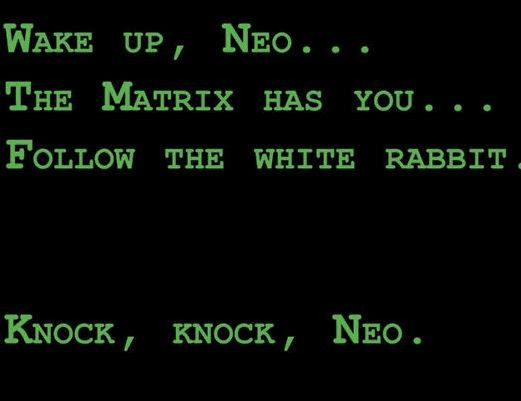

## Вы сможете
- Объяснить что такое матрицы и какие бывают их основные разновидности
- Выполнить базовые операции с матрицами с использованием функций R
- Применить в среде R методы матричной алгебры для решения простейших задач


```{r setup, include = FALSE, cache = FALSE, purl = FALSE}
# output options
options(width = 70, scipen = 6, digits = 3)
library(knitr)
# chunk default options
opts_chunk$set(fig.align='center', tidy = FALSE, fig.width = 7, fig.height = 3, warning = FALSE)
```

## Решите задачу 
В популяции некоторого организма в момент времени $t_1$ представлено четыре возрастные группы:

| Возрастная группа| Количество особей |
|:-----------------:|:-----------------:|
|         0+        |        100        |
|         1+        |         10        |
|         2+        |         5         |
|         3+        |         1         |

---

Какова будет численность возрастных групп в момент времени $t_2$ если известно, что

1. каждая особь возрастом 2+ оставляет 10 потомков, а каждая особь возрастом 3+ - 20 потомков.
2. вероятность выживания особей при переходе от $t_1$ к $t_2$ описывается следующими величинами

| Переход из  младшей группы в старшую | Вероятность выживания |
|:------------------------------------:|:---------------------:|
|                0+ - 1+               |          0.1          |
|                1+ - 2+               |          0.5          |
|                2+ - 3+               |          0.3          |


## Простое, но нерациональное решение

| Возрастная группа | Количество особей в момент времени $t_2$ |
|:-----------------:|:----------------------------------------:|
| 0+                | $5 \cdot 10 + 1 \cdot 20 = 70$ |
| 1+                | $100 \cdot 0.1 = 10$           |
| 2+                | $10 \cdot 0.5 = 5$     |
| 3+                | $5 \cdot 0.3 = 1.5$    |


## Рациональное решение


Демографический вектор в момент времени $t_1$
```{r}
t1 <- c(100, 10, 5, 1)
t1
```

## Рациональное решение


Демографическая матрица Лесли


$$
\begin{pmatrix}
F_1 & F_2 & F_3 & F_4 \\
P_{0+ -1+}& 0 & 0 & 0  \\
0 & P_{1+-2+} & 0 & 0  \\
0 & 0 & P_{2+-3+} & 0  \\
\end{pmatrix}
$$

```{r}
lesley <- matrix(c(c(0, 0, 10, 20), c(0.1, 0, 0, 0), c(0, 0.5, 0, 0), c(0, 0, 0.3, 0)), nrow = 4, byrow = T)

lesley
```

## Рациональное решение - решение средствами матричной алгебры

```{r}
lesley %*% t1
```


# Зачем нужны матрицы?

## Матричные объекты
- Есть много типов объектов, для которых такое выражение оказывается наиболее естественным (изображения, описания многомерных объектов и т.д.)
- В матрицах, как и в обычных числах, скрыта информация, которую можно извлекать и преобразовывать по определенным правилам


## Структура матриц

$$\begin{pmatrix}
a_{11} & a_{12} & \cdots & a_{1c} \\
a_{21} & a_{22} & \cdots & a_{2c} \\    
\vdots & \vdots & \ddots & \vdots \\
a_{r1} & a_{r2} & \cdots & a_{rc}
\end{pmatrix}
    $$

Размер (порядок) матрицы $r \times c$ 

## Разновидности матриц 

Вектор-строка (row matrix)

$$ 
\textbf {A} =
\begin{pmatrix}
1 & 2 & 3 
\end{pmatrix}
$$


Вектор-столбец (column matrix)

$$ 
\textbf {B} =
\begin{pmatrix}
1 \\
4 \\    
7 \\
10 
\end{pmatrix}
$$

## Разновидности матриц 

Прямоугольные матрицы (rectangular matrices)

$$ 
\textbf {C} =
\begin{pmatrix}
1 & 2 & 3 \\
4 & 5 & 6 \\    
7 & 8 & 9 \\
10 & 11 & 12 
\end{pmatrix}
$$


$$ 
\textbf {D} =
\begin{pmatrix}
1 & 2 & 3 \\
4 & 5 & 6     
\end{pmatrix}
$$

В таком виде обычно представляются исходные данные

## Квадратные матрицы (square matrices)

Это наиболее "операбельные" матрицы

$$ 
\textbf {E} =
\begin{pmatrix}
1 & 2 & 3 \\
4 & 5 & 6 \\    
7 & 8 & 9 
\end{pmatrix}
$$

Диагональные матрицы (diagonal matrix)

$$ 
\textbf {F} =
\begin{pmatrix}
1 & 0 & 0 & 0 \\
0 & 5 & 0 & 0 \\    
0 & 0 & 9 & 0 \\
0 & 0 & 0 & 1
\end{pmatrix}
$$


<!-- ##Квадратные матрицы (square matrices) -->

<!-- Треугольные матрицы (triangular matrices) -->
<!-- $$ \textbf {H} = -->
<!-- \begin{pmatrix} -->
<!-- 1 & 2 & 3 & 4 \\ -->
<!-- 0 & 5 & 6 & 7 \\     -->
<!-- 0 & 0 & 9 & 10 \\ -->
<!-- 0 & 0 & 0 & 1 -->
<!-- \end{pmatrix} -->
<!-- $$ -->

<!-- или -->

<!-- $$  -->
<!-- \textbf {H} = -->
<!-- \begin{pmatrix} -->
<!-- 1 & 0 & 0 & 0 \\ -->
<!-- 3 & 5 & 0 & 0 \\     -->
<!-- 4 & 7 & 9 & 0 \\ -->
<!-- 5 & 8 & 10 & 11 -->
<!-- \end{pmatrix} -->
<!-- $$ -->

## Квадратные матрицы (square matrices)

Единичная матрица (identity matrix)
$$ 
\textbf {I} =
\begin{pmatrix}
1 & 0 & 0 & 0 \\
0 & 1 & 0 & 0 \\    
0 & 0 & 1 & 0 \\
0 & 0 & 0 & 1
\end{pmatrix}
$$


Единичная матрица (обозначение $\textbf{I}$) занимают особое место в матричной алгебре.   
Она выполняет ту же роль, которую выполняет единица в обычной алгебре. 


## Особенность квадратных матриц

Для квадратных матриц могут быть найдены (но не обязательно существуют) некоторые важные для матричной алгебры показатели: *определитель*, *инверсия*, *собственные значения* и *собственные векторы*


## Задание

Создайте с помощью R следующую матрицу

$$ 
\begin{pmatrix}
1 & 2 & 3 & 4 \\
5 & 6 & 7 & 8 \\    
9 & 10 & 11 & 12 \\
\end{pmatrix}
$$

## Решение

```{r, echo=T}
matrix(1:12, ncol = 3, byrow = TRUE)
```

## Задание

Создайте с помощью R единичную матрицу

$$ 
\begin{pmatrix}
1 & 0 & 0 & 0 \\
0 & 1 & 0 & 0 \\    
0 & 0 & 1 & 0 \\
0 & 0 & 0 & 1 
\end{pmatrix}
$$

## Решение

```{r, echo=TRUE, purl = FALSE}
diag(rep(1,5))
```

# Операции с матрицами

## Транспонирование матриц

```{r}
A <- matrix(1:12, ncol = 3)
A
```

Транспонированная матрица $\textbf{A}$
```{r}
B <- t(A)
B
```

## Сложение матриц
```{r, purl = FALSE}
A + 4
```

```{r, purl = FALSE}
A + A
```

Но! Нельзя складывать матрицы разных размеров

```{r, eval=TRUE, purl = FALSE, error=TRUE}
A + B
```

## Биологическое приложение

Предположим, что мы подсчитывали двумя разными методами крупных и мелких животных  трех  видов в одних и тех же пробах

```{r, echo = FALSE, purl = T}
Large <- data.frame(Sp1 = round(rnorm(5, 10, 2)), Sp2 = round(rnorm(5, 10, 3)), Sp3 = round(rnorm(5, 10, 2))) 

rownames(Large) <- c("Sample1", "Sample2", "Sample3", "Sample4", "Sample5" )

Small <- data.frame(Sp1 = round(rnorm(5, 50, 5)), Sp2 = round(rnorm(5, 50, 5)), Sp3 = round(rnorm(5, 50, 5))) 

rownames(Small) <- c("Sample1", "Sample2", "Sample3", "Sample4", "Sample5" )
```


```{r, echo=FALSE, purl = FALSE}
Large
Small
```

## Биологическое приложение

Общее обилие 
```{r, purl = T}
Large + Small
```


## Простое умножение 
Умножение на число
```{r, purl = FALSE}
A * 4
```

Простое умножение матрицы на вектор возможно только если число элементов в векторе равно числу строк в матрице

```{r, purl = FALSE}
A * c(10, 11, 12, 13)
```

Все элементы первой строки матрицы умножаются на первый элемент вектора, все элементы второй строки на второй элемент вектора и т.д.  


## Биологическое применение
Допустим, учет организмов в части описаний проходил не на всей выборке, а лишь в ее части.
```{r, purl = T}
Rpocessed_portion <- c(1, 1, 1/2, 1/3, 1/4)
Processed_Factor <- 1/Rpocessed_portion
```

```{r, purl = T}
Small * Processed_Factor
```


##  Скалярное произведение векторов   
Допустимо только для векторов одинаковой размерности

$$
\textbf{a} \bullet \textbf{b} =  
\begin{pmatrix}
a_1 \\ a_2 \\ a_3 \\ a_4 \\ a_5 \\ a_6 \\ a_7
\end{pmatrix}
\times
\begin{pmatrix}
b_1 & b_2 & b_3 & b_4 & b_5 & b_6 & b_7
\end{pmatrix}
= a_1 \cdot b_1 + a_2 \cdot b_2 + \ldots + a_7 \cdot b_7 = x 
$$

Результат этой операции - число (скаляр)


## Биологическое применение
Сколько особей родится в популяции, если мы знаем репродуктивные характеристики всех возрастных групп?
$$
\begin{pmatrix}
N_1 \\ N_2 \\ N_3 \\ N_4 \\ N_5 \\ N_6 \\ N_7
\end{pmatrix}
\times
\begin{pmatrix}
F_1 & F_2 & F_3 & F_4 & F_5 & F_6 & F_7
\end{pmatrix}
$$

```{r}
N <- c(20, 40, 32, 45, 80, 50, 10)
Fert <- c( 0,  0,   1,   2,   2,   0,   0)
t(N) %*% (Fert)

```


## Умножение матриц {.smaller}

Умножать можно только в том случае, если число строк одной из матриц равно числу столбцов у другой матрицы. 
```{r}
A
B
```


```{r}
A %*% B
```

У первой матрицы (`A`) число строк равно числу столбцов у второй матрицы (`B`)

## Умножение матриц
Порядок имеет смысл!
Если поменять местами матрицы `A` и `B`, то изменится и результат  
```{r}
B %*% A
```
## Умножение матриц
Удалим из матрицы `B` последнюю строчку 
```{r}
C <- B[-3, ]
C
```

Такое произведение возможно
```{r}
C %*% A
```

Но невозможно такое произведение

```{r, eval=TRUE, error=TRUE}
A %*% C
```


## Умножение матриц
Если матрица ('A') не квадратная, то нельзя произвести такое умножение
```{r, eval=FALSE}
A %*% A
```


## Схема умножения матриц 


```{r}
M1 <- matrix(c(1, 2, 3, 4, 5, 6), byrow = T, ncol = 3)
M2 <-  matrix(7:12, byrow = T, ncol = 2)
M1 %*% M2  
```


$$
\begin{pmatrix}
1 & 2 & 3 \\ 
4 & 5 & 6 \\
\end{pmatrix}
\times
\begin{pmatrix}
7 & 8 \\ 9 & 10\\ 11 & 12\\
\end{pmatrix}
=
\begin{pmatrix}
7 \cdot 1 + 9 \cdot 2 + 11 \cdot 3 & 8 \cdot 1 + 10 \cdot 2 + 12 \cdot 3 \\ 7 \cdot 4 + 9 \cdot 5 + 11 \cdot 6 & 8 \cdot 4 + 10 \cdot 5 + 12 \cdot 6  \\
\end{pmatrix}
= \\
=
\begin{pmatrix}
58 & 64 \\ 139 & 154\\ 
\end{pmatrix}
$$

## Схема умножения матриц 


$$
\begin{pmatrix}
A & B  \\
C & D \\
\end{pmatrix}
\times
\begin{pmatrix}
E & F \\ G & H\\ 
\end{pmatrix}
=
\begin{pmatrix}
(A \cdot E + B \cdot G)  & (A \cdot F + B \cdot H ) \\ (C \cdot E + D \cdot G)  & (C \cdot F + D \cdot H)  \\
\end{pmatrix}
$$


## Биологическое применение
Простейший пример использования умножения матриц - построение модели динамики демографической структуры популяции
Для вычислений необходим начальный *демографический вектор* и *матрица Лесли*

$$
\begin{pmatrix}
F_1 & F_2 & F_3 & F_4 & F_5 & F_6 & F_7 \\
P_{1-2}& 0 & 0 & 0 & 0 & 0 & 0 \\    
0 & P_{2-3} & 0 & 0 & 0 & 0 & 0 \\    
0 & 0 & P_{3-4} & 0 & 0 & 0 & 0 \\    
0 & 0 & 0 & P_{4-5} & 0 & 0 & 0 \\    
0 & 0 & 0 & 0 & P_{5-6} & 0 & 0 \\    
0 & 0 & 0 & 0 & 0 & P_{6-7} & 0     
\end{pmatrix}
\times
\begin{pmatrix}
N1_t \\
N2_t \\
N3_t \\    
N4_t \\
N5_t \\
N6_t \\
N7_t
\end{pmatrix}
=
\begin{pmatrix}
N1_{t+1} \\
N2_{t+1} \\
N3_{t+1} \\    
N4_{t+1} \\
N5_{t+1} \\
N6_{t+1} \\
N7_{t+1}
\end{pmatrix}
$$

## Простейшая демографическая модель


```{r, echo=FALSE}
T1 <- c(20, 40, 32, 45, 80, 50, 10)
Age <- c("0", "1-10", "11-20", "21-35", "36-45", "46-55", "56-65")
Pop <- data.frame(Age, T1)
```


Демографический вектор в момент времени $t$ 
```{r, echo=FALSE}
Pop

```

Матрица Лесли
```{r, echo=FALSE}
Lesl <- matrix(
c( 0,  0,   1,   2,   2,   0,   0,
  0.6, 0,   0,   0,   0,   0,   0,
   0,  0.7, 0,   0,   0,   0,   0, 
   0,  0,   0.8, 0,   0,   0,   0,
   0,  0,   0,   0.7, 0,   0,   0,
   0,  0,   0,   0,   0.6, 0,   0,
   0, 0,    0,   0,   0,  0.2, 0  ),
byrow = T, 
ncol = 7)
Lesl
```

## Демографическая струкутра в момент времени $t+1$ 


```{r}
Pop$T2 <- as.vector( Lesl %*% (Pop$T1 ))
Pop$T3 <- as.vector( Lesl %*% (Pop$T2 ))
Pop$T4 <- as.vector( Lesl %*% (Pop$T3 ))
Pop$T5 <- as.vector( Lesl %*% (Pop$T4 ))
Pop$T6 <- as.vector( Lesl %*% (Pop$T5 ))
Pop$T7 <- as.vector( Lesl %*% (Pop$T6 ))
Pop$T8 <- as.vector( Lesl %*% (Pop$T7 ))
Pop$T9 <- as.vector( Lesl %*% (Pop$T8 ))
Pop$T10 <- as.vector( Lesl %*% (Pop$T9 ))

```

## Демографическая струкутра в момент времени $t+1$ 

```{r, echo=FALSE, message=FALSE, fig.width=6, fig.height=6}
library(ggplot2)
library(reshape)
Pop2 <- melt(Pop)
ggplot(Pop2, aes(x=Age, y = value)) + geom_bar(stat = "identity") + facet_wrap(~variable, ncol = 2) + labs(x = "Возраст", y = "Число особей")
```

## Задание

Представим себе, что вы решили купить четыре товара, по следующим ценам 

$$
\begin{matrix}
Товар & Цена \\
\hline
Товар 1 & 10 \\
Товар 2 & 20 \\
Товар 3 & 30 \\
Товар 4 & 40 \\
\end{matrix}
$$

Прямых выходов на продавца у вас нет, но есть три посредника, которые выставляют следующие "накрутки" цен. 

Какой из посредников выгоднее?

$$
\begin{matrix}
 & Товар 1 & Товар 2 & Товар 3 & Товар 4 \\
\hline
Посредник 1 & 0.1& 0.15& 0.05& 0.05 \\
Посредник 2 & 0.15& 0.15& 0.09& 0.01 \\
Посредник 3 & 0.2& 0.05& 0.1& 0.1  
\end{matrix}
$$


## Вычисление корреляций через произведение матриц

$$\bf{Cor} = \frac{\bf{{X}'_{stand}}\bf{X_{stand}}}{N-1}$$

Используем известные нам данные по размеру головного мозга


```{r}
brain <- read.csv("data/IQ_brain.csv", header = TRUE)
br <- brain[complete.cases(brain), -1]
br <- as.matrix(br)
br_scaled <- scale(br) #Стандартизуем значения

t(br_scaled) %*% br_scaled / (nrow(br_scaled) - 1) 

```


## Задание

Используя датасет `iris`, вычислите корреляцию между `Sepal.Length`  и `Sepal.Width`

## Решение {.smaller}

```{r}
L <- iris$Sepal.Length
W <- iris$Sepal.Width
matr <- as.matrix(data.frame(L, W), ncol = 2)

matr_scaled <- scale(matr)

t(matr_scaled) %*% matr_scaled / (nrow(matr_scaled) - 1) 

```

Проверим

```{r}
cor(matr)
```


# Важные положения теории матриц

## Если существует произведение матриц $\textbf{BC}$, то не обязательно существует $\textbf{CB}$

```{r}
B <- matrix(1:24, ncol = 4)
C <- matrix(1:12, ncol = 3)

B %*% C
```

HO!

```{r, eval=TRUE, error=TRUE}

C %*% B
```

Такое произведение невозможно

##  Всегда существует такое произведение матриц $\textbf{CС'}$ и $\textbf{C'С}$

```{r}
C %*% t(C)
```

```{r}
t(C) %*% C
```


##  Произведение матриц $\textbf{BC}$ как правило не равно $\textbf{CB}$
```{r}
B <- matrix(1:9, ncol = 3)
C <- matrix(11:19, ncol = 3)

B %*%  C

C %*% B
```

## $[\textbf{BC}]' = \textbf{C}'\textbf{B}'$
```{r}
t(B %*% C)
```

```{r}
t(C) %*% t(B)
```

##  Произведение $\textbf{BB'}$ и $\textbf{B'B}$ всегда дает симметричную матрицу

```{r}
B %*% t(B)
```

```{r}
t(B) %*% B

```


## Определтель матрицы

Определитель матрицы --- это некоторое число.

По значению этого числа можно *определить* есть ли у матрицы некоторые свойства (например, обратима ли матрица).

Определитель бывает *только у квадратных матриц*.


## Определтель матрицы {.columns-2 .smaller}

Матрицы, имеющие определитель равный нулю, называются *сингулярными* матрицами.

```{r}
B
det(B)
```

<br>
<br>

НО!

```{r}
B[3,3] <- B[3,3] + 1
B
det(B)
```


## Обращение (инверсия) матриц 

В матричной алгебре нет процедуры деления. Вместо нее используют обращение матриц.

$$
\textbf{X}^{-1}\textbf{X} = \textbf{I}
$$

Произведение инверсии матрицы и исходной матрицы дает единичную матрицу


## Обращение (инверсия) матриц 

Только некоторые квадратные матрицы, могут иметь обратную матрицу. 

Поэтому для квадратных матриц  справедливо 
$$\textbf{X} \textbf{X}^{-1} = \textbf{X}^{-1} \textbf{X}$$

## Обращение (инверсия) матриц 

Для матриц, определитель которых равен нулю, обратной матрицы не существует


## Обращение матриц в среде R

Создадим матрицу
```{r, echo=FALSE}
X <- matrix(c(seq(1, 8),10), nrow = 3, byrow = T)
X

```

Ее определитель
```{r}
det(X)

```

## Обращение матриц в среде R

Обратная матрица 
```{r}
solve(X)
```

По определению, $\textbf{X}^{-1}\textbf{X} = \textbf{I}$

```{r}
round(solve(X) %*% X )

```


# Примнение обращенных матриц 

## Решение систем линейных уравнений

Простейший случай использования обратных матриц - решение систем линейных уравнений
$$
\begin{cases}
1x + 2y + 3z = 2\\  
4x + 5y + 6z = 4 \\  
7x + 8y + 10z = 10   
\end{cases}
$$

Эту систему можно представить в матричном виде

$$
\begin{pmatrix}
1 & 2 & 3 \\
4 & 5 & 6 \\
7 & 8 & 10
\end{pmatrix}
\begin{pmatrix}
x \\ y \\ z
\end{pmatrix}
=
\begin{pmatrix}
2 \\ 4 \\ 10
\end{pmatrix}
$$

Тогда 

$$
\begin{pmatrix}
x \\ y \\ z
\end{pmatrix}
=
\begin{pmatrix}
1 & 2 & 3 \\
4 & 5 & 6 \\
7 & 8 & 10
\end{pmatrix}
^{-1}
\begin{pmatrix}
2 \\ 4 \\ 10
\end{pmatrix}
$$

## Зачем нужен определитель  

Если определитель матрицы коэффициентов не равен нулю, то для этой матрицы возможно обращение, а система уравнений имеет решение.

С помощью определителя матрицы коэффициентов можно определить будет ли система уравнений иметь решение.

Если определитель равен нулю, то инверсия матрицы невозможна и система уравнений не имеет решения. 

## Задание 

Решите приведенную систему уравнений с использованием матричной алгебры 

$$
\begin{cases}
1x + 2y + 3z = 2\\  
4x + 5y + 6z = 4 \\  
7x + 8y + 10z = 10   
\end{cases}
$$


## Решение

```{r}
Coef <- matrix(c(1 , 2 , 3 ,
         4 , 5 , 6 ,
         7 , 8 , 10), byrow = T, ncol = 3)
Val <- c(2,4,10)

solve(Coef) %*% Val
```

## Проверим

```{r}
round(1*3.33 + 2*-6.67 + 3*4.00)
round(4*3.33 + 5*-6.67 + 6*4.00)
round(7*3.33 + 8*-6.67 + 10*4.00)


```


# Подбор параметров линейной регрессии методом наименьших квадратов с использованием матричной алгебры

## Линейная регрессия в матричном виде

Модель линейной регрессии $y_i = b_0 + b_1x_i + e_i$ можно записать в матричном виде

$$
\mathbf{y} = \mathbf{X}{\pmb{\beta}} + \mathbf{e}
$$


Здесь  

$\textbf{y}$ - вектор предсказанных значений      

$\textbf{X}$ - модельная матрица  

$\pmb{\beta}$  - вектор коэффициентов модели $b_0 + b_1x$

$\mathbf{e}$ --- вектор остатков.


## Модельная матрица

Это матрица, описывающая "поведение" предикторов.

Для модели $y_i = b_0 + b_1x_i + e_i$

$$
\mathbf{X} = 
\begin{pmatrix}
1 & x_1 \\
1 & x_2 \\
\vdots & \vdots\\
1 & x_n \\
\end{pmatrix}
$$


## Решение этого уравнения   

Умножим обе части уравнения на транспонированную матрицу $\textbf{X}'$  

$$ \textbf{X}'  \textbf{y} = \textbf{X}'\textbf{X} \pmb{\beta}$$

Матрица $\textbf{X}'\textbf{X}$ - это всегда квадратная матрица. Ее можно обратить.

Тогда
$$
\pmb{\beta} = [\textbf{X}'\textbf{X}]^{-1}[\textbf{X}'\textbf{y}]
$$


## Подбираем коэффициенты с помощью фунции `lm()`

```{r}
brain <- read.csv("data/IQ_brain.csv", header = TRUE)

M_brain <- lm(PIQ ~ MRINACount, data = brain)
```


## Коэффициенты модели
```{r}
coefficients(M_brain)
```


## Графическое отражение, построенное с помощью `geom_smooth()`
```{r}
library(ggplot2)
theme_set(theme_bw())
ggplot(brain, aes(x = MRINACount, y = PIQ)) + geom_point() + geom_smooth(method = "lm")

```

<center>**Мы научимся все эти результаты получать вручную!** </center>


## Вычисление коэффициентов линейной регрессии вручную

Находим вектор коэффициентов на основе уравнения 
$$\pmb{\beta} = [\textbf{X}'\textbf{X}]^{-1}[\textbf{X}'\textbf{y}]$$

```{r}
X <- model.matrix(~MRINACount, data = brain)
Y <- brain$PIQ
betas <- solve(t(X) %*% X) %*% (t(X) %*% Y)
betas

```


<!-- ##Вычисление вариационно-ковариационной матрицы  -->
<!-- Подобранные параметры - это лишь _оценки_ некоторых параметров, описывающих связь между зависимой переменной и предиктором в популяции.     -->

<!-- Варьирование параметров описывает *вриацонно-ковариационная матрица*.     -->

<!-- В среде `R`, если модель задана, например, с помощью функции `lm()`, эта матрица вычисляется так    -->

<!-- ```{r} -->
<!-- vcov(Mod) -->
<!-- ``` -->


<!-- ##Вычисление вариационо-ковариационной матрицы вручную -->

<!-- $$ -->
<!-- \textbf{V}(\pmb{\beta}) = s^2[\textbf{X}'\textbf{X}]^{-1} -->
<!-- $$ -->
<!-- где -->

<!-- $$ -->
<!-- s^2 = \frac{\sum\limits_{\substack{i=1}}^n e_i^2}{n-k} -->
<!-- $$ -->

<!-- $\sum\limits_{\substack{i=1}}^n e_i^2$ - сумма квадратов остатков    -->
<!-- $n$ - объем выборки    -->
<!-- $k$ - число параметров в модели -->

<!-- ##Вычисление вариационо-ковариационной матрицы вручную -->
<!-- Вычисляем $\sum\limits_{\substack{i=1}}^n e_i^2$    -->

<!-- ```{r} -->
<!-- predict_values <- X %*% betas -->

<!-- resid_values <- cars$dist - predict_values -->

<!-- s2 <- sum(resid_values^2)/(length(resid_values) - length(betas)) -->

<!-- s2 -->
<!-- ``` -->

<!-- ##Вычисление вариационо-ковариационной матрицы вручную -->
<!-- Вычисляем вариационно-ковариационную матрицу -->

<!-- $$ -->
<!-- \textbf{V}(\pmb{\beta}) = s^2[\textbf{X}'\textbf{X}]^{-1} -->
<!-- $$ -->

<!-- ```{r} -->
<!-- covbetas <- s2 * solve(t(X) %*% X) -->
<!-- covbetas -->
<!-- ``` -->


## Применение матричной алгебры для построения графиков регрессионных моделей 

Шаг 1. Формируем искусственный датасет со всеми возможными значениями предиктора

```{r}
MyData <- data.frame(MRINACount = seq(min(brain$MRINACount), max(brain$MRINACount), length.out = 100))
head(MyData)
```

## Применение матричной алгебры для построения графиков регрессионных моделей 

Шаг 2. Формируем модельную матрицу для искусственно созданных данных

```{r}
X2 <- model.matrix( ~ MRINACount, data = MyData)
head(X2)

```

## Применение матричной алгебры для построения графиков регрессионных моделей 

Шаг 3. Вычисляем предсказанные значения для искусственно созданных данных

```{r}
MyData$Predicted <- X2 %*% betas
head(MyData)
```

## Применение матричной алгебры для построения графиков регрессионных моделей 

Шаг 4. Рисуем график
```{r}
library(ggplot2)
ggplot(MyData, aes(x = MRINACount, y = Predicted)) + geom_line(color = "blue", size = 1.5) + geom_point(data = brain, aes(x = MRINACount, y = PIQ))
```


Осталось нанести границы доверительной области. Но для этого необходимо ввести понятие **вариационно-ковариационной матрицы**


## Вычисление вариационно-ковариационной матрицы

Подобранные параметры (вектор коэффициентов) -- это лишь _оценки_ некоторых параметров, описывающих связь между зависимой переменной и предиктором в генеральной совокупности.

Варьирование параметров описывает *вриацонно-ковариационная матрица*.

В среде `R`, если модель задана, например, с помощью функции `lm()`, эта матрица вычисляется так

```{r}
vcov(M_brain)
```


## Вычисление вариационо-ковариационной матрицы вручную

$$
\textbf{V}_b = s^2[\textbf{X}'\textbf{X}]^{-1}
$$
где

$$
s^2 = \frac{\sum\limits_{\substack{i=1}}^n e_i^2}{n-k}
$$

$\sum\limits_{\substack{i=1}}^n e_i^2$ - сумма квадратов остатков    
$n$ - объем выборки    
$k$ - число параметров в модели    

## Вычисление вариационо-ковариационной матрицы вручную

Вычисляем $\sum\limits_{\substack{i=1}}^n e_i^2$

```{r}

X <- model.matrix(~MRINACount, data = brain)

predict_values <- X %*% betas

resid_values <- brain$PIQ - predict_values

s2 <- sum(resid_values^2)/(length(resid_values) - length(betas))

s2
```

Видели ли мы это число  в `summary(M_brain)`?

>- ДА! это квадрат `Residual standard error: 21 on 38 degrees of freedom`


## Вычисление вариационо-ковариационной матрицы вручную

Вычисляем вариационно-ковариационную матрицу

$$
\textbf{V}_b = s^2[\textbf{X}'\textbf{X}]^{-1}
$$

```{r}
covbetas <- s2 * solve(t(X) %*% X)
covbetas
```

## Для чего нужна вариационо-ковариационная матрица?

Она позволяет вычислить значение стандартной ошибки для предсказнных значений ($\hat{y}$) для любого значения $x$

$$
SE_{\hat y} = \sqrt{diag(\mathbf{X} \times \mathbf{V}_{\mathbf{b}} \times \mathbf{X}')}
$$
$\mathbf{V}_{\mathbf{b}}$ --- вариационно-коварационная матрица для модели   

$\mathbf{X}$ --- любая модельная матрица, включающая те же предикторы, что и исходная модель


## Применение матричной алгебры для построения графиков регрессионных моделей 

Шаг 5. Вычисляем границы доверительных интервалов

Нам известно "поведение" предсказанных значений ($\textbf{y}$). Эти значения лежат на линии регрессии. 

Значения предиктора  описано в модельной матрице $\textbf{X}$ (для измеренных показателей) или в $\textbf{X2}$ (для искусственно созданного датасета `MyData` с возможным варьированием значений предиктора). 

Для каждого значения предиктора  можно вычислить значение стандартной ошибки:


$$
SE_{\hat y} = \sqrt{diag(\mathbf{X} \times \mathbf{V}_{\mathbf{b}} \times \mathbf{X}')}
$$

## Применение матричной алгебры для построения графиков регрессионных моделей 

Шаг 5. Вычисляем границы доверительной зоны регрессии


```{r}
# Вычисляем стандартные отшибки путем перемножения матриц
  MyData$se <- sqrt(diag(X2 %*% covbetas %*% t(X2)))

```


```{r}
# Вычисляем доверительные интервалы
MyData$CiUp  <- MyData$Predicted + 1.96 *MyData$se

MyData$CiLow  <- MyData$Predicted - 1.96 *MyData$se

```


## Применение матричной алгебры для построения графиков регрессионных моделей  {.smaller .columns-2} 

Шаг 6. Строим график

```{r gg-manual, fig.height=4.5, fig.width=4, echo=FALSE}
ggplot(MyData, aes(x = MRINACount, y = Predicted)) + 
  geom_line(aes(x = MRINACount, y = CiUp),  
            linetype = 2, size = 1) + 
  geom_line(aes(x = MRINACount, y = CiLow), 
            linetype = 2, size = 1) + 
  geom_abline(slope = betas[2], intercept = betas[1], 
              color = "red") +
  geom_point(data = brain, aes(x = MRINACount, y = PIQ))  

```

```{r gg-manual, fig.height=5, fig.width=4, eval=FALSE}
```


## Сравним результаты 


```{r, echo=FALSE, fig.height=5}
ggplot(MyData, aes(x = MRINACount, y = Predicted)) + 
  geom_smooth(data =  brain, aes(x = MRINACount, y = PIQ), method = "lm", size = 2 ) +

  geom_line(aes(x = MRINACount, y = CiUp),  
            linetype = 2, size = 1) + 
  geom_line(aes(x = MRINACount, y = CiLow), 
            linetype = 2, size = 1) + 
  geom_abline(slope = betas[2], intercept = betas[1], color = "red") +
  geom_point(data = brain, aes(x = MRINACount, y = PIQ))  


```


# Not The End


## Что почитать

+ Legendre P., Legendre L. (2012) Numerical ecology. Second english edition. Elsevier, Amsterdam. Глава 2. Matrix algebra: a summary.


