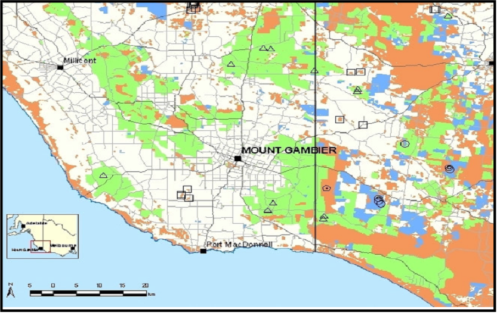

```{r setup, include = FALSE, cache = FALSE}
#-- RUN THE FRAGMENT BETWEEN LINES BEFORE COMPILING MARKDOWN
# to configure markdown parsing
options(markdown.extensions = c("no_intra_emphasis", "tables", "fenced_code", "autolink", "strikethrough", "lax_spacing", "space_headers", "latex_math"))
#------
# output options
options(width = 70, scipen = 6, digits = 3)

# to render cyrillics in plots use cairo pdf
options(device = function(file, width = 7, height = 7, ...) {
  cairo_pdf(tempfile(), width = width, height = height, ...)
  })
library(knitr)
# chunk default options
opts_chunk$set(fig.align='center', tidy = FALSE, fig.width = 7, fig.height = 3)
```

## Мы рассмотрим

+ Технику подгонки множественных регрессионных моделей
+ Процесс валидации множественных регрессионных моделей 


## Вы сможете
+ Подобрать множественную линейную модель
+ Протестировать ее статистическую значимость и валидность

# Какие факторы определяют обилие птиц во фрагментированных лесных массивах Австралии?

## Читаем данные

```{r}
bird <- read.csv("data/loyn.csv")
head(bird)
```


##  Знакомимся с даными {.smaller .columns-2}

   

(Пример взять из книги Quinn&Keugh,2002; Оригинальная работа Loyn, 1987)

Фрагментация лесных местообитаний - одна из важнейших проблем Австралии.
Вопрос: от каких факторов зависит обилие птиц во фрагментированных лесных массивах?

*Зависимая перменная*   
`ABUND` - Обилие птиц на стандартном маршруте

*Предикторы*  
`AREA` - площадь лесного массива (Га)  
`YRISOL` - год, в котором произошла изоляция лесного массива   
`DIST` - расстояние до ближайшего другого лесного массива (км)   
`LDIST` - расстояние до ближайшего более крупного массива (км)    
`GRAZE` - качественная оценка уровня выпаса скота (1 - низкий уровень, 5 - высокий урвень)    
`ALT` - высота над уровнем моря (м)   

## Можно ли ответить на вопрос таким методом?

```{r}

cor(bird)

```

## Взаимосвязь между переменными может находиться под контролем других переменых и их взаимодействий.   
### Необходимо учесть все взаимовлияния в одном анализе


## Нам предстоит построить множественную регрессионную модель

$$y_i = \beta_0 + \beta_1x_{i1} + \beta_2x_{i2} + \beta_3x_{i3} + ... + \beta_px_{ip} + \epsilon_i$$

- $y_i$ - значение зависимой переменной $Y$ при значении предикторов $X_1 = x_{i,1}$, $X_2 = x_{i,2}$ и т.д.   

- $\beta_0$ - свободный член (intercept). Значение $Y$ при $X_1=X_2=X_3=....=X_p=0$  
- $\beta_1$ - частный угловой коэффициент для зависимости $Y$ от $X_1$. Показывает насколько единиц изменяется $Y$ при изменении $X_1$ на одну единицу и при условии, что все остальные предикторы не изменяются. 
$\beta_2$, $\beta_3$, ...., $\beta_p$ - аналогично   

- $\epsilon_i$ - варьирование $Y$, не объясняемое данной моделью. 


## Геометрическая интерпретация множественной линейной модели 
###Для случая с одним предиктором $y_i = \beta_0 + \beta_1x_i + \epsilon_i$ - линия регрессии

```{r, echo=FALSE, warning=FALSE, message=FALSE}
library(ggplot2)
x <- runif(100, 0, 10)
y <- 10*x + 10 + rnorm(100, 0, 50)
qplot (x=x, y=y) + geom_smooth(method = "lm")
```

## Геометрическая интерпретация множественной линейной модели {.columns-2}
###Для случая с двумя предикторами 
$$y_i = \beta_0 + \beta_1x_{i1} + \beta_2x_{i2} + \epsilon_i$$

Плоскость в трехмерном пространстве

```{r, echo=FALSE, warning=FALSE, message=FALSE, fig.height=6, fig.width=6}
library(plot3D)
with (mtcars, {

  # linear regression
   fit <- lm(mpg ~ wt + disp)

  # predict values on regular xy grid
   wt.pred <- seq(1.5, 5.5, length.out = 30)
   disp.pred <- seq(71, 472, length.out = 30)
   xy <- expand.grid(wt = wt.pred, 
                     disp = disp.pred)

   mpg.pred <- matrix (nrow = 30, ncol = 30, 
      data = predict(fit, newdata = data.frame(xy), 
      interval = "prediction"))

# fitted points for droplines to surface
   fitpoints <- predict(fit) 

   scatter3D(z = mpg, x = wt, y = disp, pch = 18, cex = 2, theta = 20, phi = 20, ticktype = "detailed", xlab = "First predictor X1", ylab = "Second predictor X2", zlab = "Response variable",  surf = list(x = wt.pred, y = disp.pred, z = mpg.pred,  facets = NA, fit = fitpoints), main = "Model with two predictors")
  
 })

```

## Геометрическая интерпретация множественной линейной модели
###Для случая с большим количеством предикторов 
$$y_i = \beta_0 + \beta_1x_{i1} + \beta_2x_{i2} + \beta_3x_{i3} + ... + \beta_px_{ip} + \epsilon_i$$
Плоскость в n-мерном пространстве, оси которого образованы значениями предикторов


## Исследование данных (Data Exploration) {.smaller}

```{r, warning=FALSE, message=FALSE, fig.height=5.5}
library(car)
scatterplotMatrix(bird)
```

## Явные проблемы
### Есть сильные корреляции между некоторым предикторами.
```{r, warning=FALSE, message=FALSE, fig.height=5.5, echo=FALSE}
library(car)
scatterplotMatrix(bird)
```

 

## Постоим линейную модель
### Задание. Напишите самостоятельно R код, необходимый для подбора уравнения множественной регрессии

_Hint_
```{r}
head(bird, 2)
```

## Решение

```{r}
model <- lm(ABUND ~  AREA + YRISOL + DIST + LDIST + GRAZE + ALT, data = bird)

model <- lm(ABUND ~  . , data = bird)

```

## Смотрим на полученную модель {.smaller}
```{r}
summary(model)
```

# Проверка валидности модели

## Вспомним условия применимости линейных моделей
1. Линейность связи между зависимой перменной ($Y$) и предикторами ($X$)
2. Независимость $Y$ друг от друга
3. Нормальное распределение $Y$ для каждого уровня значенй $X$
4. Гомогенность дисерсии $Y$ в пределах всех уровней значений $X$
5. Отсутствие коллинеарности предикторов (для можественной регрессии)


## Для начала выясним нет ли среди наблюдений влияющих наблюдений

```{r, warning=FALSE}
library(ggplot2)
ABUND_diag <- fortify(model)
# При жестком подходе D > 4 / (N - p - 1)
# При более мягком подходе D > 1

ggplot(ABUND_diag, aes(x = .fitted, y = .stdresid)) + 
  geom_point(aes(size = .cooksd)) + 
  geom_smooth(se=FALSE) + 
  geom_hline(aes(yintercept = 0))

```


## Проверяем распределение остатков на соответствие нормальному распределению
```{r}
ggplot(ABUND_diag, aes(x = .resid)) + geom_histogram(binwidth = 5) 

```

## Проверяем распределение остатков на соответствие нормальному распределению 

```{r, warning=FALSE, fig.height=5}
library(car)
qqPlot(model)
```

## Проверяем на гетероскедастичность
```{r, echo=FALSE, fig.width=5}
ggplot(ABUND_diag, aes(x = .fitted, y = .stdresid)) + geom_point(size = 4) +  geom_hline(aes(yintercept = 0))
```


```{r, message=FALSE, warning=FALSE}
library(lmtest)
bptest(model)
```


## Проверяем на мультиколлинеарность

_Мультиколлинеарность_ -  наличие линейной зависимости между независимыми переменными (факторами) регрессионной модели.

При наличии мультиколлинеарности оценки параметров получаются неточными, а значит сложно будет дать интерпретацию влияния тех или иных факторов на объясняемую переменную   

Признаки мультиколлинеарности:    
   + Большие ошибки оценок параметров             
   + Большинство оценок параметров модели недостоверно, но F критерий всей модели свидетельствует о ее статистической значимости        

## Фактор инфляции дисперсии (Variance inflation factor)
### Фактор инфляции дисперсии (VIF) — мера мультиколлинеарности. 
```{r}
vif(model)
```

## Логика вычисления VIF

Мы подбираем модель, описывающую связь данного предиктора со всеми остальными предикторами. 

1. Строим регрессионную модель.     
$$x_1 = c_0 + c_2x_2 +c_2x_3 + .... + c_px_p$$

2. Находим $R^2$ для данной модели.   

3. Вычисляем фактор инфляции дисперсии. 
$$VIF = \frac{1}{1-R^2}$$


## Что делать, если мультиколлинеарность выявлена?

Решение № 1. Удалить из модели избыточные предикторы            
1. Последовательно удалить из модели предикторы с VIF > 5 (сначала предиктор с самым большим VIF)          
2. Вновь провести вычисление VIF
3. Если остались еще предикторы с VIF > 5, то повторить шаг 1 и 2.
4. Возможно, придется удалить и предикторы с VIF > 3            
5. Иногда полезно удалить и предикторы с VIF > 2 (Это позволит сократить набор предикторов, но не увлекайтесь!)           

## Что делать если мультиколлинеарность выявлена?

Решение № 2. Заменить исходные предикторы новыми переменными, полученными с помощью метода главных компонент

## В нашей модели явной мультколлинеарности нет!
###Однако, возможно, что  `GRAZE` - избыточный предиктор

## Удалим из модели избыточный предиктор

```{r}
model2 <- update(model, ~ . -GRAZE)
vif(model2)
```

## Смотрим на итоги {.smaller}

```{r}
summary(model2)
```

## Сравним две модели
```{r}
summary(model)$adj.r.squared
summary(model2)$adj.r.squared
```

*Удаление этого предиктора, скорее, ухудшает модель!*


## Задание: 
###Постройте и проанализируйте модель, описывающую связь между усилием мышц, осуществляющих выдох (`pemax`) и следующими параметрами тела {.columns-2}

`age` - Возраст    
`sex` - Пол (0: male, 1:female)    
`height` - Рост (cm).       
`weight` - Вес (kg).        
`bmp` - Отклонения в весе от нормы (% of normal).           
`fev1` - Объем наполенных легких.           
`rv` - Остаточный объем легких.         
`frc` - Функциональная остаточная емкость легких.   
`tlc` - Общая емкость легких.   

Для получения данных выполните следующий код 
```{r, warning=FALSE}
library(ISwR)
data(cystfibr)
```

## Решение {.smaller}
```{r}
M1 <- lm(pemax ~ ., data = cystfibr)
summary(M1)
```

## Явные признаки мультиколлинеарности
```{r}
vif(M1)
```

## Удаляем избыточные предикторы
```{r}
M2 <- update(M1, .~.-weight)
vif(M2)
```


## Удаляем избыточные предикторы

```{r}
M3 <- update(M2, . ~. - frc)
vif(M3)

```

## Удаляем избыточные предикторы

```{r}
M4 <- update(M3, . ~. - height)
vif(M4)
```

## Смотрим на полученную модель {.smaller}
```{r}
summary(M4)
```

## Диагностика модели

```{r, eval= FALSE}
plot(M4)
```


## Какой из предиктов оказывает наиболее сильное влияние?

### Для ответа на этот вопрос надо "уравнять" шкалы, всех предикторов, то есть стандартизировать их. 

## Задание. 
### Нпишите R-код, который позволяет стандартизировать шкалу предиктора. Стандаризируйе, например, вектор `fev1`

## Решение

```{r, eval=FALSE}
# 1 способ:

(cystfibr$fev1 - mean(cystfibr$fev1))/sd(cystfibr$fev1)

# 2 способ: with, чтобы меньше писать

with(cystfibr, 
  (fev1 - mean(fev1))/sd(fev1)
)

# 3 способ:

scale(cystfibr$fev1)  
```

```{r, echo=F}
with(cystfibr, 
  (fev1 - mean(fev1))/sd(fev1)
)

```


## Можно использовать функцию `scale()`

```{r, tidy=TRUE}

M4_scaled <- lm(pemax ~ scale(age) + sex + scale(bmp) + scale(fev1) + scale(rv) + scale(tlc), data = cystfibr)
```

## Какой факторов оказывает наиболее сильное влияние на усилие дыхательных мышц? {.smaller}

```{r}

summary(M4_scaled)

```


## Задание
### Оцените валидность финальной модели с помощью тестов на гетероскедастичность, автокоррелированность данных и наличие мультиколлинеарности 


## Оцениваем валидность финальной модели

```{r}
durbinWatsonTest(M4_scaled)
bptest(M4_scaled)
vif(M4_scaled)
```


# Взаимодействия предикторов

##Вернемся к данным по обилию птиц и построим модель для двух предикторов {.smaller .columns-2}
```{r}
model3 <- lm(ABUND ~ YRISOL + GRAZE, data = bird)
summary(model3)
```

```{r}
model4 <- lm(ABUND ~ YRISOL * GRAZE, data = bird)
summary(model4)
```

##Как трактовать взаимодействия?
```{r, echo=FALSE, fig.height=5}
MyData <- expand.grid(YRISOL = seq(1890, 1976, 1), GRAZE = seq(1, 5, 1)) 
MyData$Predicted <- predict(model4, newdata = MyData)
ggplot(MyData, aes(x = YRISOL,  y = Predicted, group = GRAZE)) + geom_line(aes(color = GRAZE), size = 2) + geom_point(data = bird, aes(x = YRISOL, y = ABUND, color = GRAZE), size = 4) + scale_colour_continuous(low = "yellow", high = "red") + xlab ("Год изоляции") + ylab("Обилие птиц")

```
НО! Не всегда все так просто трактуется...   
Часто трактовка взаимодействий затруднительна, особенно если предкторов много.

## Include or Don't include? That is the question... {.smaller}
###Вопрос о включени в модель взаимоодействия предикторов совсем непростой

_Существует несколько подходов_      
1. Не включать взаимодействия в модель. Но если при валидации модели в остатках появляется явный паттерн, то это может быть следствием наличия взаимодействия предикторов.    
2. Оснвываясь на априорных знаниях свойств объектов включить только те взаимоотношения, которые имеют биологический смысл.     
3. В процессе анализа данных выявить важные взаимодействия и включить их в анализ.    
4. Среди большого количества предикторов выбрать наиболее важные переменные (те, ради которых была затеяна работа). Включить в модель взаимоотношения этих предикторов с другими, менее важными, перменными.     
5. Включать в анализ только сами перменные (main terms) и взаимодействия первого уровня (two-way interaction terms).    
6. Включать в анализ и обсуждать все взаимодействия (это имеет смысл только при малом количестве предикторов).   


## Summary
>- При построении множественной регрессии важно, помимо проверки прочих условий применимости, проверить модель на наличие мультиколлинеарности
>- Если модель построена на основе стандартизированнх значений предикторов, то можно сравнивать влияние этих прдикторов.
>- Построенную модель можно улчшать.
>- В модель можно (а иногда и необходимо) включать взаимодействия предикторов.

## Что почитать
+ Кабаков Р.И. R в действии. Анализ и визуализация данных на языке R. М.: ДМК Пресс, 2014.
+ Quinn G.P., Keough M.J. (2002) Experimental design and data analysis for biologists, pp. 92-98, 111-130
+ Diez D. M., Barr C. D., Cetinkaya-Rundel M. (2014) Open Intro to Statistics., pp. 354-367.
+ Logan M. (2010) Biostatistical Design and Analysis Using R. A Practical Guide, pp. 170-173, 208-211
+ Zuur, A.F. et al. 2009. Mixed effects models and extensions in ecology with R. - Statistics for biology and health. Springer, New York, NY. pp. 538-552.

