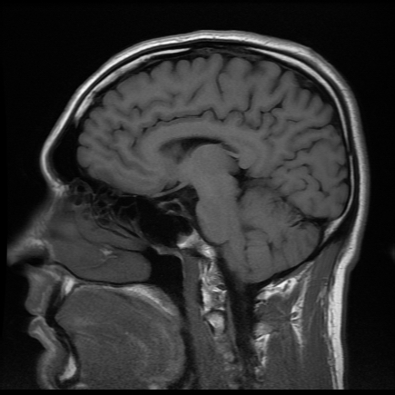
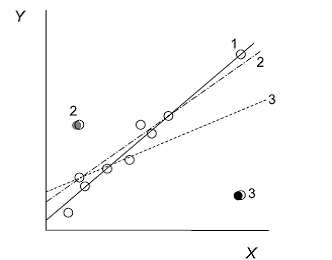
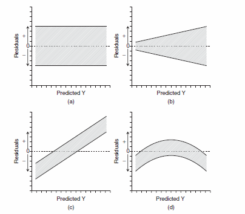

```{r setup, include = FALSE, cache = FALSE, purl = FALSE, fig.showtext = TRUE}
source("assets/xaringan_setup.R")
library(xaringanExtra)
use_tile_view()
use_scribble()
use_search(show_icon = FALSE)
use_progress_bar(color = "#6d2b5e", location = "bottom", height = "10px")
use_freezeframe()
# use_webcam()
# use_panelset()
# use_extra_styles(hover_code_line = TRUE)

# http://tachyons.io/docs/
# https://roperzh.github.io/tachyons-cheatsheet/
use_tachyons()
```

```{r libs, include=FALSE, warning=FALSE}
library("tidyverse")
library("cowplot")
library("ggplot2")
theme_set(theme_bw(base_size = 22))
```

# Описание и проверка значимости линейных моделей

## Вы сможете

- Подобрать линейную модель зависимости переменной-отклика от одного предиктора
- Протестировать значимость линейной модели в целом и значимость отдельных ее коэффициентов при помощи t и F критериев
- Проверить условия применимости линейной регрессии при помощи графиков


```{r echo=FALSE, purl=FALSE}
lm_equation <- function(fit, strict = TRUE, rnd = 2){
#   extracting call formula 
  frml <- as.character(fit$call)[2]
#   extract signs
    sign <- ifelse(grepl("-", coef(fit)[-1]), " - ", " + ")
  # extract coefficients
  coeffs <- format(round(abs(coef(fit)), rnd), digits = 2, nsmall = rnd, trim = TRUE)
  if(strict == TRUE){
    i <- 1:(length(coeffs) - 1)
    vars <- c("Y", paste0(" X", i))
    
  } else {
# extract vector of variable names
  vars <- c(all.vars(formula(fit))[1], names(fit$coefficients)[-1])
# combine everything
  }
  start <- ifelse(coef(fit)[1] > 0, paste(vars[1], coeffs[1], sep = " = "), paste(vars[1], coeffs[1], sep = " = - "))
  end <- paste(sign, coeffs[-1], vars[-1], sep = "", collapse = "")
  return(paste0(start, end, sep = ""))
}
```

---

class: middle, center, inverse

# Вспомним пример из прошлой лекции

---

## Пример: IQ и размеры мозга

Зависит ли уровень интеллекта от размера головного мозга? (Willerman et al. 1991)

.pull-left[



<small>[Scan_03_11](https://flic.kr/p/c45eZ3) by bucaorg(Paul_Burnett) on Flickr</small>  

]

.pull-right[

Было исследовано 20 девушек и 20 молодых людей

У каждого индивида измеряли:

- вес
- рост
- размер головного мозга (количество пикселей на изображении ЯМР сканера)
- Уровень интеллекта измеряли с помощью IQ тестов

<small>Пример: Willerman, L., Schultz, R., Rutledge, J. N., and Bigler, E. (1991), "In Vivo Brain Size and Intelligence", Intelligence, 15, p.223--228.  
Данные: ["The Data and Story Library"](http://lib.stat.cmu.edu/DASL)  
Фото: [Scan\_03\_11](https://flic.kr/p/c45eZ3) by bucaorg (Paul Burnett) on Flickr
</small>

]

---

## Вспомним, на чем мы остановились

```{r echo=FALSE, purl=TRUE}
## Код из прошлой лекции #################################

## Открываем данные
library(readxl)
brain <- read.csv("data/IQ_brain.csv", header = TRUE)

## Линейная модель
brain_model <- lm(PIQ ~ MRINACount, data = brain)
summary(brain_model)
```

---

## Уравнение и график зависимости

$$PIQ_i = 1.744 + 0.0001202 \cdot MRINACount_i$$

```{r echo=FALSE, purl=TRUE}
library(ggplot2)
theme_set(theme_bw())
ggplot(brain, aes(x = MRINACount, y = PIQ)) + 
  geom_point() + 
  geom_smooth(method = "lm")
```

---

class: middle, center, inverse

# Тестирование гипотез о линейных моделях
 
---
 
## Способы проверки значимости модели и ее коэффициентов

Два равноправных способа

--

### Значима ли модель целиком?

+ F критерий
<!-- : действительно ли объясненная моделью дисперсия $MS_{r}$ больше, чем случайная (= остаточная) дисперсия $MS_{e}$? -->

--

### Значима ли связь между предиктором и откликом?

+ t-критерий
<!-- : отличается ли от нуля коэффициент $b_k$ при этом предикторе $x_k$ -->
+ F-критерий
<!-- : действительно ли объясненная предиктором дисперсия $MS_{x_{k}}$ больше, чем случайная (= остаточная) дисперсия $MS_{e}$? -->

---

class: middle, center, inverse

# Тестирование гипотез с помощью t-критерия  

---

## Тестирование гипотез с помощью t-критерия  

### Гипотезы

Зависимость есть, если $\beta_k \ne 0$

Нулевая гипотеза $H_0: \beta_k = 0$

---

## Тестирование гипотез с помощью t-критерия  

### Гипотезы

Зависимость есть, если $\beta_k \ne 0$

Нулевая гипотеза $H_0: \beta_k = 0$

### Тестовая статистика

$$t=\frac{b_k - \beta_k}{SE_{b_k}} = \frac{b_k - 0}{SE_{b_k}} = \frac{b_k}{SE_{b_k}}$$

Число степеней свободы: $df = n − p$, где $n$ --- объем выборки, $p$ --- число параметров модели, $k$ --- конкретный коэффициент регрессии. 

Для простой линейной регрессии с одним предиктором $df = n - 2$.

---

## Зависит ли IQ от размера головного мозга?

$$PIQ_i = 1.744 + 0.0001202 \cdot MRINACount_i$$

```{r}
summary(brain_model)
```

```{r echo=FALSE, purl=FALSE}
n <- nrow(brain_model$model)
n_par <- length(coef(brain_model))
df_t <-  n - n_par
smr_brain <- coef(summary(brain_model))
t_val <- round(smr_brain[2, "t value"], 2)
p_val <- round(smr_brain[2, "Pr(>|t|)"], 2)
t_crit <- qt(p = 0.95, df = 38)
```

Результаты теста на IQ статистически значимо связаны <br/> с размерами мозга на МРТ ( $t_{ 0.05, `r df_t`}$ = `r t_val`, $p$ = `r p_val` ).

---

class: middle, center, inverse

# Тестирование гипотез при помощи F-критерия

```{r echo=FALSE}
lims <- range(brain$PIQ) + c(-1, 1)
yannot <- lims[1] + 0.5
xannot <- max(brain$MRINACount)
gmean <- mean(brain$PIQ, na.rm = TRUE)
Y <- 150
Y_hat <- predict(brain_model, newdata = brain[brain$PIQ == 150, ])
X <- brain$MRINACount[brain$PIQ == 150]

# Общая изменчивость
pl_tot <- ggplot(brain, aes(x = MRINACount, y = PIQ)) + 
  geom_hline(yintercept = gmean, size = 1) + 
  geom_segment(aes(x = MRINACount, y = PIQ, 
                   xend = MRINACount, yend = gmean), colour = "grey70") + 
  geom_point() +
    annotate("text", label = "Общее\nсреднее", 
             x = 1050000, y = gmean - 8, size = 4, hjust = 0.7) + 
  ggtitle("Общая изменчивость") + 
  annotate("text", label = "SS[t] == sum((bar(y) - y[i]))^2", parse = TRUE, x = xannot,  y = yannot, hjust = 0.95, vjust = 0.2, size = 6) 

# Когда есть зависимость
pl_all <- ggplot(brain, aes(x = MRINACount, y = PIQ)) +  
  geom_smooth(method = "lm", se = F, size = 1.3) + 
    geom_segment(aes(x = MRINACount, y = PIQ, 
                   xend = MRINACount, yend = gmean), colour = "grey70") +  
  geom_hline(yintercept = gmean, size = 2) + 
      annotate("text", label = "Общее среднее", 
             x = 1050000, y = gmean - 8, size = 4, hjust = 0.7) + 
  annotate("segment", x = X - 1500, y = Y, xend = X - 1500, yend = gmean, colour = "grey70", size = 2) + 
  annotate("segment", x = X + 2000, y = Y, xend = X + 2000, yend = Y_hat, colour = "#009E73", size = 2) +
  annotate("segment", x = X + 2000, y = Y_hat, xend = X + 2000, yend = gmean, colour = "#E69F00", size = 2) +
  geom_point(size = 2)

# Когда нет зависимости
pl_no <- ggplot(brain, aes(x = MRINACount, y = PIQ)) +  
      geom_segment(aes(x = MRINACount, y = PIQ, 
                   xend = MRINACount, yend = gmean), colour = "grey70") +  
  geom_hline(yintercept = gmean, size = 5) + 
      annotate("text", label = "Общее среднее", 
             x = 1050000, y = gmean - 8, size = 4, hjust = 0.7) + 
    geom_hline(yintercept = gmean, size = 2, colour = "dodgerblue1") + 
  annotate("segment", x = X - 1500, y = Y, xend = X - 1500, yend = gmean, colour = "grey70", size = 2) + 
  annotate("segment", x = X + 2000, y = Y, xend = X + 2000, yend = gmean, colour = "#009E73", size = 2) +
  geom_point(size = 2)

# Объясненная изменчивость
pl_exp <- ggplot(brain, aes(x = MRINACount, y = PIQ)) + 
  geom_smooth(method = "lm", se = F, size = 1.3) + 
  geom_hline(yintercept = gmean, size = 1) + 
  geom_segment(aes(x = MRINACount, y = gmean, 
                   xend = MRINACount, yend = fitted(brain_model)), colour = "#E69F00") + 
  geom_point() +
  annotate("text", label = "Общее\nсреднее", 
           x = 1050000, y = gmean - 8, size = 4, hjust = 0.7) + 
  ggtitle("Объясненная изменчивость") +
      annotate("text", label = "SS[r] == sum((bar(y) - hat(y)[i]))^2", parse = TRUE, x = xannot,  y = yannot, hjust = 0.95, vjust = 0.2, size = 6)

# Остаточная изменчивость
pl_res <- ggplot(brain, aes(x = MRINACount, y = PIQ)) + 
  geom_smooth(method ="lm", se = F, size = 1.3) + 
  geom_segment(aes(x = MRINACount, y = PIQ, 
                   xend = MRINACount, yend = fitted(brain_model)), colour = "#009E73") + 
  geom_point() +
  ggtitle("Случайная изменчивость") +
  annotate("text", label = "SS[e] == sum(sum((y [i] - hat(y)[i])))^2", parse = TRUE, x = xannot,  y = yannot, hjust = 0.95, vjust = 0.2, size = 6)
```

---

## Общая изменчивость

Общая изменчивость $SS_{t}$ --- это сумма квадратов отклонений наблюдаемых значений $y_i$ от общего среднего $\bar y$

```{r echo=FALSE}
pl_tot
```

---

## Структура общей изменчивости

$$SS_t = SS_r + SS_e$$

```{r echo=FALSE, fig.height=5.5, fig.width=10}
library(gridExtra)
lay <- rbind(c(NA, 1, 1, 1, 1, NA),
             c(2, 2, 3, 3, 4, 4))
grid.arrange(pl_all, pl_tot, pl_exp, pl_res, layout_matrix = lay, heights = c(0.42, 0.58))
```

---

## От изменчивостей к дисперсиям

```{r echo=FALSE, fig.height=2.8, fig.width=10}
library(gridExtra)
grid.arrange(pl_tot, pl_exp, pl_res, nrow = 1)
```


| $MS_t$, полная дисперсия | $MS_r$, дисперсия, <br /> объясненная регрессией  | $MS_e$, остаточная дисперсия | 
|-----|-----|-----|
| $MS_{t} =\frac{SS_{t}}{df_{t}}$ | $MS_{r} =\frac{SS_{r}}{df_{r}}$ | $MS_{e} =\frac{SS_{e}}{df_{e}}$ |
| $SS_{t}=\sum{(\bar{y}-y_i)^2}$ | $SS_{r}=\sum{(\hat{y}-\bar{y})^2}$ | $SS_{e}=\sum{(\hat{y}-y_i)^2}$ |
| $df_{t} = n-1$ | $df_{r} = 1$ | $df_{e} = n-2$  |

---

## С помощью $MS_r$ и $MS_e$ можно тестировать значимость коэффициентов

Если дисперсии остатков для всех значений x равны, то

$E(MS_r) = \sigma^2 + \beta_1^2\sum(x_i - \bar x)^2$ 
--
$= \sigma^2 + \sigma_{x}^2$

$E(MS_e) =\sigma^2$

<br/>

--

Если зависимости нет, то $\beta_1 = 0$, и тогда 
--
$MS_r \approx MS_e$

--

Значит, $MS_r \approx MS_e$

<br/>

--

- $H_0: \beta_1 = 0$
- $H_A: \beta_1 \ne 0$

$$F_{df_r, df_e}= \frac{MS _{r}}{MS_{e}}$$

---

## Тестирование значимости коэффициентов регрессии при помощи F-критерия

- $H_0: \beta_1 = 0$
- $H_A: \beta_1 \ne 0$

$$F_{df_r, df_e}= \frac{MS _{r}}{MS_{e}}$$

Для простой линейной регрессии $df_{r} = 1$ и $df_{e} = n - 2$


```{r f-distr, echo=FALSE, purl=FALSE}
ar <- arrow(type = "closed", length = unit(0.15,"cm"))
arb <- arrow(type = "closed", length = unit(0.15,"cm"), ends = "both")

dfr <- data.frame(f = seq(-0.01, 2, 0.001))
ggplot(dfr, aes(x = f)) + 
  stat_function(fun = df, args = list(df1 = 1, df2 = 38), size = 1.3) + 
labs(title = expression(bold(paste("F-распределение,", ~df[1]==1, ", ", ~ df[2]==38))),
     x = "F", y = "Плотность вероятности")
```

---

## Таблица результатов дисперсионного анализа

| Источник изменчивости  | df | SS | MS | F  | 
| ----- | ----- | ----- | ----- | ----- | 
| Регрессия | $df _r = 1$ | $SS _r = \sum{(\bar y - \hat y _i)^2}$ | $MS _r = \frac{SS _r}{df _r}$ | $F _{df _r, df _e} = \frac{MS _r}{MS _e}$ | 
| Остаточная|  $df _e = n - 2$ | $SS _e = \sum{(y _i - \hat y _i)^2}$ | $MS _e = \frac{SS _e}{df _e}$ | 
| Общая | $df _t = n - 1$ | $SS _t = \sum {(\bar y - y _i)^2}$ | 

<br/><br/>

Минимальное упоминание результатов в тексте должно содержать $F _{df _r, df _e}$ и $p$.

---

class: middle, center, inverse

# Оценка качества подгонки модели

---

## В чем различие между этими двумя моделями?

```{r residuals-scatter, echo=FALSE}
x <- rnorm(200, 20, 5)
y1 <- 10 * x + 5 + rnorm(100, 0, 5)
y2 <- 10 * x + 5 + rnorm(100, 0, 30)
d <- data.frame(x = x, y1 = y1)
pl_R1 <- ggplot(d, aes(x = x, y = y1)) + geom_point() + 
  geom_smooth(method = "lm", se = F)
pl_R2 <- ggplot(d, aes(x = x, y = y2)) + geom_point() + 
  geom_smooth(method = "lm", se = F)
grid.arrange (pl_R1, pl_R2, nrow = 1)
```

--

У этих моделей разный разброс остатков:

- Модель слева объясняет практически всю изменчивость
- Модель справа объясняет не очень много изменчивости

---

## Коэффициент детерминации --- мера качества подгонки модели

### Коэффициент детерминации

описывает какую долю дисперсии зависимой переменной объясняет модель

$$R^2 = \frac{SS_{r}}{SS_{t}}$$

- $0 < R^2 < 1$
- $R^2 = r^2$ --- для простой линейной регрессии коэффициент детерминации равен квадрату коэффициента Пирсоновской корреляции

---

## Если в модели много предикторов, нужно внести поправку

###  Скорректированный коэффициет детерминации (adjusted R-squared)

Применяется если необходимо сравнить две модели с разным количеством параметров  

$$ R^2_{adj} = 1- (1-R^2)\frac{n-1}{n-p}$$

$p$ - количество параметров в модели   

Вводится штраф за каждый новый параметр

---

## Еще раз смотрим на результаты регрессионного анализа зависимости IQ от размеров мозга

```{r}
summary(brain_model)
```

---

## Как записываются результаты регрессионного анализа в тексте статьи?

Мы показали, что связь между результатами теста на IQ и размером головного мозга на МРТ описывается моделью вида
<br/>
IQ = 1.74 + 0.00012 MRINACount ( $F_{1,38}$ = 6.686, p = 0.0136, $R^2$ = 0.149)
<br/>
<br/>

--

Неужели уже пора писать статью?

---

## Задание 1 & 2

Выполните задания 1 и 2 в одном из этих файлов:

- 07_task_assumptions_catsM.R
- 07_task_assumptions_GAG.R


---

class: middle, center, inverse

# Зачем нужна диагностика линейных моделей

---

## Зачем нужна диагностика модели? Разве тестов было недостаточно?

```{r}
dat <- read.table('data/orly_owl_Lin_4p_5_flat.txt')
fit <- lm(V1 ~ V2 + V3 + V4 + V5 - 1, data = dat)
coef(summary(fit))
```

Все значимо? Пишем статью?

---

## Задание 3

Постройте график зависимости остатков от предсказанных значений при помощи этого кода

```{r bird, eval=FALSE, purl=FALSE}
library(car)
residualPlot(fit, pch = ".")
```

---

## Oh, really?

```{r bird, eval=TRUE, purl=TRUE, fig.width=5, fig.height=5}
```

[http://www4.stat.ncsu.edu/~stefanski/NSF_Supported/Hidden_Images/stat_res_plots.html](http://www4.stat.ncsu.edu/~stefanski/NSF_Supported/Hidden_Images/stat_res_plots.html)

---

## Анализ остатков линейных моделей

### 1) Проверка на наличие влиятельных наблюдений

### 2) Проверка условий применимости линейных моделей

1. Линейная связь
1. Независимость
1. Нормальное распределение
1. Гомогенность дисперсий
1. Отсутствие коллинеарности предикторов (для множественной регрессии)

---

class: middle, center, inverse

# Анализ остатков

---

## Какие бывают остатки?

--

### "Сырые" остатки
$$e_i = y_i - \hat{y_i}$$

--

### Стандартизованные (стьюдентизированные) остатки

$$s_i = \frac{e_i}{\sqrt{MS_e(1-h_{ii})}}$$

- легко сравнивать (стандартизованы), учитывают силу влияния наблюдений


<hr />

- $\sqrt{MS_e}$ --- стандартное отклонение остатков
- $h_{ii}$ --- "сила воздействия" отдельных наблюдений (leverage, рычаг проекционной матрицы)

---

## Что такое проекционная матрица?

По определению, остатки $\mathbf{e} = \mathbf{Y} - \hat{\mathbf{Y}}$.

Тогда $\mathbf{e} = \mathbf{Y} - \hat{\mathbf{Y}} = \mathbf{Y} - \mathbf{X} \mathbf{b} = \mathbf{Y} - \mathbf{X}[\mathbf{X}'\mathbf{X}]^{-1}\mathbf{X}'\mathbf{Y}$.

<br/>

Обозначим  $\mathbf{H} \equiv  \mathbf{X}[\mathbf{X}'\mathbf{X}]^{-1}\mathbf{X}'$.

Матрица $\mathbf{H}$ --- называется __"хэт"-матрица__ (hat-matrix) или проекционная матрица, т.к. __она позволяет получить предсказанные значения из наблюдаемых__.

$\hat{\mathbf{Y}} = \mathbf{H}\mathbf{Y}$

<br/>

Тогда остатки можно получить как $\mathbf{e} = \mathbf{Y} - \mathbf{H}\mathbf{Y} = (\mathbf{I} - \mathbf{H})\mathbf{Y}$.

Диагональные элементы проекционной матрицы --- это мера воздействия точек на ход линии регрессии.

---

class: middle, center, inverse

# Влиятельные наблюдения

---

## Влиятельные наблюдения

Влиятельные наблюдения --- это наблюдения, которые вносят слишком большой вклад в оценку параметров (коэффициентов) модели.



<small>Из кн. Quinn, Keough, 2002</small>

Учет каких из этих точек повлияет на ход регрессии и почему?

--

- Точка 1 почти не повлияет, т.к. у нее маленький остаток, хоть и большой $X$
- Точка 2 почти не повлияет, т.к. ее $X$ близок к среднему, хоть и большой остаток
- Точка 3 повлияет сильно, т.к. у нее не только большой остаток, но и большой $X$

---

## Воздействие точек $h_{ii}$ (leverage)

показывает силу влияния значений $x_i$ на ход линии регрессии, то есть на $\hat{y_i}$

.pull-left[


<small>Из кн. Quinn, Keough, 2002</small>

]

.pull-right[


<small>Weighing Machine by neys fadzil on Flickr</small>

]

--

Точки, располагающиеся дальше от $\bar{x}$, оказывают более сильное влияние на $\hat{y_i}$

- $h_{ii}$ варьирует в промежутке от $1/n$ до 1  
- Если  $h_{ii} > 2(p/n)$, то надо внимательно посмотреть на данное значение ( $p$ --- число параметров, $n$ --- объем выборки)

---

## Расстояние Кука (Cook's distance)

описывает, как повлияет на модель удаление данного наблюдения

$$D_i = \frac{\sum{(\hat y_j-\hat{y}_{j(i)})^2}}{p \; MS_e} = \frac{e_i^2}{p \; MS_e} \; \frac {h_{ii}} {(1 - h_{ii}) ^ 2}$$

- $\hat{y_j}$ - значение предсказанное полной моделью
- $\hat{y}_{j(i)}$ - значение, предсказанное моделью, построенной без учета $i$-го значения предиктора
- $p$ - количество параметров в модели
- $MSe$ - среднеквадратичная ошибка модели ( $\hat\sigma^2$ )
- $h_{ii}$ --- "сила воздействия" отдельных наблюдений (leverage)

--

<hr />

- Зависит одновременно от величины остатков и "силы воздействия" наблюдений.

- Условное пороговое значение. Наблюдение является выбросом (outlier), если:
    - $D_i > 1$ --- это "мягкий" порог
    - $D_i > 4/(n - p)$ ( $n$ --- объем выборки, $p$ --- число параметров) --- это "жесткий" порог

---

## Что делать с наблюдениями-выбросами?

--

- Удалить?

--

__Осторожно!__ Только очевидные ошибки в наблюдениях можно удалять. Лучше найти причины.

--

- Трансформировать? Это не всегда поможет.
- Иногда можно переформулировать модель.

---

## Некоторые виды трансформаций

Трансформация  |  Формула  
------------- | -------------   
степень -2 | $1/x^2$
степень -1 | $1/x$
степень -0.5  | $1/\sqrt{x}$
степень 0.5 | $\sqrt{x}$
логарифмирование | $log(x)$  

---

## Данные для анализа остатков

```{r}
library(ggplot2)
brain_diag <- fortify(brain_model)
head(brain_diag, 2)
```

- `.hat` --- "сила воздействия" данного наблюдения (leverage)
- `.cooksd` --- расстояние Кука
- `.fitted` --- предсказанные значения
- `.resid` --- остатки
- `.stdresid` --- стандартизованные остатки

---

## График расстояния Кука

Проверяем наличие влиятельных наблюдений в `brain_model`.

Значения на графике расстояния Кука приведены в том же порядке, что и в исходных данных.
```{r echo=FALSE, purl=FALSE}
cook_cutoff <- 4 / (nrow(brain) - length(coef(brain_model)))
```

```{r gg-cook}
# График расстояния Кука
ggplot(brain_diag, aes(x = 1:nrow(brain_diag), y = .cooksd)) + 
  geom_bar(stat = "identity")
```

--

- Есть одно влиятельное наблюдение, которое нужно проверить, но сила его влияния невелика (расстояние Кука $< 1$, и только одно наблюдение больше $4/(n-p) = `r round(cook_cutoff, 2)`$)

---

## График остатков от предсказанных значений

Большую часть того, что нужно знать про остатки вы увидите на этом графике. А сейчас давайте научимся читать такой график.

```{r gg-resid}
gg_resid <- ggplot(data = brain_diag, aes(x = .fitted, y = .stdresid)) + 
  geom_point() + 
  geom_hline(yintercept = 0)
gg_resid
```

---

class: middle, center, inverse

# 1. Линейность связи

---

## Нелинейность связи видно на графиках остатков

```{r non-linear, echo=FALSE, purl=FALSE, fig.height=5}
library(gridExtra)

set.seed(39484)
x <- rnorm(100, 10, 3)
y <- (x^2.4) + rnorm(100, 0, 100)
pl_1 <- ggplot(data.frame(x = x, y = y), aes(x = x, y = y)) + geom_point() 

lm1 <- lm(y ~ x)

pl_1res <- ggplot(data.frame(fit = fitted(lm1), res = residuals(lm1)), aes(x = fit, y = res)) + geom_point() + geom_hline(yintercept = 0) + xlab("Fitted") + ylab("Residuals")


x2 <- runif(100, 1, 8)
y2 <- sin(x2) + 2 * x2 + rnorm(100)
pl_2 <- ggplot(data.frame(x = x2, y = y2), aes(x = x, y = y)) + geom_point() 

lm2 <- lm(y2 ~ x2)
pl_2res <- ggplot(data.frame(fit = fitted(lm2), res = residuals(lm2)), aes(x = fit, y = res)) + geom_point() + geom_hline(yintercept = 0) + xlab("Fitted") + ylab("Residuals") 

grid.arrange(pl_1, pl_2, pl_1res, pl_2res)
```

### Проверка на линейность связи

- График зависимости $y$ от $x$ (и от других переменных, не включенных в модель)
- График остатков от предсказанных значений

---

## Что делать, если связь нелинейна?  

- Добавить неучтенные переменные или взаимодействия
- Применить линеаризующее преобразование (Осторожно!)
- Применить обобщенную линейную модель с другой функцией связи (GLM)
- Построить аддитивную модель (GAM), если достаточно наблюдений по $x$
- Построить нелинейную модель, если известна форма зависимости

---

## Примеры линеаризующих преобразований   

```{r linearisation, echo=FALSE, purl=FALSE}
set.seed(475)
a <- 1
b <- 2
gg_tr <- ggplot() + 
  geom_point(alpha = 0.7) + 
  geom_smooth(method = "lm", alpha = 0.7)

# Логарифмическая модель
x1 <- runif(100, 2, 100)
y1 <- log(a * x1 ^ b) + rnorm(100, 0, 0.5)
# x1t <- log(x1)
pl_raw <- gg_tr %+% data.frame(x1, y1) + 
  aes(x = x1, y = y1) + 
  coord_cartesian(ylim = c(0, 10))
pl_log <- gg_tr %+% data.frame(x1, y1) + 
  aes(x = log(x1), y = y1) +
  coord_cartesian(ylim = c(0, 10)) +
  theme(axis.title.y = element_blank())

# Степенная
x4 <- runif(100, 0.1, 5)
y4 <- a * b ^ x4 + rnorm(100, 0, 1)
# y4t <- log(y4)
pl_raw1 <- gg_tr %+% data.frame(x4, y4) + aes(x = x4, y = y4)
pl_pwr <- gg_tr %+% data.frame(x4, y4) + aes(x = x4, y = log(y4))
```

### Логарифмирование

```{r log-transform, echo=FALSE, purl=FALSE, fig.width=7, fig.height=2}
grid.arrange(pl_raw, pl_log, ncol = 2, widths = c(0.52, 0.48))
```

### Возведение в степень

```{r power-transform, echo=FALSE, purl=FALSE, fig.width=7, fig.height=2}
grid.arrange(pl_raw1, pl_pwr, ncol = 2, widths = c(0.52, 0.48))
```

и т.д.

---

## При прочих равных не стоит трансформировать отклик  

```{r dep-var-transform, echo=FALSE, purl=FALSE, fig.height=3, fig.width=7}
set.seed(475)
x <- runif(100, 2, 5)
eps <- rnorm(100, 0, 10 + abs(x) ^ (3))
y <- (3.8 ^ (1 * x)) + eps

pl_raw <- ggplot(data.frame(x = (x), y = (y)), aes(x = x, y = y)) + 
  geom_point() + 
  geom_smooth(method = "lm", alpha = 0.7)

pl_log <- ggplot(data.frame(x = (x), y = log(y + 1)), aes(x = x, y = y)) + 
  geom_point() + 
  geom_smooth(method = "lm", alpha = 0.7) + ylab("Log (y)")

grid.arrange(pl_raw, pl_log, ncol = 2)
```

__Осторожно!__ Вы рискуете изучить не то, что хотели:  

1.При логарифмировании отклика вы будете изучать поведение мат.ожидания логарифма  
$E(log(y_i)) = b_0 + b_1x_{1i} + ... + e_i$.  

2.Трансформация отклика не только линеаризует зависимость, но и затронет величину остатков $e$.

--

<br/>
Вместо трансформации отклика лучше использовать обобщенную линейную модель с подходящей функцией связи, например:

$log(E(y_i)) =  b_0 + b_1x_{1i}+ ... + e_i$

---

class: middle, center, inverse

# 2. Независимость

---

## Каждое значение $y_i$ должно быть независимо от любого другого $y_j$ 

Это нужно контролировать на этапе планирования сбора материала 

* Наиболее частые источники зависимостей: 
    + псевдоповторности (повторно измеренные объекты)
    + неучтенные переменные
    + временные автокорреляции (если данные - временной ряд)
    + пространственные автокорреляции (если пробы взяты в разных местах)
    + и т.п.

---

## Диагностика нарушений независимости

Взаимозависимости можно заметить на графиках остатков

- остатки vs. предсказанные значения
- остатки vs. переменные в модели
- остатки vs. переменные не в модели

---

## Нарушение условия независимости: Неучтенная переменная

```{r unaccounted-var, echo=FALSE, purl=FALSE, fig.height=5}
set.seed(239874)
x1 <- runif(100, 20, 50)
x2 <- runif(100, 8, 22)
y <- 21 + 2 * x1 + 2 * x2 + rnorm(100, 0, 10)
NewData1 <- data.frame(y = y, x1 = x1, x2 = x2)

mod1 <- lm(y ~ x1)
gg_lm1 <- ggplot(NewData1, aes(x = x1, y = y)) + 
  geom_point() + 
  geom_smooth(method = "lm", alpha = 0.7) + 
  xlab("X1") + ggtitle("Y ~ X1")
gg_res1 <- ggplot(data.frame(fit = fitted(mod1), res = residuals(mod1, type = "pearson")), 
                  aes(x = fit, y = res)) + 
  geom_point() + 
  geom_smooth(se = FALSE, method = "loess") + 
  geom_hline(yintercept = 0) + 
  xlab("Fitted") + ylab("Residuals")
gg_res2 <-
ggplot(data.frame(fit = fitted(mod1), res = residuals(mod1, type = "pearson")), 
       aes(x = x2, y = res)) + 
  geom_point() + 
  geom_smooth(se = FALSE, method = "loess") + 
  geom_hline(yintercept = 0) + 
  xlab("X2") + ylab("Residuals")


mod2 <- lm(y ~ x1 + x2)
NewData2 <- data.frame(
  x1 = seq(min(x1), max(x1), length.out = 10),
  x2 = mean(x2))
NewData2$y <- predict(mod2, newdata = NewData2)
gg_lm2 <- ggplot(NewData2, aes(x = x1, y = y)) + 
  geom_point(data = NewData1, aes(x = x1, y = y)) + 
  geom_line(colour = "blue", size = 1) + 
  xlab("X1") + ggtitle("Y ~ X1 + X2")
gg_res3 <- ggplot(data.frame(fit = fitted(mod2), 
                             res = residuals(mod2, type = "pearson")), 
                  aes(x = fit, y = res)) + 
  geom_point() + 
  geom_smooth(se = FALSE, method = "loess") + 
  geom_hline(yintercept = 0) + 
  xlab("Fitted") + ylab("Residuals")
gg_res4 <- ggplot(data.frame(fit = fitted(mod2), 
                             res = residuals(mod2, type = "pearson")), 
                  aes(x = x2, y = res)) + 
  geom_point() + 
  geom_smooth(se = FALSE, method = "loess") + 
  geom_hline(yintercept = 0) + 
  xlab("X2") + ylab("Residuals")

grid.arrange(gg_lm1, gg_lm2, gg_res1, gg_res3, 
             gg_res2, gg_res4, ncol = 2)
```

--

- Слева: Если в модели не учтена переменная $X2$, внешне все нормально, но величина остатков зависит от $X2$
- Справа: Если $X2$ учесть, то зависимость остатков от $X2$ исчезает

---

## Нарушение условия независимости: Автокорреляция

В данном случае, наблюдения --- это временной ряд. 


```{r autocorr, echo=FALSE, purl=FALSE, fig.height=5}
x3 <- seq(1, 100, 1)

y3 <-  diffinv(rnorm(99)) + rnorm(100, 0, 2)

y3 <- y3[1:100]
pl_3 <- ggplot(data.frame(x = x3, y = y3), 
               aes(x = x, y = y)) +
  geom_point() +
  geom_smooth(method = "lm", alpha = 0.7)

lm3 <- lm(y3 ~ x3)

pl_3res <- ggplot(data.frame(fit = fitted(lm3), 
                             res = residuals(lm3)), 
                  aes(x = fit, y = res)) +
  geom_point() +
  geom_smooth(se = FALSE, method = "loess") +
  geom_hline(yintercept = 0) +
  xlab("Fitted") + ylab("Residuals")

grid.arrange(pl_3, pl_3res, nrow = 2)
```


На графиках остатков четко видно, что остатки не являются независимыми.

---

## Проверка на автокорреляцию

Проверка на автокорреляцию нужна если данные это временной ряд, или если известны координаты или время сбора проб.

Способы проверки временной автокорреляции (годятся, если наблюдения в ряду расположены через равные интервалы):

- График автокорреляционной функции остатков (ACF-plot) покажет корреляции с разными лагами.
- Критерий Дарбина-Уотсона (значимость автокорреляции 1-го порядка).

Для проверки пространственных автокорреляций

- вариограмма
- I Морана (Moran's I)

---

## Что делать, если у вас нарушено условие независимости значений?

Выбор зависит от обстоятельств. Вот несколько возможных вариантов.

+ псевдоповторности
    - избавляемся от псевдоповторностей, вычислив среднее
    - подбираем модель со случайным фактором
+ неучтенные переменные
    - включаем в модель (если возможно)
+ временные автокорреляции
    - моделируем автокорреляцию
    - подбираем модель со случайным фактором
+ пространственные автокорреляции
    - моделируем пространственную автокорреляцию
    - делим на пространственные блоки и подбираем модель со случайным фактором (= random effects model, mixed model)

---

## Проверка условия независимости

### Графики зависимости остатков от предикторов в модели
```{r resid-predict}
# Полный код
ggplot(data = brain_diag, aes(x = MRINACount, y = .stdresid)) + 
  geom_point() + 
  geom_hline(yintercept = 0)
```

```{r eval=FALSE}
# То же самое с использованием ранее созданного gg_resid
gg_resid + aes(x =  MRINACount)
```

---

### Графики зависимости остатков от предикторов не в модели

В данном случае их нет

---

class: middle, center, inverse

# 3. Нормальное распределение

---

## 3. Нормальное распределение $y$ (для каждого уровня значений $x$) 

```{r gg-norm-tunnel, echo=FALSE, fig.height=7, purl=FALSE}
## Based on code by Arthur Charpentier:
## http://freakonometrics.hypotheses.org/9593
## TODO: wrap it into a function and adapt it for use with other distributions
## as Markus Gesmann has done here
## http://www.magesblog.com/2015/08/visualising-theoretical-distributions.html

n <- 2
X <- brain$MRINACount 
Y <- brain$PIQ
dfr <- data.frame(X, Y)

# regression
reggig <- glm(Y ~ X, data = dfr, family = gaussian(link = "identity"))

# empty plot
vX <- seq(min(X) - 0.5, max(X) + 0.5, length = n)
vY <- seq(min(Y) - 50, max(Y) + 50, length = n)
mat <- persp(x = vX, y = vY, z = matrix(0, n, n), 
             zlim = c(0, 0.0001),
             theta =  - 30, phi = 20, expand = 0.0018,
             ticktype  = "detailed",  box = FALSE, border = "gray60")

x <- seq(min(X), max(X), length = 501)

# expected values
C <- trans3d(x, predict(reggig, newdata = data.frame(X = x), type = "response"), rep(0, length(x)), mat)
lines(C, lwd = 2)

sdgig <- sqrt(summary(reggig)$dispersion)

# 1SD
y1 <- qnorm(.95, predict(reggig, newdata = data.frame(X = x), type = "response"),  sdgig)
C <- trans3d(x, y1, rep(0, length(x)), mat)
lines(C, lty = 2, col = "#d95f02")
y2 <- qnorm(.05, predict(reggig, newdata = data.frame(X = x), type = "response"),  sdgig)
C <- trans3d(x, y2, rep(0, length(x)), mat)
lines(C, lty = 2, col = "#d95f02")

# C <- trans3d(c(x, rev(x)), c(y1, rev(y2)), rep(0, 2 * length(x)), mat)
# polygon(C, border = NA, col = "yellow")

# data points
C <- trans3d(X, Y, rep(0, length(X)), mat)
points(C, pch = 1, col = "black", cex = 0.4)

# density curves
n <- 6
vX <- seq(min(X), max(X), length = n)

mgig <- predict(reggig, newdata = data.frame(X = vX))
sdgig <- sqrt(summary(reggig)$dispersion)

for(j in n:1){
  stp <- 251
  x <- rep(vX[j], stp)
  y <- seq(min(min(Y) - 50, 
               qnorm(.05, 
                     predict(reggig, 
                             newdata = data.frame(X = vX[j]), 
                             type = "response"),  
                     sdgig)), 
           max(Y) + 50, 
           length = stp)
  z0 <- rep(0, stp)
  z <- dnorm(y,  mgig[j],  sdgig)
  C <- trans3d(c(x, x), c(y, rev(y)), c(z, z0), mat)
  polygon(C, border = NA, col = "light blue", density = 40)
  C <- trans3d(x, y, z0, mat)
  lines(C, lty = 2, col = "grey60")
  C <- trans3d(x, y, z, mat)
  lines(C, col = "steelblue")
}
```

Это условие невозможно проверить "в лоб", т.к. обычно каждому $x$ соответствует лишь небольшое число $y$ 
---

## Проверка нормальности распределения остатков

Если $y$ это нормально распределенная случайная величина

$$y_i \sim N(\mu_{y_i}, \sigma)$$

--

и мы моделируем ее как 

$$y_i = b_0 + b_1x_{1i} + \cdots + e_i$$ 

--

то остатки от этой модели --- тоже нормально распределенная случайная величина 

$$e_i \sim N(0, \sigma)$$

--

Т.е. выполнение этого условия можно оценить по поведению случайной части модели.

---

## Проверка нормальности распределения остатков

Есть формальные тесты, но:

- у формальных тестов тоже есть свои условия применимости
- при больших выборках формальные тесты покажут, что значимы даже небольшие отклонения от нормального распределения
- тесты, которые используются в линейной регрессии, устойчивы к небольшим отклонениям от нормального распределения

--

Лучший способ проверки --- квантильный график остатков.

---

## Квантильный график остатков

По оси Х --- квантили теоретического распределения, по оси Y --- квантили остатков модели. Если наблюдаемое распределение соответствует теоретическому, то точки должны лечь вдоль прямой по диагонали графика.

--

Обычные остатки должны подчиняться нормальному распределению $e \sim N(0, \sigma)$.

--

Cтьюдентизированные остатки --- t-распределению.

```{r qqplot}
# library(car)
qqPlot(brain_model, id = FALSE) # из пакета car
```

---

## Что делать, если остатки распределены не нормально?

Зависит от причины

- Нелинейная связь?
    - Построить аддитивную модель (если достаточно наблюдений по $x$)
    - Построить нелинейную модель (если известна форма зависимости)
- Неучтенные переменные?
    - добавляем в модель
- Зависимая переменная распределена по-другому?
    - трансформируем данные (неудобно)
    - подбираем модель с другим распределением остатков (обобщенную линейную модель)

---

class: middle, center, inverse

# 4. Постоянство дисперсии

---

## 4. Постоянство дисперсии (= гомогенность дисперсии, гомоскедастичность)

Это самое важное условие, поскольку многие тесты чувствительны к гетероскедастичности.

```{r gg-norm-tunnel, echo=FALSE, fig.height=7, purl=FALSE}
```

---

## Проверка гомогенности дисперсий

Есть формальные тесты (тест Бройша-Пагана, тест Кокрана), но:

- у формальных тестов тоже есть свои условия применимости, и многие сами неустойчивы к гетероскедастичности
- при больших выборках формальные тесты покажут, что значима даже небольшая гетероскедастичность

Лучший способ проверки на гомогенность дисперсий --- график остатков.

```{r homo-hetero, echo=FALSE, purl=FALSE, fig.height=4}
N <- 300
b_0 <- 0.5
b_1 <- 8

set.seed(123456)
x <- rnorm(N, 10, 3)
eps_1 <- rnorm(N, 0, 10)
y_1 <- b_0 + b_1*x + eps_1

# |v|^(2*t), t = 0.7
h <- function(x) x^(2*0.7) 
eps_2 <- rnorm(N, 0, h(x))
y_2 <- b_0 + b_1*x + eps_2
dat <- data.frame(x, y_1, y_2)
dat$log_y <- log(y_2)

pl_hom <- ggplot(dat, aes(x = x, y = y_1)) + geom_point(alpha = 0.5) + geom_smooth(method = "lm", alpha = 0.7) + ggtitle("Гомоскедастичность") + ylab("Y")
pl_heter <- pl_hom + aes(y = y_2) + ggtitle("Гетероскедастичность") + ylab("Y")

dat_diag_1 <- fortify(lm(y_1 ~ x, data = dat))
dat_diag_2 <- fortify(lm(y_2 ~ x, data = dat))

pl_hom_resid <- ggplot(dat_diag_1, aes(x = .fitted, y = .stdresid)) + geom_point(alpha = 0.5) + geom_smooth(se=FALSE, method = "loess")
pl_heter_resid <- pl_hom_resid %+% dat_diag_2

grid.arrange (pl_hom, pl_heter, 
              pl_hom_resid, pl_heter_resid, 
              ncol=2, heights = c(0.55, 0.45))

```

---

## Проверка на гетероскедастичность

Этот график у нас уже есть
```{r resid-plot}
gg_resid
```

--

- Гетерогенность дисперсий не выражена.

---

## Что делать если вы столкнулись с гетероскедастичностью?


```{r hetero-log-transform, fig.width=6, fig.height=6, echo=FALSE, purl=FALSE}
dat_diag2 <- fortify(lm(log_y~x, data=dat))
pl_heter2 <- ggplot(dat, aes(x=x, y=log_y)) + geom_point() + geom_smooth(method = "lm", alpha = 0.7)
pl_heter_resid2 <- ggplot(dat_diag2, aes(x = .fitted, y = .stdresid)) + geom_point() + geom_smooth(se = FALSE, method = "loess")
pl_heter <- pl_heter + ggtitle("No transformation")
pl_heter2 <- pl_heter2 + ggtitle("Log transformed Y")
grid.arrange (pl_heter, pl_heter2,  pl_heter_resid, pl_heter_resid2,  nrow=2)
```

Трансформация может помочь...

---

## Возможные причины гетероскедастичности

Даже если трансформация может помочь, лучше поискать причину гетерогенности дисперсий

- Неучтенные переменные
    - добавляем в модель
- Зависимая переменная распределена по-другому
    - трансформируем данные (неудобно)
    - подбираем модель с другим распределением остатков (обобщенную линейную модель)
- Моделируем гетерогенность дисперсии.

---

class: middle, center, inverse

# Тренинг по анализу остатков

---

## Некоторые частые паттерны на графиках остатков

.pull-left[



<small>Из кн. Logan, 2010, стр. 174</small>

]

--

.pull-right[

- Рис. a --- Условия применимости соблюдаются, модель хорошая
- Рис. b --- Клиновидный паттерн. Есть гетероскедастичность. Модель плохая
- Рис. c --- Остатки рассеяны равномерно, но нужны дополнительные предикторы
- Рис. d --- Нелинейный паттерн. Линейная модель использована некорректно

]

---

## Задание 4

Выполните три блока кода

Какие нарушения условий применимости линейных моделей здесь наблюдаются?

Вам понадобятся

1. График расстояния Кука
2. График остатков от предсказанных значений
3. Графики остатков от предикторов в модели и не в модели
4. Квантильный график остатков

---

## Задание 4, блок 1

```{r block-1-task}
set.seed(90829)
x1 <- seq(1, 100, 1)
y1 <-  diffinv(rnorm(99))  + rnorm(100, 0.2, 4)
dat1 = data.frame(x1, y1)
ggplot(dat1, aes(x = x1, y =  y1)) + geom_point()+ 
  geom_smooth(method="lm", alpha = 0.7)
```

---

## Решение, блок 1

### Графики

```{r block-1, fig.show='hold', purl=FALSE, fig.width=10, fig.height=2.2, echo=FALSE}
mod1 <- lm(y1 ~ x1, data = dat1)
mod1_diag <- fortify(mod1)
library(gridExtra)
grid.arrange(
  ggplot(mod1_diag, aes(x = 1:nrow(mod1_diag), y = .cooksd)) + 
    geom_bar(stat = "identity"),
  ggplot(data = mod1_diag, aes(x = .fitted, y = .stdresid)) + 
    geom_point() + geom_hline(yintercept = 0),
  ggplot(data = mod1_diag, aes(x = x1, y = .stdresid)) + 
    geom_point() + geom_hline(yintercept = 0),
  nrow = 1)
```

```{r block-1-q, purl=FALSE, fig.width=3, fig.height=3, echo=FALSE}
qqPlot(mod1, id = FALSE)   
```

--

- Выбросов нет, зависимость нелинейна
- Небольшие отклонения от нормального распределения

---

## Решение, блок 1

```{r eval=FALSE, purl=FALSE}
mod1 <- lm(y1 ~ x1, data = dat1)

# Данные для графиков остатков
mod1_diag <- fortify(mod1)

# 1) График расстояния Кука
ggplot(mod1_diag, aes(x = 1:nrow(mod1_diag), y = .cooksd)) + 
  geom_bar(stat = "identity")

# 2) График остатков от предсказанных значений
gg_resid <- ggplot(data = mod1_diag, aes(x = .fitted, y = .stdresid)) + 
  geom_point() + geom_hline(yintercept = 0)
gg_resid

# 3) Графики остатков от предикторов в модели и не в модели
gg_resid + aes(x = x1)

# 4) Квантильный график остатков
qqPlot(mod1, id = FALSE)       
```

---

## Задание 4, блок 2

```{r block-2-task}
  set.seed(7657674)
  x2 <- runif(1000, 1, 100)
  b_0 <- 100;  b_1 <- -20
  h <- function(x) x^0.5
  eps <- rnorm(1000, 0, h(x2))
  y2 <- b_0 + b_1 * x2 + eps
  dat2 <- data.frame(x2, y2)
  ggplot(dat2, aes(x = x2, y = y2)) + 
    geom_point() + 
    geom_smooth(method = "lm")
```

---

## Решение, блок 2


```{r block-2, fig.show='hold', purl=FALSE, fig.width=10, fig.height=2.2, echo=FALSE}
mod2 <- lm(y2 ~ x2, data = dat2)
mod2_diag <- fortify(mod2)
grid.arrange(
  ggplot(mod2_diag, aes(x = 1:nrow(mod2_diag), y = .cooksd)) + 
    geom_bar(stat = "identity"),
  ggplot(data = mod2_diag, aes(x = .fitted, y = .stdresid)) + 
    geom_point() + geom_hline(yintercept = 0),
  ggplot(data = mod2_diag, aes(x = x2, y = .stdresid)) + 
    geom_point() + geom_hline(yintercept = 0),
  nrow = 1)
```

```{r block-2-q, purl=FALSE, fig.width=3, fig.height=3, echo=FALSE}
qqPlot(mod2, id = FALSE)   
```

--

- Выбросов нет
- Гетерогенность дисперсий, остатки не подчиняются нормальному распределению

---

## Решение, блок 2

```{r eval=FALSE, purl=FALSE}
mod2 <- lm(y2 ~ x2, data = dat2)

# Данные для графиков остатков
mod2_diag <- fortify(mod2)

# 1) График расстояния Кука
ggplot(mod2_diag, aes(x = 1:nrow(mod2_diag), y = .cooksd)) + 
  geom_bar(stat = "identity")

# 2) График остатков от предсказанных значений
gg_resid <- ggplot(data = mod2_diag, aes(x = .fitted, y = .stdresid)) + 
  geom_point() + geom_hline(yintercept = 0)
gg_resid

# 3) Графики остатков от предикторов в модели и не в модели
gg_resid + aes(x = x2)

# 4) Квантильный график остатков
qqPlot(mod2, id = FALSE)       
```

---

## Задание 4, блок 3

```{r block-3-task}
set.seed(9283)
x3 <- rnorm(25, 50, 10)
b_0 <- 20; b_1 <- 20; eps <- rnorm(50, 0, 100)
y3 <- b_0 + b_1*x3 + eps
y3[100] <- 1000; x3[100] <- 95; y3[99] <- 1300; x3[99] <- 90; y3[98] <- 1500; x3[98] <- 80
dat3 <- data.frame(x3, y3)
ggplot(dat3, aes(x=x3, y=y3)) + geom_point() + geom_smooth(method="lm")
```

---

## Решение, блок 3


```{r block-3, fig.show='hold', purl=FALSE, fig.width=10, fig.height=2.2, echo=FALSE}
mod3 <- lm(y3 ~ x3, data = dat3)
mod3_diag <- fortify(mod3)
grid.arrange(
  ggplot(mod3_diag, aes(x = 1:nrow(mod3_diag), y = .cooksd)) + 
    geom_bar(stat = "identity"),
  ggplot(data = mod3_diag, aes(x = .fitted, y = .stdresid)) + 
    geom_point() + geom_hline(yintercept = 0),
  ggplot(data = mod3_diag, aes(x = x3, y = .stdresid)) + 
    geom_point() + geom_hline(yintercept = 0),
  nrow = 1)
```

```{r block-3-q, purl=FALSE, fig.width=3, fig.height=3, echo=FALSE}
qqPlot(mod3, id = FALSE)   
```

--

- 100-е наблюдение сильно влияет на ход регрессии
- Зависимость нелинейна

---

## Решение, блок 3

```{r eval=FALSE, purl=FALSE}
mod3 <- lm(y3 ~ x3, data = dat3)

# Данные для графиков остатков
mod3_diag <- fortify(mod3)

# 1) График расстояния Кука
ggplot(mod3_diag, aes(x = 1:nrow(mod3_diag), y = .cooksd)) + 
  geom_bar(stat = "identity")

# 2) График остатков от предсказанных значений
gg_resid <- ggplot(data = mod3_diag, aes(x = .fitted, y = .stdresid)) + 
  geom_point() + geom_hline(yintercept = 0)
gg_resid

# 3) Графики остатков от предикторов в модели и не в модели
gg_resid + aes(x = x3)

# 4) Квантильный график остатков
qqPlot(mod3, id = FALSE)       
```

---

## Задание 5

Выполните задание 3 в одном из этих файлов:
- 07_task_assumptions_catsM.R
- 07_task_assumptions_GAG.R


---

## Take-home messages

- Гипотезы о наличии зависимости можно тестировать при помощи t- или F-теста.
- Качество подгонки модели можно оценить при помощи коэффициента детерминации $R^2$.


--

- У линейных моделей есть условия применимости, поэтому не спешите описывать результаты --- сначала проверьте.

--

- Если условия применимости нарушены, то результатам тестов для этой модели нельзя верить (получаются заниженные доверительные вероятности, возрастает вероятность ошибок I рода).
- Анализ остатков дает разностороннюю информацию о валидности моделей.

---

## Что почитать

+ Гланц, С., 1998. Медико-биологическая статистика. М., Практика
+ Кабаков Р.И. R в действии. Анализ и визуализация данных на языке R. М.: ДМК Пресс, 2014
+ Diez, D.M., Barr, C.D. and Çetinkaya-Rundel, M., 2015. OpenIntro Statistics. OpenIntro.
+ Zuur, A., Ieno, E.N. and Smith, G.M., 2007. Analyzing ecological data. Springer Science & Business Media.
+ Quinn G.P., Keough M.J. 2002. Experimental design and data analysis for biologists
+ Logan M. 2010. Biostatistical Design and Analysis Using R. A Practical Guide
