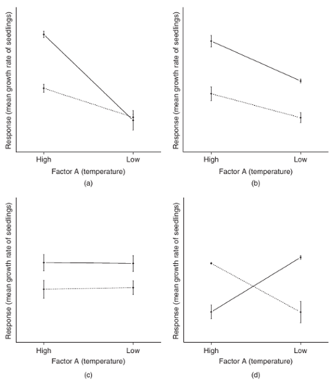
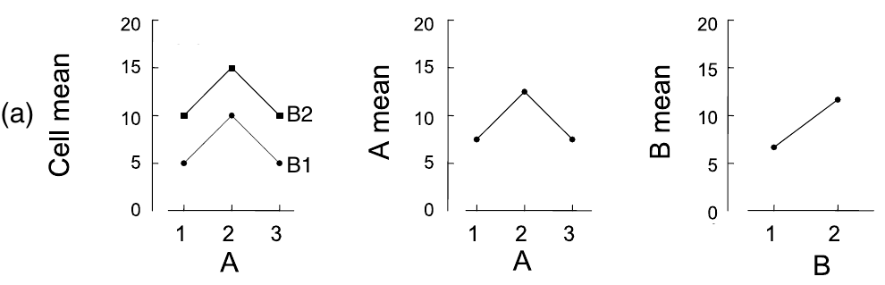
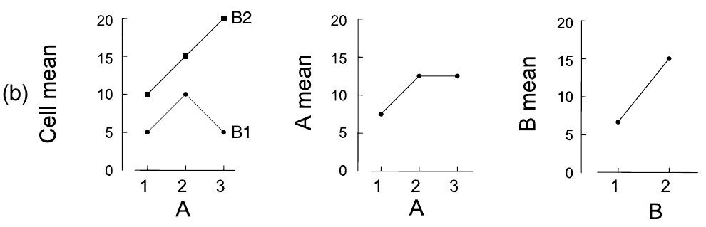
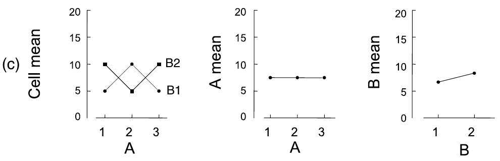
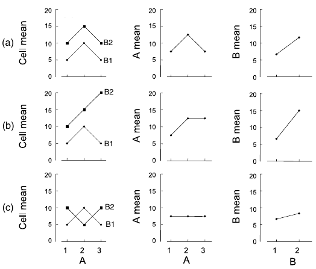

```{r setup, include = FALSE, cache = FALSE, purl = FALSE, fig.showtext = TRUE}
source("assets/xaringan_setup.R")
library(xaringanExtra)
use_tile_view()
use_scribble()
use_search(show_icon = FALSE)
use_progress_bar(color = "#6d2b5e", location = "bottom", height = "10px")
use_freezeframe()
# use_webcam()
# use_panelset()
# use_extra_styles(hover_code_line = TRUE)

# http://tachyons.io/docs/
# https://roperzh.github.io/tachyons-cheatsheet/
use_tachyons()
# use_broadcast()
```

```{r libs, include=FALSE, warning=FALSE}
library("tidyverse")
library("cowplot")
library("ggplot2")
theme_set(theme_bw(base_size = 20))
```

```{r setup1, include = FALSE, cache = FALSE, purl = FALSE}
options(knitr.kable.NA = '')
source("support_linmodr.R")
```


## Многофакторный дисперсионный анализ

- Модель многофакторного дисперсионного анализа
- Взаимодействие факторов
- Несбалансированные данные, типы сумм квадратов
- Многофакторный дисперсионный анализ в R
- Дисперсионный анализ в матричном виде

### Вы сможете

- Проводить многофакторный дисперсионный анализ и интерпретировать его результаты с учетом взаимодействия факторов

---

class: middle, center, inverse

# Данные

---

## Пример: Удобрение и беспозвоночные

Влияет ли добавление азотных и фосфорных удобрений на беспозвоночных?

Небольшие искуственные субстраты экспонировали в течение разного времени в верхней части сублиторали (Hall et al., 2000).

Зависимая переменная:

- `richness` --- Число видов

Факторы:

- `time` --- срок экспозиции (2, 4 и 6 месяцев)
- `treat` --- удобрения (добавляли или нет)

Планировали сделать 5 повторностей для каждого сочетания факторов

.small[Данные:Quinn, Keough, 2002]

---

## Знакомимся с данными

```{r}
fert <- read.csv(file='data/hall.csv')
str(fert)
# Для удобства названия переменных маленькими буквами
colnames(fert) <- tolower(colnames(fert))
# Факторы делаем факторами
fert$treat <- factor(fert$treat)
fert$time <- factor(fert$time)
```

---

## Пропущенные значения

```{r}
colSums(is.na(fert))
```

--

- Нет пропущенных значений

---

## Объемы выборок в группах

```{r}
table(fert$time, fert$treat)
```

--

- Группы разного размера

---

##   Посмотрим на график

```{r gg-mean-ci}
library(ggplot2)
theme_set(theme_bw(base_size = 14))
gg_rich <- ggplot(data = fert, aes(x = time, y = richness, colour = treat)) + 
  stat_summary(geom = 'pointrange', fun.data = mean_cl_normal)
gg_rich
```

--

- Вполне возможно, здесь есть гетерогенность дисперсий. Позже мы это проверим.

---

## Преобразовываем данные

Зависимая переменная `richness` -- это счетная величина. Она подчиняется распределению Пуассона (и чем больше ее среднее значение, тем больше дисперсия). 

Правильно было бы воспользоваться обобщенными линейными моделями с Пуассоновским распределением ошибок вместо нормального.

Но сейчас мы с вами попробуем действовать грубее (пока еще не разобрались, как это делать правильно). 

Давайте мы попробуем  преобразовать зависимую переменную, чтобы ее распределение стало больше походить на нормальное. Это может помочь, а может и нет.

```{r}
fert$log_rich <- log10(fert$richness + 1)
```

---

class: middle, center, inverse

# Многофакторный дисперсионный анализ

---

## Многофакторный дисперсионный анализ

Дисперсионный анализ становится многофакторным, если в модели используется несколько дискретных факторов.

В таком анализе появляется взаимодействие факторов.

Взаимодействие факторов возникает, когда у одного фактора эффект разный в зависимости от уровней другого.

Разберемся с этим на схемах.

---

## Что такое взаимодействие дискретных предикторов

Взаимодействие факторов - когда эффект фактора B разный в зависимости от уровней фактора A и наоборот.

На каких рисунках есть взаимодействие факторов? (.small[Logan, 2010, fig.12.2])

.pull-left[




]

--

.pull-right[

- b, c - нет взаимодействия (эффект фактора B одинаковый для групп по фактору A, линии для разных групп по фактору B на графиках расположены параллельно)
- a, d - есть взаимодействие (эффект фактора B разный для групп по фактору A, на графиках линии для разных групп по фактору B расположены под наклоном).

]


---

## Влияют ли главные эффекты и взаимодействие?


.small[Quinn, Keough, 2002, fig.9.3]

--

- взаимодействие не значимо, и не мешает интерпретировать эффекты факторов.
  - фактор А влияет
  - фактор В влияет

---

## Влияют ли главные эффекты и взаимодействие?



.small[Quinn, Keough, 2002, fig.9.3]

--

- взаимодействие значимо и мешает интерпретировать влияние факторов отдельно:
    - для В2 зависимая переменная возрастает с изменением уровня А
    - для В1 зависимая переменная возрастает только на А2, но не различается на А1 и А3
- __если смотреть на главные эффекты, можно сделать неправильные выводы (о факторе А)__:
    - фактор А влияет, группы А2 и А3 не отличаются
    - фактор В влияет, в группе В2 зависимая переменная больше, чем в В1


---

## Влияют ли главные эффекты и взаимодействие?



.small[Quinn, Keough, 2002, fig.9.3]

--

- взаимодействие значимо и мешает интерпретировать влияние факторов отдельно:
    - на уровне A2 меняется порядок различий уровней фактора B
- __если смотреть на главные эффекты, можно сделать неправильные выводы__:
    - факторы А и В не влияют


---

## Взаимодействие факторов может маскировать главные эффекты

.pull-left[



.small[Quinn, Keough, 2002, fig.9.3]

]

.pull-right[

Если есть значимое взаимодействие, то 
- главные эффекты обсуждать  не имеет смысла  
- пост хок тесты проводятся только для ваимодействия

]

---

class: middle, center, inverse

# Двухфакторный дисперсионный анализ <br/> в параметризации индикаторов

---

## Переменные-индикаторы

В нашем примере отклик --- видовое богатство, и два дискретных фактора: 

--

- `treat` --- 2 уровня (базовый `control`), для кодирования нужна одна переменная.
```{r}
contr.treatment(levels(fert$treat))
```

--

-  `time` --- 3 уровня (базовый `2`), для кодирования нужно две переменных.

```{r}
contr.treatment(levels(fert$time))
```

---

## Переменные-индикаторы

Дополнительные переменные понадобятся, чтобы учесть взаимодействие факторов.

Фрагмент модельной матрицы:

treat <br/>  | time <br/>  | treatnutrient <br/>  $x_1$  | time4 <br/> $x_2$ | time6 <br/> $x_3$| treatnutrient:time4 <br/> $x_4$ | treatnutrient:time6 <br/> $x_5$
---- | ---- | ---- | ---- | ---- | ---- | ---- 
control   |  2   | 0 | 0 | 0 | 0 | 0          
nutrient  |  2   | 1 | 0 | 0 | 0 | 0
control   |  4   | 0 | 1 | 0 | 0 | 0          
nutrient  |  4   | 1 | 1 | 0 | 1 | 0
control   |  6   | 0 | 0 | 1 | 0 | 0          
nutrient  |  6   | 1 | 0 | 1 | 0 | 1

---

## Уравнение линейной модели в параметризации индикаторов

$$y _{i} = b _0 + b _1 x _{1i} + b _2 x _{2i} + b _3 x _{3i} + b _4 x _{4i} + b _5 x _{5i}+ e _{i}$$


- $b_0$ --- значение отклика для контроля через 2 месяца (на базовом уровне обоих факторов)

Отклонения относительно базового уровня обоих факторов:

- $b_1$ --- для удобренных площадок
- $b_2$ и $b_3$ --- для площадок с экспозицией 4 или 6 мес
- $b_4$ и $b_5$ --- для удобренных площадок с экспозицией 4 или 6 мес

---

## Подбираем линейную модель <br/> в параметризации индикаторов (contr.treatment)

```{r purl=FALSE}
mod_treatment <- lm(log_rich ~ treat * time, data = fert)
mod_treatment
```

Общее уравнение модели

$$\begin{aligned}\widehat{log\_rich} _{i} = 0.828 + 0.05 treat_{nutrient\,i} + 0.463 time_{4\,i} + 0.603 time_{6\,i} + \\ + 0.138 treat_{nutrient}\ time_{4\,i} + 0.046 treat_{nutrient}\ time_{6\,i} \end{aligned}$$

---

class: middle, center, inverse

# Двухфакторный дисперсионный анализ в параметризации эффектов

---

## Переменные-эффекты

В нашем примере отклик --- видовое богатство, и два дискретных фактора: 

--

- `treat` --- 2 уровня (базовый `control`), для кодирования нужна одна переменная.
```{r}
contr.sum(levels(fert$treat))
```

--

-  `time` --- 3 уровня (базовый `2`), для кодирования нужно две переменных.

```{r}
contr.sum(levels(fert$time))
```

---

## Переменные-эффекты

Дополнительные переменные понадобятся, чтобы учесть взаимодействие факторов.

Фрагмент модельной матрицы:

treat | time | treat1 <br/> $x_1$ | time1 <br/> $x_2$ | time2 <br/> $x_3$ | treat1:time1 <br/> $x_4$ | treat1:time2 <br/> $x_5$
---- | ---- | ---- | ---- | ---- | ---- | ----
control   |  2   |  1 |  1 |  0 |  1 |  0           
nutrient  |  2   | -1 |  1 |  0 | -1 |  0 
control   |  4   |  1 |  0 |  1 |  0 |  1           
nutrient  |  4   | -1 |  0 |  1 |  0 | -1 
control   |  6   |  1 | -1 | -1 | -1 | -1           
nutrient  |  6   | -1 | -1 | -1 |  1 |  1 

---

## Уравнение линейной модели в параметризации эффектов

$$y _{i} = b _0 + b _1 x _{1i} + b _2 x _{2i} + b _3 x _{3i} + b _4 x _{4i} + b _5 x _{5i}+ e _{i}$$

- $b_0$ --- среднее значение отклика по всем данным

Отклонения от общего среднего значений отклика:

- $b_1$ --- в зависимости от тритмента (фактор `treat`)
- $b_2$ и $b_3$ --- в зависимости от экспозиции (фактор `time`)
- $b_4$ и $b_5$ --- для тритментов в зависимости от экспозиции  (взаимодействие)

---

## Подбираем линейную модель <br/> в параметризации эффектов (contr.sum)

```{r purl=FALSE}
mod_sum <- lm(log_rich ~ treat * time, data = fert,
              contrasts = list(treat = 'contr.sum', time = 'contr.sum'))
mod_sum
```

Общее уравнение модели

$$\begin{aligned}\widehat{log\_rich}_i = 1.24 -0.056 treat_{1\,i} -0.386 time_{1\,i} + 0.146 time_{2\,i} + \\ + 0.031 treat_{1\,i}time_{1\,i} -0.038 treat_{1\,i}time_{2\,i} \end{aligned}$$

---

class: middle, center, inverse

# Диагностика линейной модели

---

## Диагностика линейной модели 

Нужно проверить, выполняются ли условия применимости <br/> для модели в нужной параметризации

Данные для анализа остатков

```{r R.options=list(width = 60)}
mod_treatment_diag <- fortify(mod_treatment) # функция из пакета ggplot2
head(mod_treatment_diag, 2)
```

---

## График расстояния Кука

```{r cooksd}
ggplot(mod_treatment_diag, aes(x = 1:nrow(mod_treatment_diag), y = .cooksd)) +
  geom_bar(stat = 'identity')
```

--

- Влиятельных наблюдений нет.

---

## График остатков от предсказанных значений


```{r resid-fitted}
gg_resid <- ggplot(data = mod_treatment_diag, aes(x = .fitted, y = .stdresid)) +
  geom_point() + geom_hline(yintercept = 0)
gg_resid
```

--

- Влиятельных наблюдений нет (все в пределах 3 SD).

---

## График зависимости остатков от предикторов в модели

.pull-left[

```{r resid-predictors}
ggplot(data = mod_treatment_diag, aes(x = treat, y = .stdresid, colour = time)) +
  geom_boxplot() + geom_hline(yintercept = 0)
```


Удобнее смотреть на боксплот.

]

--

.pull-right[

- Видна гетерогенность дисперсии. 

В данном случае это не страшно, т.к. дисперсионный анализ устойчив к ситуации, когда в одной из групп разброс меньше, чем в других (особенно, если данные не слишком несбалансированные) (Underwood, 1997, McGuinness, 2002)

]

---

## Квантильный график остатков

```{r qq-plot, echo=TRUE, purl=TRUE, eval=FALSE}
library(car)
qqPlot(mod_treatment, id = FALSE) # функция из пакета car
```

```{r qq-plot1, echo=FALSE, purl=FALSE, fig.width=5.5, fig.height=3.5}
library(car)
op <- par(mar = c(3, 3, 0.5, 0.5))
qqPlot(mod_treatment, id = FALSE)
par(op)
```

--

- Отклонений от нормального распределения нет.

---

class: segue-yellow

# Несбалансированные данные, типы сумм квадратов

---

## Несбалансированные данные - когда численности в группах по факторам различаются

.pull-left[

Например так,

|    | A1 | A2 | A3 |
|----|----|----|----|
| B1 |  5 | 5  |  5 |
| B2 |  5 | 4  |  5 |

]

.pull-right[

или так,


|    | A1 | A2 | A3 |
|----|----|----|----|
| B1 |  3 | 8  |  4 |
| B2 |  4 | 7  |  4 |

]

---

## Проблемы из-за несбалансированности данных

- Оценки средних в разных группах с разным уровнем точности (Underwood 1997)

- ANOVA менее устойчив к отклонениям от условий применимости (особенно от гомогенности дисперсий) при разных размерах групп (Quinn Keough 2002, section 8.3)

- Проблемы с расчетом мощности. Если $\sigma _{\epsilon}^2 > 0$ и размеры выборок разные, то $MS _{x} \over MS _{e}$ не следует F-распределению (Searle et al. 1992).  


<br/>

--

Старайтесь _планировать_ группы равной численности!
Но если не получилось - не страшно:
- Для фикс. эффектов неравные размеры - проблема при нарушении условий применимости только, если значения доверительной вероятности _p_ близки к выбранному критическому уровню значимости $\alpha$

---

## Суммы квадратов в многофакторном дисперсионном анализе со взаимодействием

--

### Если данные сбалансированы, то ...

- взаимодействие и эффекты факторов независимы (в любой параметризации),
- все суммы квадратов и соответствующие тесты можно посчитать в одном анализе,
- результат не зависит от порядка включения факторов в модель.

--

### Если данные несбалансированы, то ...

- суммы квадратов для факторов не равны общей сумме квадратов,
- для вычислений используется регрессионный подход (несколько сравнений вложенных моделей),
- результат анализа может зависеть от порядка включения факторов в модель. 

---

## Порядок тестирования значимости предикторов в дисперсионном анализе


"Типы сумм квадратов" | I тип | II тип | III тип
---- | ---- | ---- | ---- 
Название | Последовательный | Без учета взаимодействий высоких порядков | Иерархический

---

## Порядок тестирования значимости предикторов <br/> в дисперсионном анализе

.small[

"Типы сумм квадратов" | I тип | II тип | III тип
---- | ---- | ---- | ---- 
Название | Последовательный | Без учета взаимодействий высоких порядков | Иерархический
Порядок расчета SS | SS(A) <br/> SS(B&#124;A)  <br/> SS(AB&#124;B, A) | SS(A&#124;B) <br/> SS(B&#124;A) <br/> SS(AB&#124;B, A) | SS(A&#124;B, AB) <br/> SS(B&#124;A, AB) <br/> SS(AB&#124;B, A)
Величина эффекта зависит от выборки в группе | Да | Да | Нет
Результат зависит от порядка включения факторов в модель | Да | Нет | Нет
Параметризация | Любая | Любая | Только параметризация эффектов
Команда R | aov(), anova() | Anova() (пакет car) |  Anova() (пакет car)

__Осторожно!__ Тестируя предикторы в разном порядке, вы тестируете разные гипотезы!

]

---

## Если несбалансированные данные, выберите подходящий порядок тестирования гипотез

<!-- - SSe и SSab всегда рассчитываются одинаково, вне зависимости от порядка тестирования гипотез и от сбалансированности данных -->
<!-- - SSa, SSb --- есть три способа расчета (суммы квадратов I, II и III типа, терминология пришла из SAS) в зависимости от порядка тестирования значимости факторов -->


### Если данные сбалансированы, то ...

- При использовании любого типа сумм квадратов результаты расчетов будут одинаковы.

### Если данные несбалансированы, то ...

- Результаты зависят от выбранного типа сумм квадратов (т.к. он определяет, какие гипотезы при этом тестируются).

<br/>

Для несбалансированных данных иногда рекомендуют __суммы квадратов III типа__ если есть взаимодействие факторов (Maxwell & Delaney 1990, Milliken, Johnson 1984, Searle 1993, Yandell 1997, Glantz, Slinker 2000). Но при этом __нарушается принцип маргинальности__, поэтому некоторые статистики не любят тех, кто так делает...

---

class: middle, center, inverse

# Многофакторный дисперсионный анализ в R

---

## Дисперсионный анализ со II типом сумм квадратов

При таком способе, сначала тестируется взаимодействие, затем отдельные факторы в модели без взаимодействия.

```{r}
mod_treatment <- lm(log_rich ~ treat * time, data = fert)
library(car)
Anova(mod_treatment, type = 'II')
```

---

## Дисперсионный анализ c III типом сумм квадратов

.small[

Опишем процедуру на тот случай, если вдруг вам понадобится воспроизвести в R дисперсионный анализ с III типом сумм квадратов.

При этом способе вначале тестируют взаимодействие, когда все другие факторы есть в модели. Затем тестируют факторы, когда все другие факторы и взаимодействие есть в модели.

]

--

__Внимание: при использовании III типа сумм квадратов, нужно обязательно указывать тип контрастов для факторов__  
(`contrasts=list(фактор_1 = contr.sum, фактор_2=contr.sum)`).

--

```{r tidy.opts=list(width.cutoff=40)}
mod_sum <- lm(log_rich ~ treat * time, data = fert, 
            contrasts = list(treat = contr.sum, time = contr.sum))
Anova(mod_sum, type = 3)
```

---

## Почему для расчета III типа сумм квадратов обязательно использовать параметризацию эффектов ?

Для расчета III типа сумм квадратов нужно иметь возможность удалить из модели влияние предиктора, и одновременно оставить в ней взаимодействие (т.е. предикторы и взаимодействие были независимы друг от друга).

--

__В параметризации индикаторных переменных предикторы и взаимодействие коллинеарны__, т.е. суммы квадратов III типа будут рассчитаны неправильно.

```{r}
vif(mod_treatment)
```

--

__В параметризации эффектов переменных предикторы и взаимодействие независимы__, значит получатся верные суммы квадратов III типа.

```{r}
vif(mod_sum)
```

---

class: segue-yellow

# Пост хок тест для взаимодействия факторов

---

## Пост хок тесты в многофакторном дисперсионном анализе

- Поскольку взаимодействие достоверно, факторы отдельно можно не тестировать. Проведем пост хок тест по взаимодействию, чтобы выяснить, какие именно группы различаются

- Если бы взаимодействие было недостоверно, мы бы провели пост хок тест по тем факторам, влияние которых было бы достоверно. Как? См. предыдущую презентацию.

---

## Пост хок тест для взаимодействия факторов

Пост хок тест для взаимодействия факторов делается легче всего "обходным путем" 

1. Создаем переменную-взаимодействие 
2. Подбираем модель без свободного члена
3. Делаем пост хок тест для этой модели

---

## Задание 1

Дополните этот код, чтобы посчитать пост хок тест Тьюки по взаимодействию факторов


```{r eval=FALSE, purl=TRUE}
# Создаем переменную-взаимодействие
fert$treat_time <- interaction(fert$treat, fert$time)
# Подбираем линейную модель от этой переменной без свободного члена
fit_inter <- lm()
# Делаем пост хок тест для этой модели
library(multcomp)
dat_tukey <- glht(, linfct = mcp( = 'Tukey'))
summary()
```

---

## Решение

```{r phoc, eval=FALSE, purl=FALSE}
# Создаем переменную-взаимодействие
fert$treat_time <- interaction(fert$treat, fert$time)
# Подбираем линейную модель без свободного члена
fit_inter <- lm(log_rich ~ treat_time - 1, data = fert)
# Делаем пост хок тест для этой модели
library(multcomp)
dat_tukey <- glht(fit_inter, linfct = mcp(treat_time = 'Tukey'))
summary(dat_tukey)
```

---

## Результаты пост хок теста в виде таблицы почти нечитабельны

```{r phoc, echo=FALSE, purl=FALSE}
```

---

## Данные для графика при помощи `predict()`

У нас два дискретных фактора, поэтому вначале используем `expand.grid()`

```{r}
MyData <- expand.grid(treat = levels(fert$treat),
                      time = levels(fert$time))
MyData <- data.frame(
  MyData,
  predict(mod_treatment, newdata = MyData, interval = 'confidence')
  )
# Обратная трансформация (не забываем про единичку, которую прибавляли)
MyData$richness <- 10^MyData$fit - 1
MyData$LWR <- 10^MyData$lwr - 1
MyData$UPR <- 10^MyData$upr - 1
MyData
```

---

## Задание 2

Создайте MyData вручную для модели в обычной параметризации:

- предсказанные значения 
- стандартные ошибки
- верхнюю и нижнюю границы доверительных интервалов

```{r eval=FALSE}
MyData <- expand.grid(treat = levels(fert$treat),
                     time = levels())
X <- model.matrix(~ , data = )
betas <- coef()
MyData$fit <- 
MyData$se <-   (X %*% vcov(mod_treatment) %*% t(X))
MyData$lwr <- MyData$ - 2 * 
MyData$upr <- MyData$ + 2 * 

# Обратная трансформация
MyData$richness <- 
MyData$LWR <- 
MyData$UPR <- 
MyData
```


```{r task-mydata, purl=FALSE, echo=FALSE}
MyData <- expand.grid(treat = levels(fert$treat),
                     time = levels(fert$time))
X <- model.matrix(~ treat * time, data = MyData)
betas <- coef(mod_treatment)
MyData$fit <- X %*% betas
MyData$se <- sqrt(diag(X %*% vcov(mod_treatment) %*% t(X)))
MyData$lwr <- MyData$fit - 2 * MyData$se
MyData$upr <- MyData$fit + 2 * MyData$se
# Обратная трансформация
MyData$richness <- 10^MyData$fit - 1
MyData$LWR <- 10^MyData$lwr - 1
MyData$UPR <- 10^MyData$upr - 1
MyData
```

---

## Решение:

```{r task-mydata, purl=FALSE, echo=TRUE}
```

---

## Задание 3

Постройте график результатов, на котором будут изображены предсказанные средние значения видового богатства в зависимости от тритмента и времени экспозиции.


```{r tidy.opts=list(width.cutoff=60), eval=FALSE, purl=TRUE}
pos <- position_dodge(width = 0.2)
gg_linep <- ggplot(data = , aes()) + 
  geom_  (position = pos) +
  geom_  (aes(group = ), position = pos) +
  geom_  (position = pos, width = 0.1) 
gg_linep
```

```{r gg-lineplot, tidy.opts=list(width.cutoff=60), eval=TRUE, purl=FALSE, echo=FALSE}
pos <- position_dodge(width = 0.2)
gg_linep <- ggplot(data = MyData, aes(x = time, y = richness, 
              ymin = LWR,  ymax = UPR, colour = treat)) + 
  geom_point(position = pos) +
  geom_line(aes(group = treat), position = pos) +
  geom_errorbar(position = pos, width = 0.1) 
gg_linep
```

---

## График результатов: Линии с точками

```{r gg-lineplot, tidy.opts=list(width.cutoff=60), eval=TRUE, purl=FALSE, echo=TRUE}
```

---

## Приводим график в приличный вид

```{r tidy.opts=list(width.cutoff=60)}
gg_final <- gg_linep + labs(x = 'Экспозиция',  y = 'Число видов') + 
  scale_colour_brewer(name = '', palette = 'Dark2', 
    labels = c('Контроль', 'Эксперимент'))
gg_final
```

---

## Take home messages

- Многофакторный дисперсионный анализ позволяет оценить взаимодействие факторов. Если оно значимо, то лучше воздержаться от интерпретации их индивидуальных эффектов

--

- Если численности групп равны, получаются одинаковые результаты вне зависимости от порядка тестирования значимости факторов

--

- В случае, если численности групп неравны (несбалансированные данные), есть несколько способов тестирования значимости факторов (I, II, III типы сумм квадратов)

---

## Дополнительные ресурсы

- Quinn, Keough, 2002, pp. 221-250
- Logan, 2010, pp. 313-359
- Sokal, Rohlf, 1995, pp. 321-362
- Zar, 2010, pp. 246-266
