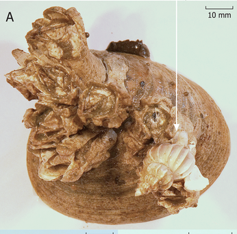
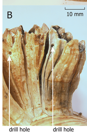
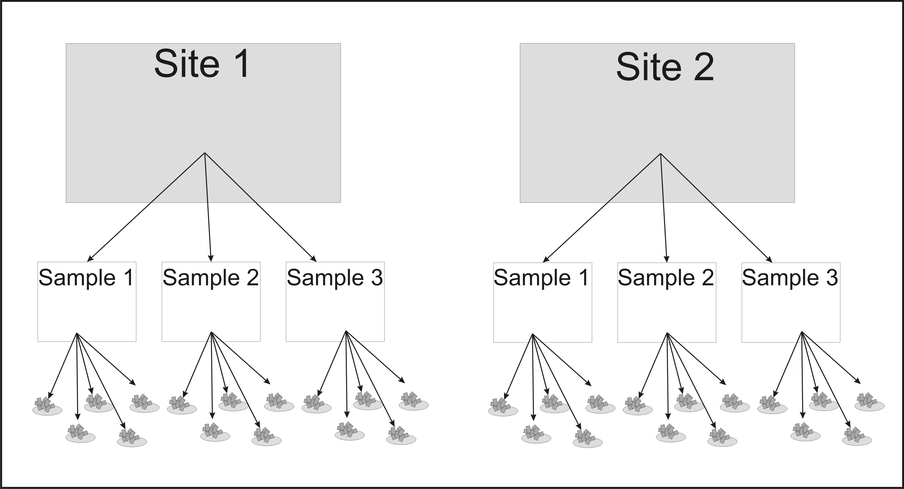
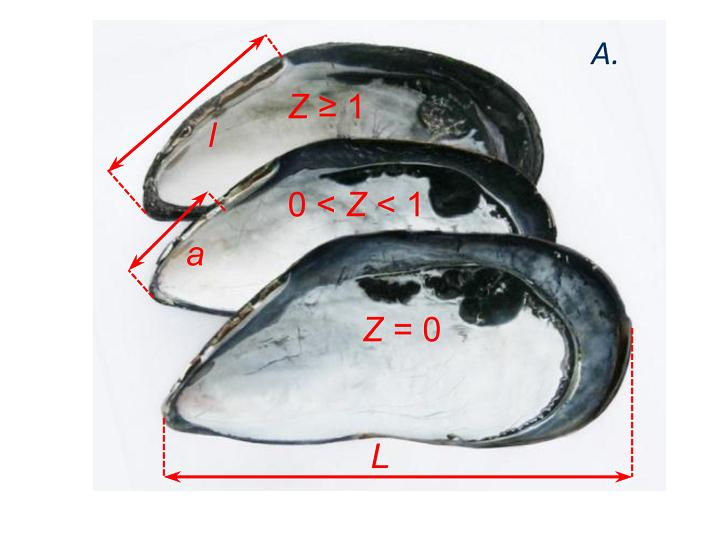

## Вы узнаете

- Об обобщенных смешанных линейных моделях (GLMM) и о функциях R, которые могут их рассчитать

### Вы сможете

- Построить обобщенную смешанную модель для бинарных данных.
- Применить для построения модели функции из нескольких пакетов, реализованных в R.


```{r setup, include = FALSE, cache = FALSE, purl = FALSE}
# output options
options(width = 70, scipen = 6, digits = 3)
library(knitr)
# chunk default options
opts_chunk$set(fig.align='center', tidy = FALSE, fig.width = 7, fig.height = 3, warning = FALSE, cache = TRUE)
```


# Вспомним основные идеи работы с бинарными переменными

## Вопросы
>- Какое распределение используют при работе с бинарными данными? 
>- Сколько параметров в функции плотности вероятности этого распределения? 
>- В каком соотношении находятся матожидание и дисперсия этого распределения?

## Биномиальное распределение

$f(y; N, \pi) = \frac{N!}{y! \times (N-y)!} \times \pi^y \times (1 - \pi)^{N-y}$

<div class="columns-2">

<small>

Пределы варьирования

$0 \le Y \le +\infty$, &emsp; $Y$ **целочисленные**

</small>


```{r, echo=FALSE, fig.width=5, fig.height=4}
library(ggplot2)
mu1 <- 0.1
mu2 <- 0.5
N1 <- 10
N2 <- 30

y <- 0:30
pi <- data.frame(y = rep(y, 4), pi = c(dbinom(y, size = N1, prob = mu1), dbinom(y,  size = N1, prob = mu2), dbinom(y,  size = N2, prob = mu1), dbinom(y,  size = N2, prob = mu2)),  mu = rep(c(mu1, mu2), each = 2*length(y)), N = rep(c(N1, N2, N1, N2), each = length(y)))

ggplot(pi, aes(x = y, y = pi)) + geom_bar(stat = "identity") + facet_grid(N~mu,  scales = "free_y", labeller = label_both) + ggtitle("Биномиальное распрделение \n при разных параметрах") + ylab("Плотность вероятности (f)")

```


### Два параметра ($N$, $\pi$)

Среднее: &emsp;&emsp; $E(Y)  = N \times \pi$  
Дисперсия: $var(Y) = N \times \pi \times (1-\pi)$  
Параметр $N$ определяет количество объектов в испытании  
Парметр $\pi$ - вероятность события ($y = 1$)

</div>

##Вопросы 
>- Что такое шансы?
<br><br>
>- Что такое логиты?
<br><br>
>- Какую связывающую функцию обычно используются при работе с бинарными перменными отклика?

##Шансы и логиты   
Дискретный отклик: 1 или 0    
<br><br>
Вероятност события: $\pi = \frac{N_i}{N_{total}}$   
<br><br>
Шансы (odds): $odds=\frac{\pi}{1-\pi}$   
<br><br>
_Логиты_ (logit):  $ln(odds)=\ln(\frac{\pi}{1-\pi})$   

##Связывающая функция для бинарных перменных отклика

Каноническая связывающая функция - *логит-функция*: $\eta(\pi)=\ln(\frac{\pi}{1-\pi})$

`family = binomial(link = "logit")`

Помимо логит-функции можно применить еще несколько:

*Complementary Log-Log* связывающая функция : $\eta(\pi)=\ln(-\ln(1-\pi))$  
`family = binomial(link = "cloglog")`    

*Пробит* - связывающая фунция: $\eta(\pi)=\Phi^{-1}(\pi)$

$\Phi$ - кумулятивная функция нормального распределения
`family = binomial(link = "probit")`


##Что где находится на этом графике?

```{r, echo=FALSE, fig.height=5}
require(ggplot2)
x <- seq(1:50)
dat <- data.frame(y = NA, x = NA)
for(i in 1:length(x)) {d <- data.frame(y = rbinom(8, 1, 0.02*i), x = i)
dat <- rbind(dat, d)}

M <- glm(y ~ x, data = dat, family = "binomial")
dat<-dat[-1,]

dat_fr <- data.frame(x = unique(dat$x), y = tapply(dat$y, dat$x, data = dat, FUN=mean))

ggplot(dat, aes(x = x, y = y)) + geom_smooth(method= "glm", method.args = list(family = "binomial"), color = "red", size = 2) + geom_point(aes(x = x, y = y), position = position_jitter(height = 0.01)) + geom_point(data = dat_fr, aes(x = x, y = y), size = 4, color = "blue") + labs(x = "Предиктор", y = "Переменная отклика")

```

##Разные связывающие функции
Красная линия - binomial(link = "logit")   
Синяя линия - binomial(link = "сloglog")   
Зеленая линя - binomial(link = "probit")    


```{r, echo=FALSE, fig.height=5}

M_logit <- glm(y ~ x, data = dat, family = binomial(link = "logit"))

M_cloglog <- glm(y ~ x, data = dat, family = binomial(link = "cloglog"))

M_probit <- glm(y ~ x, data = dat, family = binomial(link = "probit"))


MyData = data.frame(x = seq(min(dat$x), max(dat$x), length.out = 100 ))

MyData$Predict_logit <- predict(M_logit, newdata = MyData, type = "response") 
MyData$Predict_cloglog <- predict(M_cloglog, newdata = MyData, type = "response") 
MyData$Predict_probit <- predict(M_probit, newdata = MyData, type = "response") 


ggplot(MyData, aes(x = x)) + geom_line(aes(y = Predict_logit), color = "red") + geom_line(aes(y = Predict_cloglog), color = " blue") + geom_line(aes(y = Predict_probit), color = "green") + geom_point(data = dat_fr, aes(x = x, y = y), size = 2, color = "blue") + labs(x = "Предиктор", y = "Переменная отклика")
  

```


#Построение модели для бинарной переменной отклика
## Морские желуди: Кого съедят бореотрофоны? {.smaller .columns-2}
Данные взяты из работы    
Yakovis Y., Artemieva A. "Bored to Death: Community-Wide Effect of Predation on a Foundation Species in a Low-Disturbance Arctic Subtidal System" PLOS, 2015. DOI: 10.1371/journal.pone.0132973    
  
 

 


##Вопрос: от каких факторов зависит будет ли атакован балянус хищником?
Мы будем оценивать связь вероятности гибели балянуса от нападения *Boreotrophon clathratus*.   


###Дизайн сбора материала 

 


##Читаем данные

```{r}
bal <- read.table("data/Yakovis2.csv", header = TRUE, sep = ";")
```

```{r}
#Some housekeeping
bal$Site <- factor(bal$Site)
bal$Sample <- factor(bal$Sample)
bal$Substrate_ID <- factor(bal$Substrate_ID)

```


##Переменные 

`Site` -точка сбора материала    
`Sample` - квдарат 1х1 м, на котором производился сбор друз   
`BorN` - количество *Boreotrophon clathratus* на квадрате   
`Substrate_ID` - Номер друзы   
`ALength` - Диаметр апертуры   
`Age` - Возраст балянуса   
`Position` - Расположение балянуса (первичный субстрат/вторичный субстрат)   
`Status` - живой/мертвый 
<br> <br>
`Drill` - Зависимая переменная (0 - нет следов сверления; 1 - есть следы сверления)

###Для ответа на поставленный вопрос целесообразно работать с мертвыми особями

##Задание

Вычислите какая доля живых и мертвых особей несет следы сверления

##Решение

```{r}
bal1 <- bal[bal$Status == "live_barnacle", ]
mean(bal1$Drill ==1) 

```

```{r}
bal2 <-  bal[bal$Status == "empty_test", ]
mean(bal2$Drill == 1) 
```


## Задание 
###Напишите код, который задаст формулу для фиксированной части модели 

##Решение
```{r}
Fix_effect <- formula(Drill ~ BorN + ALength + Age + Position + Site)
```

## Задание 
###Напишите код, который задаст формулу для случайной части модели 

##Решение

```{r}
Rand_effect <- formula(~1|Sample/Substrate_ID)

```


##Согласно дизайну сбора материала, необходимо построить обобщенную смешанную линейную модель (GLMM)

Функция максимального правдоподобия для GLMM     

$$Lik(\beta, D) = \Pi_i\int f(Y_i|b_i)\times f(b_i)db_i$$

Вычисление максимума функции правдоподобия для GLMM может производиться только в численном виде (аналитическое решение невозможно). Поэтому все алгоритмы очень затратны по времени.  

##Инструменты `R`, позволяющие подобрать GLMM

Пакет         | Функция     | Особенности работы функции   
|-------------|-------------|-------------|  
`MASS` | `glmPQL()` | Использует penalised quasi-likelihood (PQL) алгоритм, следовательно не выдает AIC. Выбор оптмальной модели может производиться только на основе оценок статистической значимсоти параметров (критерий Вальда). Работает быстро.    
`glmmML`  | `glmmML()` | Выдает значение AIC. Может использовать только один уровень группирующих факторов. Работает быстро.   
`lme4` |  `glmer()`  | Выдает значение AIC. Работает медленно. При сложных моделях часто не сходится.    
`glmmADMB`  | `glmmadmb()` | Выдает значение AIC. Работает ОЧЕНЬ медленно (Для сложных моделей и бльших объемов данных до нескольких часов).  


**Важно!**Во всех случаях надо с осторожостью принимать решения при уровнях значимости близкх к 5%!   
Альтернативный подход к построению сложных моделей - использование методов **Байесовской статистики**

##Подбираем модель с помощью функции `glmmPQL`

```{r, eval=FALSE, message=FALSE}
library(MASS)

M1_PQL <- glmmPQL(Fix_effect, random = ~1|Sample/Substrate_ID, 
                  data = bal2, 
                  family = "binomial")
```


```{r, echo=FALSE, cache=TRUE}
library(MASS)
M1_PQL <- glmmPQL(Fix_effect, random = Rand_effect, data = bal2,family = "binomial", verbose = FALSE)
# Коэффициенты
C_glmmPQL <- round(nlme::fixed.effects(M1_PQL), 3)
```

##Результаты {.smaller}
```{r}
summary(M1_PQL)

```

##Подбираем модель с помощью функции `glmmML()`

```{r, message=FALSE, cache=TRUE}
library(glmmML)
M1_ML <- glmmML(Fix_effect, cluster = Substrate_ID, data = bal2)
M2_ML <- glmmML(Fix_effect, cluster = Sample, data = bal2)
# Коэффициенты
C_glmmML_1 <- round(as.numeric(coefficients(M1_ML)), 3)
C_glmmML_2 <- round(as.numeric(coefficients(M2_ML)), 3)

```

##Результаты первой модели

```{r}
glmmML::summary.glmmML(M1_ML)
```

##Результаты второй модели

```{r}
glmmML::summary.glmmML(M2_ML)
```


##Подбираем модель с помощью функции `glmer()`


```{r, message=FALSE, cache=TRUE}
library(lme4)
M1_glmer <- glmer(Drill ~ BorN + ALength + Age + Position + Site +
                    (1|Sample/Substrate_ID), data = bal2, 
                  family = "binomial") 

C_glmer <- round(lme4::fixef(M1_glmer), 3)
```

##Результаты {.smaller .columns-2}
```{r}
summary(M1_glmer)
```


##Сравним коэффициенты, подобранные разными функциями 

```{r echo=FALSE, eval=FALSE}
data.frame(C_glmmPQL, C_glmmML_1, C_glmmML_2, C_glmer)
```

<pre>
          Parameter glmmPQL glmmML_1  glmmML_2  glmer
1       (Intercept)  -4.119   -4.367   -4.152  -4.404
2              BorN   0.072    0.087*   0.117*  0.094*
3           ALength   0.148*   0.132*   0.065   0.127*
4               Age  -0.100   -0.068    0.036  -0.061
5 Positionsecondary   1.261*   1.297*   1.224*  1.306*
6             Site2  -0.298   -0.290    0.205  -0.231


</pre>

###Выбор на совести исследователя!

##Выбор оптимальной модели

```{r, cache=TRUE}
drop1(M1_glmer)
```

##Выбор оптимальной модели
```{r, cache=TRUE}
M2_glmer <- update(M1_glmer, .~.- Site)
anova(M1_glmer, M2_glmer)
```


##Выбор оптимальной модели

```{r, cache=TRUE}
drop1(M2_glmer)
```

##Выбор оптимальной модели

```{r, cache=TRUE}
M3_glmer <- update(M2_glmer, .~.-Age)
anova(M2_glmer, M3_glmer)
```


##Выбор оптимальной модели

```{r, cache=TRUE}
drop1(M3_glmer)
```

##Результаты {.smaller}

```{r}
summary(M3_glmer)
```

##Проверка валидности модели

```{r, fig.height=5}
plot(M3_glmer)
```


##Проверка валидности модели {.smaller}

```{r, echo=FALSE, message=FALSE, warning=FALSE, fig.height=5}
library(ggplot2)
library(gridExtra)
diagnost <- data.frame(.fitted = fitted(M3_glmer), .resid = residuals(M3_glmer, type ="pearson"))

diagnost<-cbind(diagnost, bal2)

Pl1 <- ggplot(diagnost, aes(x = .fitted, y = .resid)) + geom_point() + geom_smooth(se=F)

Pl2 <- ggplot(diagnost, aes(x = BorN, y = .resid)) + geom_point() + geom_smooth(method = "loess", se=F)

Pl3 <- ggplot(diagnost, aes(x = ALength, y = .resid)) + geom_point() + geom_smooth( se=F)

Pl4 <- ggplot(diagnost, aes(x = Position, y = .resid)) + geom_boxplot()

grid.arrange(Pl1, Pl2, Pl3, Pl4, ncol = 2)


```

##Функция для проверки наличия избыточности дисперсии (overdispersion) в модели {.smaller}

из http://glmm.wikidot.com/faq


```{r}
overdisp_fun <- function(model) {
  ## number of variance parameters in 
  ##   an n-by-n variance-covariance matrix
  vpars <- function(m) {
    nrow(m)*(nrow(m)+1)/2
  }
  model.df <- sum(sapply(VarCorr(model),vpars))+length(fixef(model))
  rdf <- nrow(model.frame(model))-model.df
  rp <- residuals(model,type="pearson")
  Pearson.chisq <- sum(rp^2)
  prat <- Pearson.chisq/rdf
  pval <- pchisq(Pearson.chisq, df=rdf, lower.tail=FALSE)
  c(chisq=Pearson.chisq,ratio=prat,rdf=rdf,p=pval)
}

```


## Проверка на избыточность дисперсии

```{r}
overdisp_fun(M3_glmer)
```


##Визуализация предсказаний модели {.smaller}

```{r, echo=FALSE, fig.height=5}
MyData <- expand.grid(BorN = seq(min(bal2$BorN), max(bal2$BorN)),
                      ALength = seq(min(bal2$ALength), max(bal2$ALength)),
                      Position = levels(bal2$Position)) 
                      

MyData$Predicted <- predict(M3_glmer,newdata = MyData, type = "response", re.form = NA)

ggplot(MyData, aes(x = ALength, y = Predicted, color = BorN)) + geom_line(aes(group = BorN), size = 1.5) + facet_grid(~Position, labeller = label_both) + scale_color_gradient(low = "green", high = "red")

```

#Строим модель для идентификации криптических видов

## Можно ли по морфологическим признакам идентифицировать вид мидии? {.smaller .columns-2}
 
Данные взяты из работы M.Katolikova, V.Khaitov, R.Väinölä, M.Gantsevich, P.Strelkov "Genetic, Ecological and Morphological Distinctness of the Blue Mussels *Mytilus*
*trossulus* Gould and *M. edulis* L. in the White Sea" PLOS ONE DOI:10.1371/journal.pone.0152963


 


Нас интересует, можно ли определить вид мидии, используя Z-идекс?


##Данные

**population** - идентификатор поселения, где проводились сборы   
**L** - длина моллюска     
**Z** - Z-индекс    
**structure** - индекс STRUCTURE (Вероятность встретить гены *M.trossulus* в генотипе данной особи)

```{r}
myt <- read.table("data/myt_gen_morph.csv", header = TRUE, sep = ";")
head(myt)
```

##Вводим бинарную переменную

Задание: Создайте в датасете переменную `Sp` в которой 1 будет кодировать особей с индексом `structure` $\geq$ 0.5 (*M.trossulus*), а 0 - особей с индексом `structure` $<$ 0.5 (*M.edulis*)

##Вводим бинарную переменную
Решение

```{r}
myt$Sp [myt$structure >= 0.5] <- 1
myt$Sp [myt$structure < 0.5] <- 0

```


##Особенности данных

>- Исследовано 26 популяций.     
>- Мидии из одной популяции могут быть более похожими друг на друга, чем мидии из разных популяций.    
>- Нарушение независимости выборок.    
>- Нужна модель со смешанными эффектами, основанная на биномиальном распределении.


##Строим модель
Задание: Напишите код, необходимый для расчетов параметров модели 


##Строим модель {.smaller}

```{r}
Myt_M1 <- glmer(Sp ~ Z + (1|population), data = myt, 
                  family = "binomial")
summary(Myt_M1)
```

##Диаграмма рассеяния остатков 
```{r, echo = FALSE, message=FALSE, fig.height=5 }
diagnost <- data.frame(.fitted = fitted(Myt_M1), .resid = residuals(Myt_M1, type ="pearson"))

diagnost<-cbind(diagnost, myt)

Pl1 <- ggplot(diagnost, aes(x = .fitted, y = .resid)) + geom_point() + geom_smooth(se=F)

Pl2 <- ggplot(diagnost, aes(x = Z, y = .resid)) + geom_point() + geom_smooth(method = "loess", se=F)

Pl3 <- ggplot(diagnost, aes(x = L, y = .resid)) + geom_point() + geom_smooth( se=F)


grid.arrange(Pl1, Pl2, Pl3, ncol = 2)

```


##Проверка на избыточность дисперсии

```{r}
overdisp_fun(Myt_M1)
```

Необходима корректировка модели!

Ваши предложения?

##Пробуем добавить ковариату

```{r}
Myt_M2 <- glmer(Sp ~ Z + L + (1|population), data = myt, 
                  family = "binomial")

overdisp_fun(Myt_M2)
```


##Модели со случайным интерсептом и случайным угловым коэффициетом (random slope and random intercept)

```{r}
Myt_M3 <- glmer(Sp ~ Z + (1 + Z|population), data = myt, 
                  family = "binomial")


Myt_M4 <- glmer(Sp ~ Z + L + (1 + Z|population), data = myt, 
                  family = "binomial")

Myt_M5 <- glmer(Sp ~ Z + L + (1 + L|population), data = myt, 
                  family = "binomial")

AIC(Myt_M1, Myt_M2, Myt_M3, Myt_M4,  Myt_M5)

```

##Проверка на избыточность дисперсии 
```{r}
overdisp_fun(Myt_M4)
```
##График рассеяния остатков
```{r, message=FALSE, echo=FALSE}
diagnost <- data.frame(.fitted = fitted(Myt_M4), .resid = residuals(Myt_M4, type ="pearson"))

diagnost<-cbind(diagnost, myt)

Pl1 <- ggplot(diagnost, aes(x = .fitted, y = .resid)) + geom_point() + geom_smooth(se=F)

Pl2 <- ggplot(diagnost, aes(x = Z, y = .resid)) + geom_point() + geom_smooth(method = "loess", se=F)

Pl3 <- ggplot(diagnost, aes(x = L, y = .resid)) + geom_point() + geom_smooth( se=F)

grid.arrange(Pl1, Pl2, Pl3, ncol = 2)
```


##Результаты {.smaller}
```{r}
summary(Myt_M4)
```

##Визуализация модели

Примем L за среднее

```{r, echo = FALSE}
# MyData <- expand.grid(Z = seq(0, max(myt$Z), length.out = 100), population = unique(myt$population), L = mean(myt$L))

MyData <- unique(myt[, c("Z", "population")])

MyData$L <- mean(myt$L)

MyData$Predict_random <- predict(Myt_M4, newdata = MyData, type = "response")

MyData2 <- data.frame (Z = seq(0, max(myt$Z), length.out = 100), L = mean(myt$L))

MyData2$Predict_fix <- predict(Myt_M4, newdata = MyData2, re.form = ~0, type = "response")

ggplot(MyData, aes(x = Z)) + geom_line(aes(y = Predict_random, group = population), color = "gray") + geom_line(data = MyData2, aes(x = Z, y = Predict_fix), color = "red", size = 2) + theme_bw() + labs(x = "Z-индекс", y = "Вероятость быть M.trossulus")

```

##На графиках, визуализирующих модель, желательно привести исходные данные {.smaller}

```{r, message=FALSE}
library(dplyr)
library(doBy)
myt$Z_class <- ntile(myt$Z, 20) 
myt_prop <- summaryBy(Z + Sp ~ Z_class, data  = myt, keep.names = T)

ggplot(MyData, aes(x = Z)) + geom_line(aes(y = Predict_random, group = population), color = "gray") + 
  geom_line(data = MyData2, aes(x = Z, y = Predict_fix), color = "red", size = 2) + theme_bw() + 
  labs(x = "Z-индекс", y = "Вероятость быть M.trossulus") + 
  geom_point(data = myt_prop, aes(x = Z, y = Sp), color = "blue", size  = 4 )

```


## Summary

- Построение обобщенных смешанных моделей (GLMM) для бинарных перменных отклика аналогично построению моделей для GLM и LMM.
- Идеального алгоритма для построения GLMM пока нет.
- Существующие ныне алгоритмы пригодны только для простых моделей.
- Очень важно проверять модель на избыточность дисперсии


## Что почитать
+ Zuur, A.F. et al. 2009. Mixed effects models and extensions in ecology with R. - Statistics for biology and health. Springer, New York, NY. 


