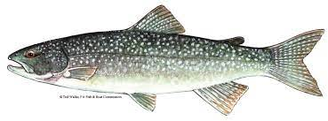

```{r setup, include = FALSE, cache = FALSE, purl = FALSE}
# output options
options(width = 80, scipen = 4, digits = 3)
library(knitr)
# chunk default options
opts_chunk$set(fig.align='center', tidy = FALSE, 
               fig.width = 9, fig.height = 3, fig.retina = 3,
               warning = FALSE, message = FALSE)
options(knitr.kable.NA = '')
source("support_linmodr.R")
```

## Общая линейная модель --- удобный инструмент описания связей

$y_i = \beta_0 + \beta_1 x_{1i} + ... + \beta_{p-1}x_{p-1\,i} + \varepsilon_i$,

где $\varepsilon_i \sim N(0, \sigma)$.

Предикторы в такой модели могут быть дискретными и непрерывными.

```{r glm, echo=FALSE, purl=FALSE}
library(ggplot2)
theme_set(theme_bw(base_size = 14))
N <- 100
set.seed(3829)
x <- rnorm(N, 5, 3)
dat <- data.frame(x = x, y = 5 + 0.8 * x + rnorm(N, 0, 1.7))
ggplot(data = dat, aes(x = x, y = y)) + geom_point(colour = 'grey20', position = position_jitter(width = 0.05)) + geom_smooth(method = 'lm')
```

---

## Применимость общих линейных моделей ограничена

<br/>

$y_i = \beta_0 + \beta_1 x_{1i} + ... + \beta_{p-1}x_{p-1\,i} + \varepsilon_i$,

где $\varepsilon_i \sim N(0, \sigma)$.

<br/>

--

Т.е. на самом деле мы имеем ввиду, что переменная-отклик подчиняется нормальному распределению:

$y_i \sim N(\mu_i, \sigma)$

$E(y_i) = \mu_i = \beta_0 + \beta_1 x_{1i} + ... + \beta_{p-1}x_{p-1\,i}$

--

Но если отклик подчиняется другому распределению, такие модели не годятся.

<br/>

Далее мы будем использовать именно этот способ записи модели (распределение отклика и линейный предиктор) мы будем использовать дальше.

---

## Обобщенные линейные модели

Обобщенные линейные модели (Generalized Linear Models, GLM, GLZ, GLIM) позволяют моделировать зависимости не только для нормально-распределенных величин, но и для других распределений.

<br/>

Не путайте обобщенные линейные модели с общими (General Linear Models, тоже сокращаются как GLM).

---

## Важнейшие распределения из семейства экспоненциальных

.pull-left[

Для непрерывных величин

- Нормальное распределение
- Гамма распределение

]

.pull-right[

Для дискретных величин

- Биномиальное распределение
- Распределение Пуассона
- Отрицательное биномиальное распределение

]

---

## Нормальное распределение

.pull-left[

```{r norm-distr, echo=FALSE, purl=FALSE, fig.width=5.5, fig.height=6}
library(ggplot2)
mu1 <- 0
mu2 <- 10
sigma1 <- 3
sigma2 <- 7
y <- seq(-20, 40, length.out = 100)
pi <- data.frame(y = rep(y, 4), pi = c(dnorm(y, mu1, sigma1), dnorm(y, mu1, sigma2), dnorm(y, mu2, sigma1), dnorm(y, mu2, sigma2)), mu = rep(c(mu1, mu2), each = 2*length(y)), sigma = rep(c(sigma1, sigma2, sigma1, sigma2), each = length(y)) )

ggplot(pi, aes(x = y, y = pi)) + geom_line(stat = "identity", colour = 'grey20', size = 1) + facet_grid(mu~sigma, labeller = label_both) + 
  # ggtitle("Нормальное распределение \nпри разных параметрах") + 
  ylab("f(y)")
```

]

.pull-right[

$$f(y)= \frac {1}{\sqrt{2 \pi \sigma^2}} \cdot e^{-\frac{1}{2 \sigma^2} (y - \mu)^2}$$
Параметры:

- $\mu$ -- среднее  
- $\sigma$ -- стандартное отклонение

<br/>

Свойства:

- $E(y)  = \mu$ -- мат.ожидание
- $var(y) = \sigma^2$ -- дисперсия
- $-\infty \le y \le +\infty$,  $y \in \mathbb R$ -- значения

]

???

Faraway J.J. (2017) Extending the linear model with R, p.154 - написано про variance functions

---

## Гамма-распределение

.pull-left[

```{r gamma-distr, echo=FALSE, purl=FALSE, fig.width=5.5, fig.height=6}
mu1 <- 3
mu2 <- 1
nu1 <- 0.1
nu2 <- 2
y <- seq(0, 10, length.out = 100)

pi <- data.frame(
  y = rep(y, 4), 
  mu = rep(c(mu1, mu2), each = 2*length(y)), 
  nu = rep(c(nu1, nu2, nu1, nu2), each = length(y)) )
pi$pi = dgamma(pi$y, pi$nu, pi$mu)

ggplot(pi, aes(x = y, y = pi)) + 
  geom_line(stat = "identity", colour = 'grey20', size = 1) + 
  facet_grid(mu ~ nu, labeller = label_both) + 
  # ggtitle("Гамма распределение при разных параметрах") + 
  ylab("f(y)")

```

]

.pull-right[

$f(y) = \frac{1}{\Gamma(\nu)}\cdot (\frac{\nu}{\mu})^{\nu} \cdot y^{\nu-1} \cdot e^{\cfrac{y \cdot \nu}{\mu}}$
Параметры:

- $\mu$ -- среднее  
- $\nu$ -- определяет степень избыточности дисперсии


<br/>

Свойства:

- $E(y) = \mu$ -- мат.ожидание
- $var(y) = \frac {\mu^2}{\nu}$ -- дисперсия
- $0 < y \le +\infty$, $y \in \mathbb R$ -- значения


]

---

## Биномиальное распределение

.pull-left[

```{r binomial-distr, echo=FALSE, purl=FALSE, fig.width=5.5, fig.height=6}
mu1 <- 0.1
mu2 <- 0.5
N1 <- 10
N2 <- 50
y <-seq(0, 35, by = 1)
pi <- data.frame(y = rep(y, 4), pi = c(dbinom(y, size = N1, prob = mu1), dbinom(y,  size = N2, prob = mu1), dbinom(y,  size = N1, prob = mu2), dbinom(y,  size = N2, prob = mu2)),  mu = rep(c(mu1, mu2), each = 2*length(y)), N = rep(c(N1, N2, N1, N2), each = length(y)))

ggplot(pi, aes(x = y, y = pi)) + geom_bar(stat = "identity", fill = 'grey20') + facet_grid(N~mu,  labeller = label_both) + 
  # ggtitle("Биномиальное распределение \nпри разных параметрах") + 
  ylab("f(y)")
```

]

.pull-right[

$$f(y) = \frac{n!}{y! \cdot (n-y)!} \cdot \pi^y \cdot (1 - \pi)^{n-y}$$

Параметры:

- $n$ -- число объектов в испытании  
- $\pi$ -- вероятность того, что $y = 1$


<br/>

Свойства:

- $E(y)  = n \cdot \pi$ -- мат.ожидание
- $var(y) = n \cdot \pi \cdot (1-\pi)$ -- дисперсия
- $0 \le y \le +\infty$, $y \in \mathbb{N}$ -- значения

]

---

## Распределение Пуассона 

.pull-left[

```{r poisson-distr, echo=FALSE, purl=FALSE, fig.width=5.5, fig.height=6}
mu1 <- 1
mu2 <- 5
mu3 <- 10
mu4 <- 20
y <- seq(0, 35, by = 1)

pi <- data.frame(
  y = rep(y, 4),  
  pi = c(dpois(y, mu1), dpois(y, mu2), dpois(y, mu3), dpois(y, mu4)), 
  mu = rep(c(mu1, mu2, mu3, mu4), each = length(y))
)

ggplot(pi, aes(x = y, y = pi)) + 
  geom_bar(stat = "identity", fill = 'grey20') + 
  facet_wrap(~ mu, nrow = 2, labeller = label_both) + 
  # ggtitle("Распределение Пуассона \nпри разных параметрах") + 
  ylab("f(y)")
```

]

.pull-right[

$$f(y)= \frac{\mu^y \cdot e^{-\mu}}{y!}$$

Параметр:

- $\mu$ -- задает среднее и дисперсию


<br/>

Свойства:

- $E(y) = \mu$ --- мат.ожидание
- $var(y) = \mu$ --- дисперсия
- $0 \le y \le +\infty$, $y \in \mathbb{N}$ --- значения


]

---

## Отрицательное биномиальное распределение

.pull-left[

```{r neg-binomial-distr, echo=FALSE, purl=FALSE, fig.width=5.5, fig.height=6}
mu1 <- 1
mu2 <- 5
k1 <- 0.1
k2 <- 100
y <- 0:30

pi <- data.frame(
  y = rep(y, 4), 
  pi = c(dnbinom(y, size = k1, mu = mu1), 
         dnbinom(y, size = k1, mu = mu2), 
         dnbinom(y, size = k2, mu = mu1), 
         dnbinom(y, size = k2, mu = mu2)), 
  mu = rep(c(mu1, mu2), each = 2*length(y)), 
  k = rep(c(k1, k2, k1, k2), each = length(y)) )

ggplot(pi, aes(x = y, y = pi)) + 
  geom_bar(stat = "identity", fill = 'grey20') + 
  facet_grid(mu~k, labeller = label_both, scales = "free_y") + 
  # ggtitle("Отрицательное биномиальное распределение \nпри разных параметрах") + 
  ylab("f(y)")
```

]

.pull-right[

$f(y) = \frac{\Gamma(y + k)}{\Gamma(k) \cdot \Gamma(y+1)} \cdot (\frac{k}{\mu + k})^k \cdot (1 - \frac{k}{\mu + k})^y$

Параметры: 

- $\mu$ -- среднее  
- $k$ -- определяет степень избыточности дисперсии

<br/>

Свойства:

- $E(y)  = \mu$ -- мат.ожидание
- $var(y) = \mu + \frac {\mu^2}{k}$ -- дисперсия
- $0 \le y \le +\infty$, $y \in \mathbb{N}$ -- значения

]

???

Это смесь Пуассоновского и Гамма распределений: $y$ подчиняется распределению Пуассона с Гамма-распределенным $\mu$. Приближается к распр. Пуассона при очень больших $k$.

---

## Обобщенные линейные модели <br/> (Generalized Linear Models)

Обобщенные линейные модели (Nelder, Weddlerburn, 1972)

- Позволяют моделировать не только величины, подчиняющиеся нормальному распределению, но и другим распределениям из семейства экспоненциальных.

- Подбор коэффициентов делается методом максимального правдоподобия.


---

## Чем отличается обобщенная линейная модель от общей?

На примере нормального распределения $f(y_i|\theta) = N(\mu_i, \sigma)$

--

### Общая линейная модель состоит из двух компонентов

$y_i \sim f(y_i|\theta)$

$E(y_i) = \mu_i = \beta_0 + \beta_1 x_{1i} + ... + \beta_{p-1}x_{p-1\,i}$

--

### Обобщенная линейная модель состоит из трех компонентов

$y_i \sim f(y_i|\theta)$ 

$E(y_i) = \mu_i = g^{-1}(\beta_0 + \beta_1 x_{1i} + ... + \beta_{p-1}x_{p-1\,i})$

$g(\mu_i) = \eta_i$

$\eta_i = \beta_0 + \beta_1 x_{1i} + ... + \beta_{p-1}x_{p-1\,i}$

- Случайная часть --- $y_i \sim f(y_i|\theta)$ --- распределение из семейства экспоненциальных с параметрами $\theta$.  
- Фиксированная часть.
- $g()$ --- функция связи, которая появляется в GLM и трансформирует мат. ожидание отклика в линейный предиктор (обратная функция обозначается $g^{-1}()$).

---

class: split-two

.row.bg-main1[.content[

## Функция связи

$y_i \sim f(y_i|\theta)$ 

$E(y_i) = \mu_i = g^{-1}(\beta_0 + \beta_1 x_{1i} + ... + \beta_{p-1}x_{p-1\,i})$

$\color{red} {g(\mu_i) = \eta_i}$

$\eta_i = \beta_0 + \beta_1 x_{1i} + ... + \beta_{p-1}x_{p-1\,i}$

<br/>

Функция связи $g(\mu)$ используется разная в зависимости от распределения $f(y_i|\theta)$

]]

--

.row.bg-main2[
.split-three[
.column[

**Идентичность:**

$E(y_i) = \mu_i \phantom{\frac{e^{\beta_0}}{1 + e^{\beta_0}}}$

$\color{red} {\mu_i = \eta_i}$

$\eta_i = \beta_0 + \beta_1 x_{1i} + ... + \\+ \beta_{p-1}x_{p-1\,i}$

]

.column[

**Логарифм:**

$E(y_i) = e^{\beta_0 + \beta_1 x_{1i} + ... + \beta_{p-1}x_{p-1\,i}} \phantom{\frac{e^{\beta_0}}{1 + e^{\beta_0}}}$

$\color{red} {ln(\mu_i) = \eta_i}$

$\eta_i = \beta_0 + \beta_1 x_{1i} + ... + \\+ \beta_{p-1}x_{p-1\,i}$

]

.column[

**Логит:** 

$E(y_i) = \frac{e^{\beta_0 + \beta_1 x_{1i} + ... + \beta_{p-1}x_{p-1\,i}}}{1 + e^{\beta_0 + \beta_1 x_{1i} + ... + \beta_{p-1}x_{p-1\,i}}}$

$\color{red} {ln\big(\frac{\mu_i}{1 - \mu_i}\big) = \eta_i}$

$\eta_i = \beta_0 + \beta_1 x_{1i} + ... + \\+ \beta_{p-1}x_{p-1\,i}$

]]]

---

## Параметры обобщенных линейных моделей подбирают методом максимального правдоподобия

Правдоподобие (likelihood) --- измеряет соответствие реально наблюдаемых данных тем, что можно получить из модели при определенных значениях параметров.

.pull-left[

```{r gg-norm-tunnel0, echo=FALSE, fig.height=4.5, purl=FALSE}
## Based on code by Arthur Charpentier:
## http://freakonometrics.hypotheses.org/9593
## TODO: wrap it into a function and adapt it for use with other distributions
## as Markus Gesmann has done here
## http://www.magesblog.com/2015/08/visualising-theoretical-distributions.html
library(boot)
data(catsM)
cat <- catsM
op <- par(mar = c(0, 0, 0, 0))
n <- 2
X <- cat$Bwt
Y <- cat$Hwt
df <- data.frame(X,Y)

# regression
reggig <- glm(Y ~ X, data = df, family = gaussian(link = "identity"))

# empty plot
vX <- seq(min(X) - 0.1, max(X) + 0.1, length = n)
vY <- seq(min(Y) - 10, max(Y) + 10, length = n)
mat <- persp(x = vX, y = vY, z = matrix(0, n, n),
             zlim = c(0, 0.1),
             theta =  -30, phi = 20, expand = 0.1,
             ticktype  = "detailed",  box = FALSE, border = "gray60")

x <- seq(min(X), max(X), length = 501)

# expected values
C <- trans3d(x, predict(reggig, newdata = data.frame(X = x), type = "response"), rep(0, length(x)), mat)
lines(C, lwd = 2)

sdgig <- sqrt(summary(reggig)$dispersion)

# 1SD
y1 <- qnorm(.95, predict(reggig, newdata = data.frame(X = x), type = "response"),  sdgig)
C <- trans3d(x, y1, rep(0, length(x)), mat)
lines(C, lty = 2, col = "#d95f02")
y2 <- qnorm(.05, predict(reggig, newdata = data.frame(X = x), type = "response"),  sdgig)
C <- trans3d(x, y2, rep(0, length(x)), mat)
lines(C, lty = 2, col = "#d95f02")

# C <- trans3d(c(x, rev(x)), c(y1, rev(y2)), rep(0, 2 * length(x)), mat)
# polygon(C, border = NA, col = "yellow")

# data points
C <- trans3d(X, Y, rep(0, length(X)), mat)
points(C, pch = 1, col = "black", cex = 0.4)

# density curves
n <- 6
vX <- seq(min(X), max(X), length = n)

mgig <- predict(reggig, newdata = data.frame(X = vX))

sdgig <- sqrt(summary(reggig)$dispersion)

for(j in n:1){
  stp <- 251
  x <- rep(vX[j], stp)
  y <- seq(min(min(Y) - 10,
               qnorm(.05,
                     predict(reggig,
                             newdata = data.frame(X = vX[j]),
                             type = "response"),
                     sdgig)),
           max(Y) + 10,
           length = stp)
  z0 <- rep(0, stp)
  z <- dnorm(y,  mgig[j],  sdgig)
  C <- trans3d(c(x, x), c(y, rev(y)), c(z, z0), mat)
  polygon(C, border = NA, col = "light blue", density = 40)
  C <- trans3d(x, y, z0, mat)
  lines(C, lty = 2, col = "grey60")
  C <- trans3d(x, y, z, mat)
  lines(C, col = "grey20")
}
par(op)
```

]
.pull-right[


Это произведение вероятностей получения каждой из точек данных:

$$L(\theta| \text{data}) = \Pi^n _{i = 1}f(\text{data}| \theta)$$

- $f(\text{data}| \theta)$ --- функция распределения с параметрами $\theta$

]

--

Нужно найти параметры  $\theta$, которые максимизируют правдоподобие:

$$L(\theta | \text{data}) \longrightarrow \text{max}$$

--

Вычислительно проще работать с логарифмами правдоподобий (loglikelihood): 

$$lnL(\theta| \text{data}) \longrightarrow \text{max}$$

Редко можно решить аналитически, обычно используются численные решения.

---

class: middle, center, inverse

# Пример -- энергетическая ценность икры

---

## Пример -- энергетическая ценность икры

Один из показателей, связанных с жизнеспособностью икры -- доля сухого вещества. Она пропорциональна количеству запасенной энергии. 

.pull-left[

Отличается ли энергетическая ценность икры большой озерной форели в сентябре и ноябре?

]

.pull-right[



]

.small[
Данные: Lantry et al., 2008   
Источник: пакет Stat2Data
]

---

## Открываем данные

```{r}
library(Stat2Data)
data(FishEggs)
```

Все ли правильно открылось?

```{r}
str(FishEggs)
```

Нет ли пропущенных значений?

```{r}
colSums(is.na(FishEggs))
```

---

## Меняем порядок уровней факторов

Уровни факторов в исходных данных:

```{r}
levels(FishEggs$Month)
```

Делаем базовым уровнем сентябрь.

```{r}
FishEggs$Month <- relevel(FishEggs$Month, ref = 'Sep')
```

Теперь уровни в хронологическом порядке:

```{r}
levels(FishEggs$Month)
```

---

## Объемы выборок

```{r}
table(FishEggs$Month)
```

---

## Ищем выбросы

```{r eval=FALSE}
library(ggplot2)
theme_set(theme_bw())
```
```{r dotplots}
library(cowplot)

gg_dot <- ggplot(FishEggs, aes(y = 1:nrow(FishEggs))) + geom_point()
plot_grid(gg_dot + aes(x = Age), 
          gg_dot + aes(x = PctDM), nrow = 1)
```


---

## Модель для описания питательной ценности икры

### GLM с нормальным распределением отклика

$y_i \sim N(\mu_i, \sigma)$  
$E(y_i) = \mu_i$  
$\mu_i = \eta_i$ --- функция связи "идентичность" (identity)  
$\eta_i = \beta_0 + \beta_1 x_{1i} + ... + \beta_{p-1}x_{p-1\,i}$

--

### Модель зависимости в примере

Как зависит питательная ценность икры от месяца вылова рыбы (сентябрь или ноябрь) с учетом ковариаты (возраста рыбы) и их взаимодействия.

$PctDM_i \sim N(\mu_i, \sigma)$  
$E(PctDM_i) = \mu_i$  
$\mu_i = \eta_i$  
$\eta_i = \beta_0 + \beta_1 Age_{i} + \beta_2 Month_{Nov\,i} + \beta_{3} Age_{i} Month_{Nov\,i}$

.small[

- $PctDM_i$ -- содержание сухого вещества в икре
- $Age_{i}$ -- возраст рыбы
- $Month_{Nov\,i}$ -- переменная-индикатор для уровня $Month_{Nov\,i} = 1$
]

???

В генеральной совокупности параметры модели $\beta_0, ..., \beta_3$.  
Подобрав модель, мы получим их оценки $b_0, ..., b_3$.


---

## Подбираем модель

```{r}
mod <- glm(PctDM ~ Age * Month, data = FishEggs)
mod
```

--

```{r}
# Чтобы записать модель, нужна еще сигма.
sigma(mod)
```

--

$PctDM_i \sim N(\mu_i, 1.24)$  
$E(PctDM_i) = \mu_i$  
$\mu_i = \eta_i$  
$\eta_i = 38.12 - 0.24 Age_{i} + 1.28 Month_{Nov\,i} + 0.02 Age_{i} Month_{Nov\,i}$

---

class: middle, center, inverse

# Диагностика модели

---

## Разновидности остатков в GLM

.pull-left[

### Остатки в масштабе отклика <br/>(response residuals)

$$e_i = y_i - E(y_i)$$
<br/>

- Это разница между наблюдаемым и предсказанным значениями.
- Аналог (и синоним) "сырых" остатков в простой линейной регрессии.

]

--

.pull-right[
### Пирсоновские остатки <br/>(Pearson's residuals)

$$r_{p\,i} = \frac{y_i - E(y_i)}{\sqrt{var(y_i)}}$$

- Это обычные остатки, деленные на стандартную ошибку предсказанного значения. 
- Аналог стандартизованных остатков в простой линейной регрессии.
]

--

.pull-left[

```{r}
resid(mod, type = 'response')[1:5]
```
]

.pull-right[
```{r}
resid(mod, type = 'pearson')[1:5]
```
]

Для GLM с нормальным распределением отклика оба типа остатков одинаковы.


---

## Условия применимости GLM с нормальным распределением отклика

--

- Случайность и независимость наблюдений внутри групп.
- Нормальное распределение остатков.
- Гомогенность дисперсий остатков.
- Отсутствие коллинеарности предикторов.

---

## Проверка на коллинеарность

Мы и так знаем, что в параметризации индикаторных переменных взаимодействие будет коллинеарно со своими составляющими (и это нормально, см. прошлую лекцию).

Важно проверить, будут ли коллинеарны другие предикторы.

```{r}
library(car)
vif(update(mod, . ~ . - Age:Month))
```

--

Коллинеарности нет.

---

## Данные для анализа остатков

```{r}
mod_diag <- fortify(mod) # функция из пакета ggplot2
head(mod_diag)
```

---

## График расстояния Кука

```{r cooksd}
ggplot(mod_diag, aes(x = 1:nrow(mod_diag), y = .cooksd)) +
  geom_bar(stat = 'identity') +
  geom_hline(yintercept = 1, linetype = 2)
```

Влиятельных наблюдений нет.


---

## График остатков от предсказанных значений

```{r resid-fitted}
gg_resid <- ggplot(data = mod_diag, aes(x = .fitted, y = .stdresid)) +
  geom_point() + geom_hline(yintercept = 0)
gg_resid
```

--

Влиятельных наблюдений нет.  
Мало данных в области с небольшими предсказанными значениями.

---

## График зависимости остатков от предикторов в модели


```{r eval=FALSE, purl=TRUE}
ggplot(data = mod_diag, aes(x = Age, y = .stdresid)) +
  geom_point() + geom_hline(yintercept = 0)
ggplot(data = mod_diag, aes(x = Month, y = .stdresid)) +
  geom_boxplot() + geom_hline(yintercept = 0)
```

```{r resid-predictors, echo=FALSE, purl=FALSE}
library(cowplot)
plot_grid(
ggplot(data = mod_diag, aes(x = Age, y = .stdresid)) +
  geom_point() + geom_hline(yintercept = 0),
ggplot(data = mod_diag, aes(x = Month, y = .stdresid)) +
  geom_boxplot() + geom_hline(yintercept = 0),
nrow = 1, align = 'h')
```

--

Нет выраженной гетероскедастичности.


---

class: middle, center, inverse

# Тестирование значимости коэффициентов

---

## Тест Вальда для коэффициентов GLM

$H_0: \beta_k = 0$  
$H_A: \beta_k \ne 0$


$$\frac{b_k - \beta_k} {SE_{b_k}} = \frac{b_k} {SE_{b_k}} \sim N(0, 1)$$

- $b_k$ --- оценка коэффициента GLM.

<br/>

--

Хорошо работает только на больших выборках (Agresty, 2007).

Если приходится оценивать $\sigma$, то
$\frac{b_k} {SE_{b_k}} \sim t_{(df = n - p)}$

- $n$ --- объем выборки.
- $p$ --- число параметров модели.

???

Wasserman, 2006. All of Statistics. Краткий рассказ о тесте Вальда. Agresty 2007/ An introduction to categorical data analysis. Предостережение о том, что тест Вальда плохо себя ведет на малых выборках. https://en.wikipedia.org/wiki/Abraham_Wald Абрахам Вальд, венгерский математик, в 1938 г эмигрировал в США, во время войны изучал как распределены повреждения самолетов, в 1950м погиб в авиакатастрофе в Индии.

---

## В `summary()` записаны результаты теста Вальда

С увеличением возраста рыбы на год процент сухого вещества в икре снижается на 0.24% (тест Вальда, $t_{df = 31} = -2.62$, p = 0.013). Это происходит одинаково в сентябре и ноябре. Энергетическая ценность икры в сентябре и ноябре не различается.

.small[

```{r}
summary(mod)
```

]

---

class: middle, center, inverse

# Анализ девиансы

---

## Шкала для сравнения моделей

--

**Насыщенная модель** -- каждое уникальное наблюдение (сочетание значений предикторов) описывается одним из $n$ параметров.

$lnL_{saturated} = 0$  
$df_{saturated} = n - p_{saturated} = n - n = 0$

--

**Предложенная модель** -- модель, подобранная в данном анализе $\hat y_i = \beta_0 + \beta_1x_{1i} + \ldots + \beta_{p - 1} x_{p - 1\,i}$.

$lnL_{model} \ne 0$   
$df_{model} = n - p_{model}$

--

**Нулевая модель** -- все наблюдения описываются одним параметром (средним) $\hat y_i = \beta_0$.

$lnL_{null} \ne 0$   
$df_{null} = n - p_{null} = n - 1$


---

## Девианса

Это мера различия правдоподобий двух моделей (оценка разницы логарифмов правдоподобий).


**Остаточная девианса**

$d_{residual} = 2(lnL_{saturated} - lnL_{model}) = -2 lnL_{model}$

**Нулевая девианса**

$d_{null} = 2(lnL_{saturated} - lnL_{null}) = -2 lnL_{null}$


<br/>

Сравнение нулевой и остаточной девианс позволяет судить о статистической значимости модели в целом (при помощи теста отношения правдоподобий).

$d_{null} - d_{residual} = - 2(lnL_{null} - lnL_{model}) = 2(lnL_{model} - lnL_{null})$

???

Остаточная девианса показывает, насколько предложенная модель хуже насыщенной. Нулевая девианса показывает насколько нулевая отличается от насыщенной - т.е. полный диапазон изменения логарифма правдоподобия. Сравнение нулевой и остаточной девианс девианс показывает, насколько предложенная модель лучше нулевой.

---

## Тест отношения правдоподобий (Likelihood Ratio Test) 

Тест отношения правдоподобий (Wilks, 1938) используется для сравнения правдоподобий

$$LRT = 2ln\Big(\frac{L_{M_1}}{L_{M_2}}\Big) = 2(lnL_{M_1} - lnL_{M_2})$$

- $M_1$ и $M_2$ --- вложенные модели ( $M_1$ --- более полная, $M_2$ --- уменьшенная),
- $L_{M_1}$, $L_{M_2}$ --- правдоподобия,
- $lnL_{M_1}$, $lnL_{M_2}$ --- логарифмы правдоподобий.

Сравниваются __вложенные модели, подобранные методом максимального правдоподобия__.

Разница логарифмов правдоподобий $LRT$ имеет распределение, которое можно аппроксимировать распределением $\chi^2$ с числом степеней свободы $df = df_{M_2} - df_{M_1}$.

???

(Wilks, 1938)

---

## LRT используется для сравнения моделей

Для тестирования значимости модели целиком:

$$LRT = 2ln\Big(\frac{L_{model}}{L_{null}}\Big) = 2(lnL_{model} - lnL_{null}) = d_{null} - d_{residual}$$


$df = df_{null} - df_{model} = (n - 1) - (n - p_{model}) = p_{model} - 1$

<br/>

Для тестирования значимости предикторов:

$$LRT = 2ln\Big(\frac{L_{model}}{L_{reduced}}\Big) = 2(lnL_{model} - lnL_{reduced})$$


$df = df_{reduced} - df_{model} = (n - p_{reduced}) - (n - p_{model}) = p_{model} - p_{reduced}$


???

Остаточная девианса показывает, насколько предложенная модель хуже насыщенной. Нулевая девианса показывает насколько нулевая отличается от насыщенной - т.е. полный диапазон изменения логарифма правдоподобия. Сравнение нулевой и остаточной девианс девианс показывает, насколько предложенная модель лучше нулевой.


---

## Тестируем значимость модели целиком при помощи LRT

```{r eval=FALSE}
?anova.glm
```


```{r}
null_model <- glm(PctDM ~ 1, data = FishEggs)
anova(null_model, mod, test = 'Chi')
```


---

## Тестируем значимость предикторов при помощи LRT

Используем II тип тестов ("II тип сумм квадратов"):

**1. Тестируем значимость взаимодействия**
```{r}
drop1(mod, test = 'Chi')
```

**2. Тестируем значимость предикторов, когда взаимодействие удалено**

```{r}
mod_no_int <- update(mod, . ~ . -Age:Month)
drop1(mod_no_int, test = 'Chi')
```

---

## Запись результатов LRT-тестов значимости предикторов

Содержание сухого вещества в икре зависит от возраста рыбы и месяца (p < 0.01, тест отношения правдоподобий, табл. 1). Характер зависимости энергетической ценности икры от возраста одинаков в сентябре и ноябре.

```{r echo=FALSE}
tmp <- drop1(mod, test = 'Chi')
tmp1 <- drop1(mod_no_int, test = 'Chi')

dfr <- data.frame(
  `Предиктор` = c('-', 'Возраст:Месяц', 'Возраст', 'Месяц'),
  df = c(tmp$Df, tmp1$Df[2:3]),
  D = round(c(tmp$Deviance, tmp1$Deviance[2:3]), 3),
  p = c(tmp$`Pr(>Chi)`, tmp1$`Pr(>Chi)`[2:3]))

dfr$p <- format.pval(dfr$p, digits = 2, eps = 0.01)
dfr$p[1] <- NA
kable(dfr, format = 'html', caption = 'Анализ девиансы для модели зависимости энергетической ценности икры от возраста рыбы, месяца и их взаимодействия. Тесты II типа. df --- число степеней свободы, D --- девианса, p --- уровень значимости.')
```


---

class: middle, center, inverse

# Описание качества подгонки GLM

---

## Доля объясненной девиансы

Аналог $R^2$, одна из характеристик качества подгонки модели.

**Остаточная девианса**

$d_{residual} = 2(lnL_{saturated} - lnL_{model}) = -2 lnL_{model}$

**Нулевая девианса**

$d_{null} = 2(lnL_{saturated} - lnL_{null}) = -2 lnL_{null}$

<br/>

**Доля объясненной девиансы**

$\cfrac{d_{null} - d_{residual}}{d_{null}}$

<br/>

--

Долю объясненной девиансы легко вычислить

```{r}
(mod$null.deviance - mod$deviance) / mod$null.deviance
```

Модель объясняет `r round((mod$null.deviance - mod$deviance) / mod$null.deviance *100, 1)`% девиансы.


---

class: middle, center, inverse

# График предсказаний модели

---

## Задание 1

Постройте график предсказаний модели.

---

## Данные для графика предсказаний

```{r}
library(dplyr)
New_Data <- FishEggs %>% 
  group_by(Month) %>%
  do(data.frame(Age = seq(min(.$Age), max(.$Age), length.out = 100)))
head(New_Data)
```

---

## Предсказания при помощи `predict()`

```{r}
Predictions <- predict(mod, newdata = New_Data, se.fit = TRUE)
New_Data$fit <- Predictions$fit  # Предсказанные значения
New_Data$se <- Predictions$se.fit # Стандартные ошибки
t_crit <- qt(0.975, df = nrow(FishEggs) - length(coef(mod)) - 1) # t для дов. инт.
New_Data$lwr <- New_Data$fit - t_crit * New_Data$se
New_Data$upr <- New_Data$fit + t_crit * New_Data$se

head(New_Data)
```

---

## Данные для графика вручную

```{r}
X <- model.matrix(~ Age * Month, data = New_Data) # Модельная матрица
betas <- coef(mod) # Коэффициенты
New_Data$fit <- X %*% betas  # Предсказанные значения
New_Data$se <- sqrt(diag(X %*% vcov(mod) %*% t(X))) # Стандартные ошибки
t_crit <- qt(0.975, df = nrow(FishEggs) - length(coef(mod)) - 1) # t для дов. инт.
New_Data$lwr <- New_Data$fit - t_crit * New_Data$se
New_Data$upr <- New_Data$fit + t_crit * New_Data$se

head(New_Data)
```

---

## График предсказаний модели

```{r predictions}
Plot_egg <- ggplot(New_Data, aes(x = Age, y = fit)) +
  geom_ribbon(alpha = 0.2, aes(ymin = lwr, ymax = upr, group = Month)) +
  geom_line(aes(colour = Month), size = 1) +
  geom_point(data = FishEggs, aes(x = Age, y = PctDM, colour = Month))
Plot_egg
```


---

class: middle, center, inverse

# Отбор моделей для GLM (model selection)

---

## Подбор "оптимальной" модели

В подобранной можно протестировать значимость влияния предикторов и на этом остановиться.

Или можно упростить модель, аналогично тому, как мы это делали со множественной линейной регрессией, но использовав LRT вместо F-теста.

---

## Пытаемся сократить модель

```{r}
mod_no_int <- update(mod, . ~ . -Age:Month)
drop1(mod_no_int, test = 'Chi')
```

Если мы решили "сократить" модель, то теперь придется описать модель `mod_no_int`

---

## Уравнение сокращенной модели

Как зависит питательная ценность икры от месяца вылова рыбы (сентябрь или ноябрь) с учетом ковариаты (возраста рыбы) и их взаимодействия.

```{r}
mod_no_int
```

.pull-left[
```{r}
#Чтобы записать модель,нужна сигма
sigma(mod_no_int)
```
]

--

.pull-right[
$PctDM_i \sim N(\mu_i, 1.22)$  
$E(PctDM_i) = \mu_i$  
$\mu_i = \eta_i$  
$\eta_i = 38.0 - 0.23 Age_{i} + 1.52 Month_{Nov\,i}$

- $PctDM_i$ -- содержание сухого вещества в икре
- $Age_{i}$ -- возраст рыбы
]

---

class: middle, center, inverse

# Информационные критерии --- еще один способ сравнения или упрощения моделей

---

## Информационный критерий Акаике (Akaike Information Criterion, AIC)


$$AIC = -2 logLik + 2p$$

- $logLik$ --- логарифм правдоподобия для модели
- $2p$ --- штраф за введение в модель $p$ параметров, т.е. за "сложность" модели

--

AIC --- это мера потери информации, которая происходит, если реальность описывать этой моделью (Akaike 1974)

AIC --- относительная мера качества модели. Т.е. не бывает какого-то "хорошего" AIC. Значения AIC можно интерпретировать только в сравнении с AIC для других моделей: чем меньше AIC --- тем лучше модель.

<br/>

--

__Важно!__   Информационные критерии можно использовать для сравнения __даже для невложенных моделей__. Но модели должны быть __подобраны с помощью ML__ и __на одинаковых данных__!

---

## Некоторые другие информационные критерии

|Критерий | Название  | Формула|
|------ | ------ | ------|
|AIC | Информационный критерий Акаике | $AIC = -2 logLik + 2p$|
|BIC | Баесовский информационный критерий | $BIC = -2 logLik + p \cdot ln(n)$|
|AICc | Информационный критерий Акаике с коррекцией для малых выборок (малых относительно числа параметров: $n/p < 40$, Burnham, Anderson, 2004) | $AIC_c = -2 logLik + 2p + \frac{2p(p + 1)}{n - p - 1}$|

- $logLik$ - логарифм правдоподобия для модели
- $p$ - число параметров
- $n$ - число наблюдений


---

## Как рассчитать AIC в GLM?

$$AIC = -2 logLik + 2p$$
__В GLM с нормальным распределением отклика число параметров --- это число коэффициентов + 1__, т.к. появился дополнительный параметр $\sigma$

$PctDM_i \sim N(\mu_i, 1.22)$  
$E(PctDM_i) = \mu_i$  
$\mu_i = \eta_i$  
$\eta_i = 38.0 - 0.23 Age_{i} + 1.52 Month_{Nov\,i}$

```{r}
(p <- length(coef(mod_no_int)) + 1) # число параметров
logLik(mod_no_int)         # Логарифм правдоподобия

as.numeric(-2 * logLik(mod_no_int) + 2 * p)

AIC(mod_no_int) # Есть готовая функция
```


---

## AIC удобно использовать для сравнения моделей, даже невложенных

Пусть у нас есть несколько моделей:

```{r}
mod <-        glm(formula = PctDM ~ Age * Month, data = FishEggs)
mod_no_int <- glm(formula = PctDM ~ Age + Month, data = FishEggs)
mod_age <-    glm(formula = PctDM ~ Age,         data = FishEggs)
mod_month <-  glm(formula = PctDM ~ Month,       data = FishEggs)
```

```{r}
AIC(mod, mod_no_int, mod_age, mod_month)
```


Судя по AIC, лучшая модель `mod_no_int`. 

Если значения AIC различаются всего на 1-2 единицу --- такими различиями можно пренебречь и выбрать более простую модель (`mod_no_int`).


---

## Take-home messages

- Обобщенные линейные модели (Generalized Linear Models, GLM) позволяют моделировать зависимости для откликов с распределением из семейства экспоненциальных

<br/>

--

- Для тестирования предикторов в GLM используются:
    - Тесты Вальда для коэффициентов (плохо на малых выборках).
    - Тесты отношения правдоподобий вложенных моделей (более точно).
- Доля объясненной девиансы оценивает качество подгонки GLM

<br/>

--

- Сравнивая модели можно отбраковать переменные, включение которых в модель не улучшает ее
- __Метод сравнения моделей нужно выбрать заранее, еще до анализа__


---

## Что почитать

+ .red[Zuur, A.F. and Ieno, E.N., 2016. A protocol for conducting and presenting results of regression-type analyses. Methods in Ecology and Evolution, 7(6), pp.636-645.]
+ Кабаков Р.И. R в действии. Анализ и визуализация данных на языке R. М.: ДМК Пресс, 2014
+ .red[Zuur, A., Ieno, E.N. and Smith, G.M., 2007. Analyzing ecological data. Springer Science & Business Media.]
+ Quinn G.P., Keough M.J. 2002. Experimental design and data analysis for biologists
+ Logan M. 2010. Biostatistical Design and Analysis Using R. A Practical Guide
