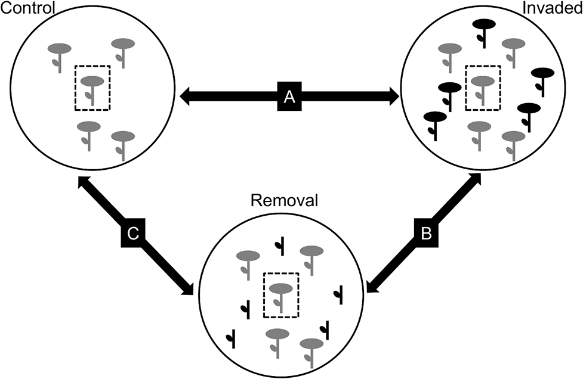

```{r setup, include = FALSE, cache = FALSE, purl = FALSE, fig.showtext = TRUE}
source("assets/xaringan_setup.R")
library(xaringanExtra)
use_tile_view()
use_scribble()
use_search(show_icon = FALSE)
use_progress_bar(color = "#6d2b5e", location = "bottom", height = "10px")
use_freezeframe()
# use_webcam()
# use_panelset()
# use_extra_styles(hover_code_line = TRUE)

# http://tachyons.io/docs/
# https://roperzh.github.io/tachyons-cheatsheet/
use_tachyons()
# use_broadcast()
```

```{r libs, include=FALSE, warning=FALSE}
library("tidyverse")
library("cowplot")
library("ggplot2")
theme_set(theme_bw(base_size = 20))
```

```{r setup1, include = FALSE, cache = FALSE, purl = FALSE}
options(knitr.kable.NA = '')
source("support_linmodr.R")
```

## Мы рассмотрим 

+ Варианты анализа для случаев, когда зависимая перменная --- счетная величина (целые неотрицательные числа)

###  Вы сможете

+ Объяснить особенности разных типов распределений, принадлежащих экспоненциальному семейству. 
+ Построить пуасоновскую и квази-пуассоновскую линейную модель
+ Объяснить проблемы, связанные с избыточностью дисперсии в модели
+ Построить модель, основанную на отрицательном биномиальном распределении

---

## Распределение Пуассона 

.pull-left[

```{r poisson-distr, echo=FALSE, purl=FALSE, fig.width=5.5, fig.height=6}
library(ggplot2)
theme_set(theme_bw(base_size = 14))

mu1 <- 1
mu2 <- 5
mu3 <- 10
mu4 <- 20
y <- seq(0, 35, by = 1)

pi <- data.frame(
  y = rep(y, 4),  
  pi = c(dpois(y, mu1), dpois(y, mu2), dpois(y, mu3), dpois(y, mu4)), 
  mu = rep(c(mu1, mu2, mu3, mu4), each = length(y))
)

ggplot(pi, aes(x = y, y = pi)) + 
  geom_bar(stat = "identity", fill = 'grey20') + 
  facet_wrap(~ mu, nrow = 2, labeller = label_both) + 
  # ggtitle("Распределение Пуассона \nпри разных параметрах") + 
  ylab("f(y)")
```

]

.pull-right[

$$f(y)= \frac{\mu^y \cdot e^{-\mu}}{y!}$$

Параметр:

- $\mu$ -- задает среднее и дисперсию


<br/>

Свойства:

- $E(y) = \mu$ --- мат.ожидание
- $var(y) = \mu$ --- дисперсия
- $0 \le y \le +\infty$, $y \in \mathbb{N}$ --- значения


]

---

## Отрицательное биномиальное распределение

.pull-left[

```{r neg-binomial-distr, echo=FALSE, purl=FALSE, fig.width=5.5, fig.height=6}
mu1 <- 1
mu2 <- 5
k1 <- 0.1
k2 <- 100
y <- 0:30

pi <- data.frame(
  y = rep(y, 4), 
  pi = c(dnbinom(y, size = k1, mu = mu1), 
         dnbinom(y, size = k1, mu = mu2), 
         dnbinom(y, size = k2, mu = mu1), 
         dnbinom(y, size = k2, mu = mu2)), 
  mu = rep(c(mu1, mu2), each = 2*length(y)), 
  k = rep(c(k1, k2, k1, k2), each = length(y)) )

ggplot(pi, aes(x = y, y = pi)) + 
  geom_bar(stat = "identity", fill = 'grey20') + 
  facet_grid(mu~k, labeller = label_both, scales = "free_y") + 
  # ggtitle("Отрицательное биномиальное распределение \nпри разных параметрах") + 
  ylab("f(y)")
```

]

.pull-right[

$f(y) = \frac{\Gamma(y + k)}{\Gamma(k) \cdot \Gamma(y+1)} \cdot (\frac{k}{\mu + k})^k \cdot (1 - \frac{k}{\mu + k})^y$

Параметры: 

- $\mu$ -- среднее  
- $k$ -- определяет степень избыточности дисперсии

<br/>

Свойства:

- $E(y)  = \mu$ -- мат.ожидание
- $var(y) = \mu + \frac {\mu^2}{k}$ -- дисперсия
- $0 \le y \le +\infty$, $y \in \mathbb{N}$ -- значения

]

???

Это смесь Пуассоновского и Гамма распределений: $y$ подчиняется распределению Пуассона с Гамма-распределенным $\mu$. Приближается к распр. Пуассона при очень больших $k$.

---

## GLM в "туннеле" из распределений

В каждом конкретном случае при анализе данных нам предстоит выяснить, какое из распределений больше подходит для моделирования отклика.

- Достаточно ли возможностей распределения Пуассона, чтобы описать связь среднего и дисперсии? 
- Если нет, то справится ли отрицательное биномиальное распределениие, у которого есть параметр, для описания этой связи?


```{r echo=FALSE}
# A Graphical Look at Poisson Regression
# https://bookdown.org/roback/bookdown-bysh/ch-poissonreg.html
# https://github.com/broadenyourstatisticalhorizons/bysh_book/blob/1be2441d7dc0ac57e428218cac504ed3147fd8c6/04-Poisson-Regression.Rmd#L109

library(dplyr)
library(tidyr)
library(gridExtra)  # enable multiple plotting
library(MASS)

# Now make Poisson regression picture
set.seed(42)
nbreaks <- 6
b0 <- 0
b1 <- 0.1
N <- 1000


dat <- data.frame(x=(x = runif(N, 0, 20)),
                  y=rpois(N, lambda = exp(b0  + b1 * x)))
## breaks: where you want to compute densities
breaks <- seq(0, max(dat$x), len=nbreaks)
dat$section <- cut(dat$x, breaks)

## Get the residuals
dat$res <- dat$y - (b0  + b1 * dat$x)
## Compute densities for each section, flip the axes, add means of sections
## Note: densities need to be scaled in relation to section size
dens <- do.call(rbind, lapply(split(dat, dat$section), function(x) {
  d <- density(x$res, n=500)
  res <- data.frame(x = max(x$x) - d$y * 10, y = d$x + mean(x$y))
  res <- res[order(res$y), ]
  n_obs <- nrow(res)
  ## Get some data for poisson lines as well
  xs <- seq(min(x$y), max(x$y), len = 500)
  res <- rbind(res, data.frame(y = xs,
                               x = max(x$x) - 10 * dpois(round(xs), exp(b0 + b1 * max(x$x) ))))
  res$type <- rep(c("empirical", "poisson"), each = n_obs)
  res
}))

dens$section <- rep(levels(dat$section), each=N)

pois_assume <- ggplot(dat, aes(x, y)) +
  geom_point(size = 0.75, alpha = 0.5, position = position_jitter(height = 0.1)) +
  geom_smooth(method="loess", fill=NA, lwd=1) +
  geom_path(data=dens[dens$type=="poisson",], aes(x, y, group=section),
            color='red', lwd=1.1) +
  # geom_path(data=dens[dens$type=="empirical",], aes(x, y, group=section),
  #           color="powderblue", lwd=1.1) +
  geom_vline(xintercept=breaks, lty=1, colour = 'grey80')
# pois_assume


# Negative Binomial
set.seed(42)
th <- 10
dat <- data.frame(x=runif(N, 0, 20),
                  y=rnegbin(N, mu = exp(b0  + b1 * x), theta = th))
## breaks: where you want to compute densities
breaks <- seq(0, max(dat$x), len=nbreaks)
dat$section <- cut(dat$x, breaks)
## Get the residuals
dat$res <- dat$y - (b0  + b1 * dat$x)
## Compute densities for each section, flip the axes, add means of sections
## Note: densities need to be scaled in relation to section size
dens <- do.call(rbind, lapply(split(dat, dat$section), function(x) {
  d <- density(x$res, n=500)
  res <- data.frame(x = max(x$x) - d$y * 10, y = d$x + mean(x$y))
  res <- res[order(res$y), ]
  n_obs <- nrow(res)
  ## Get some data for nb lines as well
  xs <- seq(min(x$y), max(x$y), len = 500)
  res <- rbind(res, data.frame(y = xs,
                               x = max(x$x) - 10 * dnbinom(round(xs), mu = exp(b0 + b1 * max(x$x) ), size = th)))
  res$type <- rep(c("empirical", "nb"), each = n_obs)
  res
}))

dens$section <- rep(levels(dat$section), each=N)

nb_assume <- ggplot(dat, aes(x, y)) +
  geom_point(size = 0.75, alpha = 0.5, position = position_jitter(height = 0.1)) +
  geom_smooth(method="loess", fill=NA, lwd=1) +
  geom_path(data=dens[dens$type=="nb",], aes(x, y, group=section),
            color='red', lwd=1.1) +
  # geom_path(data=dens[dens$type=="empirical",], aes(x, y, group=section),
            # color="powderblue", lwd=1.1) +
  geom_vline(xintercept=breaks, lty=1, colour = 'grey80')
# nb_assume

grid.arrange(
  pois_assume + 
    labs(title = 'GLM с Пуассоновским \nраспределением отклика') +
    coord_cartesian(ylim = c(0, 20)),
  nb_assume + 
    labs(title = 'GLM с отрицательным биномиальным \nраспределением отклика') +
    coord_cartesian(ylim = c(0, 20)),
  ncol = 2)
```


---

background-image: url("images/Muscari_comosum_flowers.jpeg")
background-position: center
background-size: cover

# Пример: визиты опылителей

---

class: split-two

.row.bg-main1[.content[

## Мускари, копеечник и визиты опылителей

Мускари (_Leopoldia comosa_) --- представитель родной флоры острова Менорка. В 18-19вв на остров завезли копеечник венечный (_Hedysarum coronarium_), который быстро натурализовался. Оба вида цветут одновременно и опыляются насекомыми.

Как зависит число визитов опылителей на цветки мускари от присутствия вселенца и разнообразия флоры в ближайшей окрестности? (Данные Montero-Castaño, Vilà, 2015)
]]

.row.bg-main2[
.split-three[
.column[
.center[


.tiny[Muscari à toupet (Muscari comosum),  
Dordogne, France --- Père Igor]
]
]

.column[
.center[

]

]

.column[
.center[


.tiny[French-honeysuckle.  
Close to Santadi Basso, Sardinia, Italy  
--- Hans Hillewaert]
]

]]]

???

https://doi.org/10.1371/journal.pone.0128595

---

## Дизайн исследования

Подсчитывали число визитов опылителей на выбранное растение мускари <br/> (в пунктирной рамке) на трех типах участков.

```{r echo=FALSE, out.width='600px'}

```

.left-column[
```{r echo=FALSE, out.width='100px'}

```
]

.right-column[.right[.small[Fig.2 из [Montero-Castaño, Vilà, 2015](https://doi.org/10.1371/journal.pone.0128595)]]]

---

## Переменные

Отклик и главный предиктор:

- `Visits` --- число визитов всех опылителей на цветок мускари
- `Treatment` --- тип площадки, тритмент (фактор с 3 уровнями):
    - `Invaded` --- мускари в смеси с видом-вселенцем;
    - `Removal` --- мускари в смеси с видом-вселенцем с удаленными цветками; 
    - `Control` --- мускари без вида-вселенца.

--

Важные ковариаты:

- `DiversityD_1` --- Разнообразие флоры на площадке ( $exp(H’)$,  где $H'$ --- индекс Шеннона-Уивера) (возможно, на луг с более разнообразной растительностью прилетит больше опылителей).
- `Flowers` --- число цветков мускари на площадке (чем больше, тем больше опылителей).
- `Hours` --- продолжительность наблюдений (чем дольше, тем больше насчитали).

--

Другие переменные:

- `Total_1` --- общая плотность цветков
- `Visits_NO_Apis` --- посещения опылителей без учета пчел
- `Fruit` --- число цветов с плодами через месяц
- `No_Fruit` --- число цветов без плодов через месяц


---

## Открываем из знакомимся с данными

```{r data, }
library(readxl)
pol <- read_excel("data/Pollinators_Montero-Castano, Vila, 2015.xlsx", 
                  sheet = 1)
head(pol)
```

--

```{r}
# Сколько пропущенных значений?
colSums(is.na(pol))
```

---

## Есть ли выбросы?

```{r eval=FALSE}
library(ggplot2)
theme_set(theme_bw())
```

```{r dotplots, opts.label='fig.wide'}
library(cowplot)
dot_plot <- ggplot(pol, aes(y = 1:nrow(pol))) + geom_point()
plot_grid(dot_plot + aes(x = DiversityD_1), 
          dot_plot + aes(x = Flowers),
          dot_plot + aes(x = Hours), nrow = 1)
```

--

- Выбросов нет.
- Разную продолжительность периодов наблюдений нужно учесть в модели.

---

## Каков объем выборки?

```{r}
table(pol$Treatment)
```

--

### Как распределены короткие периоды наблюдений по тритментам?

```{r}
table(pol$Hours, pol$Treatment)
```

---

## Коллинеарны ли непрерывные и дискретные предикторы?

```{r colinearity}
box_plot <- ggplot(pol, aes(x = Treatment)) + geom_boxplot()

plot_grid(box_plot + aes(y = DiversityD_1),
          box_plot + aes(y = Flowers), nrow = 1)
```

--

- Возможно, есть коллинеарность.  
Перед подбором модели проверим это при помощи `vif()`

---

## Как распределена переменная-отклик?


Число визитов насекомых -- счетная переменная. Для ее моделирования нужно использовать подходящее распределение.

```{r response-distrib, fig.show='asis'}
ggplot(pol, aes(x = Visits)) + geom_histogram()
mean(pol$Visits == 0) # Какова пропорция нулей?
```

- Примерно `r round(mean(pol$Visits == 0) * 100)`% наблюдений -- нули. Иногда из-за избытка нулей (Zero inflation) в модели может появиться избыточность дисперсии. Будем иметь это в виду.

---

class: middle, center, inverse

# GLM с нормальным распределением отклика

---

## Что будет, если проигнорировать, что отклик --- численная переменная?

--

$Visits_i \sim N(\mu_i, \sigma)$  

--

$E(Visits_i) = \mu_i$, $var(Visits_i) = \sigma^2$  

--

$\mu_i = \eta_i$ -- функция связи "идентичность"  

--

$\eta_i = b_0 + b_1 Treatment_{Invaded\ i} + b_2 Treatment_{Removal\ i} + \\ + b_3 DiversityD1_{i} + b_4 Flowers_{i} + b_5 Hours_{i}$

--

```{r R.options=list(width=60)}
M_norm <- glm(Visits ~ Treatment + DiversityD_1 + Flowers + Hours, data = pol)
coef(M_norm)
sigma(M_norm)
```

--

$Visits_i \sim N(\mu_i, 4.17)$   
$E(Visits_i) = \mu_i$, $var(Visits_i) = \sigma^2$  
$\mu_i = \eta_i$
$\eta_i =  -3.3 + 2.9 Treatment_{Invaded\ i} -1.1 Treatment_{Removal\ i} - \\ -1.2 DiversityD1_{i} + 0.1 Flowers_{i} + 6.7 Hours_{i}$

---

## Данные для графика предсказаний простой линейной модели

```{r}
library(dplyr)
NewData <- pol %>% 
  group_by(Treatment)%>%
  do(data.frame(Flowers = seq(min(.$Flowers), max(.$Flowers), length.out=50))) %>%
  mutate(DiversityD_1 = mean(pol$DiversityD_1),
         Hours = 0.75)

# Модельная матрица и коэффициенты
X <- model.matrix(~ Treatment + DiversityD_1 + Flowers + Hours, data = NewData)
betas <- coef(M_norm)
# Предсказания в масштабе функции связи (eta) уже в масштабе отклика (mu)
NewData$mu <- X %*% betas       
NewData$SE_mu <- sqrt(diag(X %*% vcov(M_norm) %*% t(X)))  # SE

head(NewData, 3)
```

---

## График предсказаний

```{r predict-pois, fig.height=5, eval=FALSE}
ggplot(NewData, aes(x = Flowers, y = mu, fill = Treatment)) +
  geom_ribbon(aes(ymin = mu - 2 * SE_mu, ymax = mu + 2 * SE_mu), alpha=0.3)+
  geom_line(aes(colour = Treatment)) +
  geom_hline(yintercept = 0)
```

.pull-left[

```{r predict-pois, fig.height=5, echo=FALSE}
```

]

--

.pull-right[
.center[


Отрицательные предсказания!
]
]

--

С такой моделью работать точно нельзя, но мы продолжим из любопытства. Нужно же посмотреть, какие еще проблемы возникают при использовании нормального распределения для моделирования счетных величнн.


---

## Результаты подбора модели

```{r}
summary(M_norm) 
```

---

## Анализ девиансы для модели с нормальным распределением отклика


```{r}
drop1(M_norm, test = 'Chi')
```

--

Число визитов опылителей на цветки мускари:

- НЕ зависит от присутствия вселенца и его цветов,
- НЕ зависит от разнообразия флоры на участке,
- зависит от числа цветов мускари.

Прежде чем доверять этим результатам, нужно проверить, выполняются ли условия применимости.


---

## Нет ли коллинеарности предикторов


```{r}
library(car)
vif(M_norm)
```

--

- Коллинеарности нет.

---

## Задание 1

Постройте график пирсоновских остатков от предсказанных значений для модели `M_norm`.

Какие нарушения условий применимости вы на нем видите?

<br/>

Дополните код:

```{r eval=FALSE}
M_norm_diag <- data.frame(.fitted = fitted(),
                          .resid_p = residuals())

ggplot(data = , aes()) + geom_hline( = 0) + 
  geom_point()
```


---

## График остатков от предсказанных значений


```{r norm-resid, purl=FALSE, eval=FALSE}
M_norm_diag <- data.frame(.fitted = fitted(M_norm, type = "response"),
                          .resid_p = residuals(M_norm, type = "pearson"))

ggplot(M_norm_diag, aes(y = .resid_p)) + geom_hline(yintercept = 0) + 
  geom_point(aes(x = .fitted))
```

.pull-left[
```{r norm-resid, purl=FALSE, echo=FALSE}
```
]

--

.pull-right[
.center[

]
- Гетерогенность дисперсий остатков.
- Отрицательные предсказания!
]

--

Чуда не произошло

---

## Модель с нормальным распределением отклика <br/>не подходит

Два способа решения проблем с моделью:

1. Грубый способ: логарифмировать зависимую переменную и построить модель для нее. 
2. Лучше построить модель, основанную на распределении, подходящем для счетных данных:
    - распределение Пуассона,
    - отрицательное биномиальное распределение.

---

class: middle, center, inverse

# GLM с Пуассоновским распределением отклика

---

## GLM с Пуассоновским распределением отклика

--

$Visits_i \sim Poisson(\mu_i)$  

--

$E(Visits_i) = \mu_i$, $var(Visits_i) = \mu_i$  

--

$\text{ln}(\mu_i) = \eta_i$ --- функция связи логарифм  

--

$\begin{aligned}\eta_i & =  b_0 + b_1 Treatment_{Invaded\ i} + b_2 Treatment_{Removal\ i} + \\ &+ b_3 DiversityD1_{i} + b_4 Flowers_{i} + b_5 Hours_{i}\end{aligned}$

--

```{r  R.options=list(width=60)}
M_pois <- glm(Visits ~ Treatment + DiversityD_1 + Flowers + Hours, 
              data = pol, family = "poisson")
coef(M_pois)
```

--

$Visits_i \sim Poisson(\mu_i)$  
$E(Visits_i) = \mu_i$, $var(Visits_i) = \mu_i$  
$\text{ln}(\mu_i) = \eta_i$  
$\begin{aligned}\eta_i = &-2.66 + 0.71 Treatment_{Invaded\ i} - 0.22 Treatment_{Removal\ i} - \\ &- 0.46 DiversityD1_i + 0.04  Flowers_i + 4.69 Hours_i\end{aligned}$

---

## Тесты коэффициентов Пуассоновской GLM

.left-column[
.small[Для тестирования значимости коэффициентов в Пуассоновской GLM используются  
__z-тесты Вальда__, т.к. не приходится оценивать дисперсию и  
t-статистика Вальда будет подчиняться нормальному распределению.
]
]
.right-column[
```{r R.options=list(width = 70), highlight.output = 12}
summary(M_pois)
```
]

---


## Смысл коэффициентов Пуассоновской GLM

.left-column[
.small[__Интерсепт__ $b_0$ показывает чему равно значение $\eta = ln(\mu_i)$ на базовом уровне, когда все предикторы $x_k = 0$.  
Значит, значение самого отклика равно $e^{b_0}$.]

.small[Т.е. если разнообразие цветов DiversityD_1, обилие цветов Flowers и время наблюдения Hours равны нулю, то ожидаемое число визитов опылителей 
$e^{`r round(coef(M_pois)[1], 3)`} = `r round(exp(coef(M_pois)[1]), 2)`$.

Для этих данных $b_0$ не имеет биологического смысла.
]
]
.right-column[
```{r R.options=list(width = 70), highlight.output = 12}
summary(M_pois)
```
]

---

## Смысл коэффициентов Пуассоновской GLM

.left-column[
.small[Коэффициенты $b_k$ при переменных-индикаторах $x_k$, кодирующих уровни __дискретных предикторов__, показывают, на сколько единиц отличается значение $\eta = ln(\mu_i)$ от базового уровня.  
Значит, значение отклика отличается в $e^{b_k}$ раз от базового уровня.]

.small[Т.е. в присутствии вида-вселенца в
$e^{`r round(coef(M_pois)[2], 3)`} = `r round(exp(coef(M_pois)[2]), 2)`$
раза больше визитов опылителей, а при удалении - в
$e^{`r round(coef(M_pois)[3], 3)`} = `r round(exp(coef(M_pois)[3]), 2)`$
раза, т.е. на `r 100 - round(exp(coef(M_pois)[3]), 2) * 100`% меньше чем в контроле.
]

]
.right-column[
```{r R.options=list(width = 70), highlight.output = 13:14}
summary(M_pois)
```
]

---

## Смысл коэффициентов Пуассоновской GLM

.left-column[
.small[Угловые коэффициенты при __непрерывных предикторах__ $b_k$ показывают, на сколько единиц меняется значение $\eta = ln(\mu_i)$, если предиктор $x_k$ изменяется на единицу.  
Значит, сам отклик изменяется в $e^{b_k}$ раз.]


.small[Т.е. при росте биоразнообразия на 1 число визитов изменяется в
$e^{`r round(coef(M_pois)[4], 3)`} = `r round(exp(coef(M_pois)[4]), 2)`$
раз, т.е. уменьшается на `r 100 - round(exp(coef(M_pois)[4]), 2) * 100`%.

А если цветков мускари  больше на 1, то растет в $e^{`r round(coef(M_pois)[5], 3)`} = `r round(exp(coef(M_pois)[5]), 2)`$
раз, т.е. на `r abs(100 - round(exp(coef(M_pois)[5]), 2) * 100)`%.
]

]
.right-column[
```{r R.options=list(width = 70), highlight.output = 15:17}
summary(M_pois)
```
]


---

## Анализ девиансы для модели с Пуассоновским распределением отклика


```{r}
drop1(M_pois, test = 'Chi')
```

--

Число визитов опылителей на цветки мускари:

- зависит от присутствия вида-вселенца и его цветов,
- зависит от разнообразия флоры на данном участке,
- зависит от числа цветов самого мускари.

Можем ли мы доверять этим результатам? Пока не известно.


---

## Данные для предсказаний

```{r}
NewData <- pol %>% 
  group_by(Treatment)%>%
  do(data.frame(Flowers = seq(min(.$Flowers), max(.$Flowers), length.out=50))) %>% 
  mutate(DiversityD_1 = mean(pol$DiversityD_1),
         Hours = 0.75)
```

Давайте получим предсказания при помощи операций с матрицами,  
чтобы своими глазами увидеть работу функции связи.

.pull-down[.content-box-red[
Осторожно!  
Хоть и можно получить предсказания при помощи `predict()`, но   
**`predict()` возвращает "правильные" `SE` только в масштабе функции связи!**

```{r eval=FALSE}
?predict.glm
```
<br/>
]]

---

## Задание 2

Дополните код, чтобы получить предсказания модели при помощи операций с матрицами.

```{r eval=FALSE}
# Модельная матрица и коэффициенты
X <- 
betas <- 

# Предсказанные значения и стандартные ошибки...
# ...в масштабе функции связи (логарифм)
NewData$fit_eta <- 
NewData$SE_eta <- sqrt(( %*% vcov(M_pois) %*% ))

# ...в масштабе отклика (применяем функцию, обратную функции связи)
NewData$fit_mu <- 
NewData$lwr <- 
NewData$upr <- 
```


---

## Предсказания модели при помощи операций с матрицами


```{r}
# Модельная матрица и коэффициенты
X <- model.matrix(~ Treatment + DiversityD_1 + Flowers + Hours, data = NewData)
betas <- coef(M_pois)

# Предсказанные значения и стандартные ошибки...
# ...в масштабе функции связи (логарифм)
NewData$fit_eta <- X %*% betas       
NewData$SE_eta <- sqrt(diag(X %*% vcov(M_pois) %*% t(X)))

# ...в масштабе отклика (применяем функцию, обратную функции связи)
NewData$fit_mu <- exp(NewData$fit_eta)
NewData$lwr <- exp(NewData$fit_eta - 2 * NewData$SE_eta)
NewData$upr <- exp(NewData$fit_eta + 2 * NewData$SE_eta)

head(NewData, 2)
```

---

## График предсказаний в масштабе функции связи

```{r pois-predict-link, eval=FALSE}
ggplot(NewData, aes(x = Flowers, y = fit_eta, fill = Treatment)) +
  geom_ribbon(aes(ymin = fit_eta - 2 * SE_eta, 
                  ymax = fit_eta + 2 * SE_eta), 
              alpha = 0.5) +
  geom_line(aes(colour = Treatment)) + 
  geom_hline(yintercept = 0)
```


.pull-left[
```{r pois-predict-link, echo=FALSE}
```

]

--

.pull-right[

В масштабе функции связи мы моделируем линейную зависимость логарифмов мат. ожидания отклика от предикторов.

]

---

## График предсказаний в масштабе переменной-отклика


```{r pois-predict-response, eval=FALSE}
ggplot(NewData, aes(x = Flowers, y = fit_mu, fill = Treatment)) +
  geom_ribbon(aes(ymin = lwr, 
                  ymax = upr), 
              alpha = 0.5) +
  geom_line(aes(colour = Treatment)) + 
  geom_hline(yintercept = 0)
```

.pull-left[
```{r pois-predict-response, echo=FALSE}
```
]

--

.pull-right[


GLM с Пуассоновским распределением отклика моделирует его нелинейную cвязь предикторами за счет функции связи $log()$.

И никаких отрицательных предсказаний!

]

---

## Возможные с Пуассоновской GLM

GLM с Пуассоновским распределением отклика учитывает гетерогенность дисперсии, т.к. $var(y_i) = mu_i = E(y_i)$. Стандартные ошибки возрастают с увеличением предсказанного значения.

.pull-left[

```{r pois-predict-response2, echo=FALSE}
ggplot(NewData, aes(x = Flowers, y = fit_mu, fill = Treatment)) +
  geom_ribbon(aes(ymin = lwr, 
                  ymax = upr), 
              alpha = 0.5) +
  geom_line(aes(colour = Treatment)) + 
  geom_hline(yintercept = 0)
```

]

--

.pull-right[

Но достаточно ли этого для моделирования данных? Нет ли здесь сверхдисперсии?


]

---

## Условия применимости GLM с Пуассоновским распределением отклика

- Случайность и независимость наблюдений внутри групп.
- Отсутствие сверхдисперсии. (Дисперсия остатков равна мат.ожиданию при каждом уровне значений предикторов).
- Отсутствие коллинеарности предикторов.

---

## График остатков


```{r gg-pois-resid, eval=FALSE}
M_pois_diag <- data.frame(.fitted = fitted(M_pois, type = "response"),
                            .resid_p = residuals(M_pois, type = "pearson"))
ggplot(M_pois_diag, aes(x = .fitted, y = .resid_p)) + 
  geom_point() + 
  geom_hline(yintercept = 0)
```


.pull-left[
```{r gg-pois-resid, echo=FALSE}
```

А что это за странные полоски?

]

--

.pull-right[

Полоски из точек — это наблюдения с разными значениями отклика: 0, 1, 2, ... визита опылителей.

Нет никаких отрицательных предсказаний!


]


---

class: middle, center, inverse

# Избыточность дисперсии (overdispersion)

---

## Избыточность дисперсии (overdispersion)

Если данные подчиняются распределению Пуассона, то дисперсия должна быть равна среднему значению.

- $E(y_i)  = \mu_i$
- $var(y_i) = \mu_i$

Если это не так, то мы не сможем доверять результатам. Это будет значить, что мы применяем модель, основанную на Пуассоновском распределении, к данным, которые не подчиняются этому распределению. 

---

## Если есть избыточность дисперсии...

Пуассоновские модели недооценивают (приуменьшают) "раздувшиеся" стандартные ошибки.

--

__В норме, если данные подчиняются распределению Пуассона__, то:

$var(y_i) = \mu_i$

--

Т.е. дисперсии и стандартные ошибки, "нормальные" для распределения Пуассона:

$var(E(y_i)) = {\mu_i} / n$

$SE_{E(y_i)} = \sqrt {var(E(y_i))}$

--

__Если данные НЕ подчиняются распределению Пуассона__, и дисперсия в $\varphi$ раз больше среднего ( $\varphi > 1$), то:

$var^*(y_i) = \varphi\mu_i$

--

Тогда дисперсии должны быть больше в $\varphi$ раз, а стандартные ошибки --- в $\sqrt {\varphi}$ раз:

$var^*(E(y_i)) = {\varphi\mu_i} / n$

$SE^*_{E(y_i)} = \sqrt {\varphi~var(E(y_i))}$

__Если при сверхдисперсии использовать обычное распределение Пуассона, то оценки стандартных ошибок окажутся занижены.__


???

Fox 2016, p.431-432

В биномиальных моделях см. Dunn, Smyth, 2018, p.347

В пуассоновских моделях см. Dunn, Smyth, 2018, p.397


---

## Проблемы из-за неучтенной избыточности дисперсии <br/>в Пуассоновских GLM

- Из-за того, что оценки стандартных ошибок занижены:
  + Доверительные интервалы для коэффициентов заужены
  + Доверительная зона предсказаний модели будет заужена
  + Уровень значимости в тестах Вальда для коэффициентов будет занижен.


- Тесты, основанные на сравнении правдоподобий, дадут смещённые результаты, т.к. соотношение девианс не будет подчиняться $\chi^2$-распределению.

---

## Проверка на сверхдисперсию

```{r}
# Функция для проверки наличия сверхдисперсии в модели (автор Ben Bolker)
# http://bbolker.github.io/mixedmodels-misc/glmmFAQ.html
# Код модифицирован, чтобы учесть дополнительный параметр в NegBin GLMM, 
# подобранных MASS::glm.nb()
overdisp_fun <- function(model) {
  rdf <- df.residual(model)  # Число степеней свободы N - p
  if (any(class(model) == 'negbin')) rdf <- rdf - 1 ## учитываем k в NegBin GLMM
  rp <- residuals(model,type='pearson') # Пирсоновские остатки
  Pearson.chisq <- sum(rp^2) # Сумма квадратов остатков, подчиняется Хи-квадрат распределению 
  prat <- Pearson.chisq/rdf  # Отношение суммы квадратов остатков к числу степеней свободы
  pval <- pchisq(Pearson.chisq, df=rdf, lower.tail=FALSE) # Уровень значимости
  c(chisq=Pearson.chisq,ratio=prat,rdf=rdf,p=pval)        # Вывод результатов
}
```

Модифицировано по Ben Bolker's [glmmFAQ](http://bbolker.github.io/mixedmodels-misc/glmmFAQ.html)

<br/>

```{r}
overdisp_fun(M_pois)
```

Избыточность дисперсии есть! Дисперсия в `r as.numeric(round(overdisp_fun(M_pois)[2], 1))` раза выше среднего.

---

## Причины избыточности дисперсии 

+ Наличие выбросов.
+ В модель не включен важный предиктор или взаимодействие предикторов.
+ Нарушена независимость выборок (есть внутригрупповые корреляции).
+ Нелинейная связь между ковариатами и зависимой переменной.
+ Выбрана неподходящая связывающая функция.
+ Количество нулей больше, чем предсказывает выбранное <br/> распределение отклика (Zero inflation) .
+ Выбрана неподходящая функция распределения для отклика.

--

### Как бороться с избыточностью дисперсии

Взвесив все, что известно о данных, можно решить, как именно усовершенствовать модель.

<br/>

Для модели числа визитов опылителей мы попробуем два варианта действий:

- Можно построить квази-пуассоновскую модель.
- Можно построить модель, основанную на отрицательном биномиальном распределении.


---

class: middle, center, inverse

# Квази-пуассоновские модели

---

## Квази-пуассоновские модели

.left-column[

Помните, не бывает  
"квази-пуассоновского  
распределения"!


]

.right-column[

$Visits_i \sim Quasipoisson(\mu_i)$  

$E(Visits_i) = \mu_i$, $var(y_i) = \varphi\ \mu_i$  

$\text{ln}(\mu_i) = \eta_i$ --- функция связи логарифм  

$\begin{aligned}\eta_i & =  b_0 + b_1 Treatment_{Invaded\ i} + b_2 Treatment_{Removal\ i} + \\ &+ b_3 DiversityD1_{i} + b_4 Flowers_{i} + b_5 Hours_{i}\end{aligned}$

<br/>

Квазипуассоновские модели используют распределение Пуассона, но при этом вносится поправка для стандартных ошибок на степень избыточности дисперсии $\varphi$.

$\varphi$ оценивается по данным и показывает, во сколько раз дисперсия больше среднего. 

]

???

Вот такой вариант оценки используется в R (рекомендован McCullagh, Nelder, 1989):

$$\varphi =  \frac{var(E(y_i))}{\mu_i}=\frac {\frac{\sum{(e_{p~i})^2}}{n - p}}  {\mu_i} =  \frac{\sum{(e_{p~i})^2}}{n - p}$$

---

## Особенности квази-пуассоновской GLM

- Оценки параметров $\beta$ такие же как в Пуассоновской GLM.
- Стандартные ошибки оценок коэффициентов домножены на $\sqrt{\varphi}$.
- Доверительные интервалы к оценкам коэффициентов домножены на $\sqrt{\varphi}$.
- Логарифмы правдоподобий уменьшаются в $\varphi$ раз.

--

### Работа с квази-моделями

1. В тестах параметров используются $t$-тесты Вальда (и $t$-распределение) вместо $z$-тестов Вальда (и стандартного нормального распределения).
2. Для анализа девиансы используются $F$-тесты.
3. Для квази-пуассоновских моделей не определена функция максимального правдоподобия, поэтому нельзя вычислить AIC (но иногда считают квази-AIC = QAIC).


???

См. Højsgaard and Halekoh 2005. Overdispersion Søren Højsgaard and Ulrich Halekoh; Biometry
Research Unit Danish Institute of Agricultural Sciences; June 1, 2005 Printed: June 1,
2005 File: overdispersion

http://genetics.agrsci.dk/statistics/courses/phd05/material/src/overdispersion

---

## Квази-пуассоновская модель

$Visits_i \sim Quasipoisson(\mu_i)$  
$E(Visits_i) = \mu_i$, $var(Visits_i) = \varphi\ \mu_i$  
$\text{ln}(\mu_i) = \eta_i$ --- функция связи логарифм  
$\begin{aligned}\eta_i & =  b_0 + b_1 Treatment_{Invaded\ i} + b_2 Treatment_{Removal\ i} + \\ &+ b_3 DiversityD1_{i} + b_4 Flowers_{i} + b_5 Hours_{i}\end{aligned}$

--

```{r}
M_quasi <- glm(Visits ~ Treatment + DiversityD_1 + Flowers + Hours, data = pol, 
                 family = "quasipoisson")
coef(M_quasi)
summary(M_quasi)$dispersion
```

--

$Visits_i \sim Quasipoisson(\mu_i)$  
$E(Visits_i) = \mu_i$, $var(Visits_i) = 3.016\ \mu_i$  
$\text{ln}(\mu_i) = \eta_i$  
$\begin{aligned}\eta_i = &-2.66 + 0.71 Treatment_{Invaded\ i} - 0.22 Treatment_{Removal\ i} - \\ &- 0.46 DiversityD1_i + 0.04  Flowers_i + 4.69 Hours_i\end{aligned}$


---

## Результаты подбора модели

Те же коэффициенты, что в Пуассоновской модели, но стандартные ошибки домножены на $\sqrt{\varphi}$. Для тестирования используются t-тесты Вальда, т.к. пришлось оценить $\varphi$ и статистика Вальда больше не подчиняется нормальному распределению.

```{r}
summary(M_quasi)
```

---

## Анализ девиансы для квази-пуассоновской модели


```{r}
drop1(M_quasi, test = "F")
```

--

Число визитов опылителей на цветки мускари:

- зависит от присутствия вида-вселенца и его цветов,
- зависит от разнообразия флоры на данном участке,
- зависит от числа цветов самого мускари.

Можем ли мы доверять этим результатам?  
Это приблизительные результаты. Не стоит доверять $p$ близким к $\alpha = 0.05$.  
Из-за сверхдисперсии значимыми могут оказаться незначимые эффекты.

---

class: middle, center, inverse

# GLM с отрицательным биномиальным распределением отклика

---

### GLM с отрицательным биномиальным распределением

--

$Visits_i \sim NB(\mu_i, k)$   

--

$E(Visits_i) = \mu_i$, $var(Visits_i) = \mu_i + \frac{\mu_i^2}{k}$  

--

$\text{ln}(\mu_i) = \eta_i$ --- функция связи логарифм  

--

$\eta = b_0 + b_1 Treatment_{Invaded\ i} + b_2 Treatment_{Removal\ i} + \\ + b_3 DiversityD1_{i} + b_4 Flowers_{i} + b_5 Hours_{i}$

--

```{r R.options=list(width=60)}
library(MASS)
M_nb <- glm.nb(Visits ~ Treatment + DiversityD_1 + Flowers + Hours,  
               data = pol, link = "log")
coef(M_nb)
summary(M_nb)$theta
```

--

.small[
$Visits_i \sim NB(\mu_i, 1.936)$  
$E(Visits_i) = \mu_i$, $var(Visits_i) = \mu_i + \frac{\mu_i^2}{1.936}$  
$\text{ln}(\mu_i) = \eta_i$  
$\eta_i = -1.97 + 0.57 Treatment_{Invaded\ i} - 0.11 Treatment_{Removal\ i} -\\ -0.49 DiversityD1_{i} + 0.03 Flowers_{i} + 4.10 Hours_{i}$
]

---

## Результаты подбора модели

Коэффициенты отличаются от Пуассоновской модели, но интерпретируются аналогично.

Для тестирования используются z-тесты Вальда, т.к. статистика Вальда подчиняется нормальному распределению.

```{r}
summary(M_nb)
```

---

## Анализ девиансы модели с отрицательным биномиальным распределением отклика


```{r}
drop1(M_nb, test = 'Chi')
```

--

Число визитов опылителей на цветки мускари:

- не зависит от присутствия вида-вселенца и его цветов,
- зависит от разнообразия флоры на данном участке,
- зависит от числа цветов самого мускари.

Можем ли мы доверять этим результатам? Это нужно еще проверить.

---

## Задание 3

Проведите диагностику модели `M_nb`.

Видите ли вы какие-нибудь нарушения условий применимости?

---

## График остатков

```{r nb-resid}
M_nb_diag <- data.frame(.fitted = fitted(M_nb, type = "response"),
                          .resid_p = residuals(M_nb, type = "pearson"),
                          pol)
gg_resid <- ggplot(M_nb_diag, aes(y = .resid_p)) + geom_hline(yintercept = 0)
gg_resid + geom_point(aes(x = .fitted))
```

--

Ничего необычного (нет отрицательных предсказаний, нет заметной нелинейности).

---

## Проверка на сверхдисперсию

Обратите внимание, у моделей с отрицательным биномиальным распределением добавляется еще один параметр

```{r}
overdisp_fun(M_nb)
```

--

Избыточности дисперсии нет

---

## Графики остатков от переменных, которые есть в модели

```{r nb-resid-in, fig.height=5, eval=FALSE}
plot_grid(gg_resid + geom_boxplot(aes(x = Treatment)),
          gg_resid + geom_boxplot(aes(x = as.factor(Hours))),
          gg_resid + geom_point(aes(x = DiversityD_1)),
          gg_resid + geom_point(aes(x = Flowers)),
          nrow = 2)
```

.pull-left[
```{r nb-resid-in, fig.height=5, echo=FALSE}
```
]
.pull-right[

Ничего страшного. Может показаться, что есть какой-то невнятный нелинейный паттерн на графике зависимости отстатков от количества цветков мускари, но скорее всего это связано с небольшим количеством наблюдений.

]


---

## Графики остатков от переменных, которых нет в модели

Из всех оставшихся переменных только `Total_1` можно рассматривать как потенциальный предиктор.

```{r nb-resid-out}
gg_resid + geom_point(aes(x = Total_1))
```

--

Ничего криминального. Никаких паттернов. Можно не включать в модель.

---

## Данные для предсказаний

```{r}
NewData <- pol %>% group_by(Treatment)%>%
  do(data.frame(Flowers = seq(min(.$Flowers), max(.$Flowers), length.out=50))) %>% 
  mutate(DiversityD_1 = mean(pol$DiversityD_1),
         Hours = 0.75)
```

Как и в прошлый раз, давайте получим предсказания при помощи операций с матрицами, чтобы своими глазами увидеть работу функции связи.

.pull-down[.content-box-red[
Осторожно!  
Хоть и можно получить предсказания при помощи `predict()`, но   
**`predict()` возвращает "правильные" `SE` только в масштабе функции связи!**

```{r eval=FALSE}
?predict.glm
```
<br/>
]]

---

## Предсказания модели при помощи операций с матрицами


```{r}
# Модельная матрица и коэффициенты
X <- model.matrix(~ Treatment + DiversityD_1 + Flowers + Hours, data = NewData)
betas <- coef(M_nb)

# Предсказанные значения и стандартные ошибки...
# ...в масштабе функции связи (логарифм)
NewData$fit_eta <- X %*% betas       
NewData$SE_eta <- sqrt(diag(X %*% vcov(M_nb) %*% t(X)))

# ...в масштабе отклика (применяем функцию, обратную функции связи)
NewData$fit_mu <- exp(NewData$fit_eta)
NewData$lwr <- exp(NewData$fit_eta - 2 * NewData$SE_eta)
NewData$upr <- exp(NewData$fit_eta + 2 * NewData$SE_eta)

head(NewData, 2)
```

---

## График предсказаний в масштабе функции связи


```{r nb-predict-link}
ggplot(NewData, aes(x = Flowers, y = fit_eta, fill = Treatment)) +
  geom_ribbon(aes(ymin = fit_eta - 2 * SE_eta, 
                  ymax = fit_eta + 2 * SE_eta), 
              alpha = 0.5) +
  geom_line(aes(colour = Treatment)) + 
  geom_hline(yintercept = 0)
```

В масштабе функции связи мы моделируем линейную зависимость логарифмов мат. ожидания отклика от предикторов.


---

## График предсказаний в масштабе отклика

```{r nb-predict-response}
ggplot(NewData, aes(x = Flowers, y = fit_mu, fill = Treatment)) +
  geom_ribbon(aes(ymin = lwr, 
                  ymax = upr), 
              alpha = 0.3) +
  geom_line(aes(colour = Treatment)) + 
  geom_hline(yintercept = 0)
```


GLM с отрицательным биномиальным распределением отклика моделирует его нелинейную связь предикторами за счет функции связи $log()$.

---

## GLM с отрицательным биномиальным распределением отклика

GLM с отрицательным биномиальным распределением отклика до какой-то степени может учесть гетерогенность дисперсии ( $E(y_i) = \mu_i$, $var(y_i) = \mu_i + \frac{\mu_i^2}{k}$). 

На графике видно, что стандартные ошибки возрастают с увеличением предсказанного значения даже сильнее, чем это было у Пуассоновской модели.

Этого оказалось вполне достаточно для моделирования данных (сверхдисперсии здесь нет).


```{r nb-predict-final, echo=FALSE}
ggplot(NewData, aes(x = Flowers, y = fit_mu, fill = Treatment)) +
  geom_ribbon(aes(ymin = lwr, 
                  ymax = upr), 
              alpha = 0.3) +
  geom_line(aes(colour = Treatment)) + 
  geom_hline(yintercept = 0) + 
  ylab('Visits')
```


---

## Выводы

Число визитов опылителей на цветки мускари значимо зависит от разнообразия флоры на данном участке (тест отношения правдоподобий, $p = 0.02$).

При этом, чем больше цветов самого мускари, тем больше прилетает опылителей (тест отношения правдоподобий, $p = 0.01$).

Влияние присутствия вида-вселенца или его цветов не было выявлено.

```{r nb-predict-final, echo=FALSE}
```

---

## Take-home messages

- Важно формулировать модель с учетом распределения зависимой переменной.   При моделировании счетных данных используются:
    + распределение Пуассона,
    + отрицательное биномиальное распределение.
    
--

- В моделях для счетных данных не должно быть избыточности дисперсии. Она может возникать по многим причинам, поэтому нет единого рецепта борьбы с ней:
    - В квази-пуассоновских GLM используются поправки для стандартных ошибок оценок коэффициентов модели.
    - В моделях, основанных на отрицательном биномиальном распределении, специальный параметр этого распределения "описывает" сверхдисперсию.

---

## Что почитать

+ Zuur, A.F. and Ieno, E.N., 2016. A protocol for conducting and presenting results of regression-type analyses. Methods in Ecology and Evolution, 7(6), pp.636-645.
+ Кабаков Р.И. R в действии. Анализ и визуализация данных на языке R. М.: ДМК Пресс, 2014
+ Zuur, A., Ieno, E.N. and Smith, G.M., 2007. Analyzing ecological data. Springer Science & Business Media.
