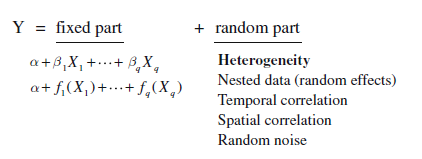

## Вы узнаете

- Как можно смоделировать "поведение" дисперсии

### Вы сможете

- Построить модели для данных, демонстрирующих высокую степень гетерогености дисперсии 
- Подобрать оптимальную модель, учитывающую ковариаты дисперсии
- Построить смешанную модель учитывающую не только группирующие (случайные) факторы, но и гетерогенность дисперсии.  
 


```{r setup, include = FALSE, cache = FALSE}
#-- RUN THE FRAGMENT BETWEEN LINES BEFORE COMPILING MARKDOWN
# to conimages markdown parsing
options(markdown.extensions = c("no_intra_emphasis", "tables", "fenced_code", "autolink", "strikethrough", "lax_spacing", "space_headers", "latex_math"))
#------
# output options
options(width = 70, scipen = 6, digits = 3)

# to render cyrillics in plots use cairo pdf
options(device = function(file, width = 7, height = 7, ...) {
  cairo_pdf(tempfile(), width = width, height = height, ...)
  })
library(knitr)
# chunk default options
opts_chunk$set(fig.align='center', tidy = TRUE, fig.width = 7, fig.height = 3, message=FALSE, warning=FALSE)
```

## В начале курса мы записывали "обычную" регрессионную модель в таком виде

$$y_i = \beta_0 + \beta_1x_i + \epsilon_i$$

Фиксированная часть модели: $y_i = \beta_0 + \beta_1x_i$   
Случайная часть модели:  $\epsilon_i$    
<br>
**Важное ограничивающее условие метода:**  $\epsilon \sim N(0, \sigma^2)$


## Теория смешанных моделей расширяет наши представления о случайной части модели 



из Zuur et al. 2009

##Модели на языке матриц{.smaller}
Простая линейная модель
$$y_i = \mathbf X_i\mathbf\beta + \epsilon_i$$

$$\epsilon_i \sim N(0, \mathbf\sigma^2_i)$$

Смешанная линейная модель с группирующими факторами

$$y_i = \mathbf X_i\mathbf\beta + \mathbf Z_i\mathbf b_i +  \epsilon_i$$
$$\epsilon \sim N(0, \Sigma_i)$$
$$b_i \sim N(0, \mathbf\Psi)$$

Расширенная смешанная линейная модель
$$y_i = \mathbf X_i\mathbf\beta + \mathbf Z_i\mathbf b_i +  \epsilon_i$$
$$\epsilon \sim N(0, \sigma^2 \times \mathbf\Lambda_i)$$
$$b_i \sim N(0, \mathbf\Psi)$$


#Моделирование гетерогенности дисперсии

## Способствуют ли взрослые мидии притоку молоди? {.smaller}

Даные взяты из работы Khaitov, 2013

<div class="columns-2">

```{r muss-data}
myt <- read.table("data/myt.csv", sep=";", header =T)
head(myt, 12)
```


</div>

##В качестве зависимой перменной будем анализировать $\sqrt{N_{recruits}}$

```{r}

myt$Sq_Recruits <- sqrt(myt$Recruits) 

myt$fYear <- factor(myt$Year)

```


##Строим обычную регрессионную модель {.smaller}

```{r}
mod_formula <- formula(Sq_Recruits ~ Large +  fYear + Bank  +  Large:fYear + Large:Bank )

M1_lm <- lm(mod_formula , data = myt)

anova(M1_lm)
```

Можем ли мы доверять этим результатам?

##Проведем диагностику данной модели
```{r, echo=FALSE, message=FALSE, warning=FALSE}
library(ggplot2)
library(gridExtra)

diag_M1_lm <- fortify(M1_lm)

Res_plot1 <- ggplot(diag_M1_lm, aes(x=.fitted, y = .stdresid)) + geom_point() + geom_hline(yintercept = 0) + geom_smooth(se = F)

Res_plot2 <- ggplot(diag_M1_lm, aes(x=Large, y = .stdresid)) + geom_point() + geom_hline(yintercept = 0)+ geom_smooth(se = F)

Res_plot3 <- ggplot(diag_M1_lm, aes(x=fYear, y = .stdresid)) + geom_boxplot() + geom_hline(yintercept = 0) + theme(axis.text.x = element_text(angle = 90))

Res_plot4 <- ggplot(diag_M1_lm, aes(x=Bank, y = .stdresid)) + geom_boxplot() + geom_hline(yintercept = 0)


```


```{r, echo=FALSE, fig.height=6}
grid.arrange(Res_plot1, Res_plot2, Res_plot3, Res_plot4, ncol = 2)
```

Мы не можем доверять величинам уровня значимости!
Нарушается условие применимости линейных моделей, основанных на нормальном распределении остатков с неизменной дисперсией.

##Ковариата дисперсии (Variance covariate) {.smaller}

```{r, echo=FALSE, fig.height=4}
grid.arrange(Res_plot2, Res_plot3, ncol = 2)
```


Видно, что дисперсия остатков убывает по мере увеличения значения переменной `Large` и меняется год от года 

Переменные `Large` и `fYear` являются ковариатами дисперсии

##Ковариата дисперсии (Variance covariate)

Новая модель будет включен еще один компонент 
$$\epsilon \sim N(0, \sigma^2 \times f(VC))$$

$VC$ -  ковариата дисперсии   
$f(VC)$ - функция, вводящая попаравку, стабилизирующую дисперсию 
<br>
В зависимости от формы функции $f(VC)$ мы получим разную структуру дисперсии в модели


#Различные формы структуры дисперсии

##Для дальнейших вычислений необходимо использовать функцию `gls` из пакета `nlme`

```{r}
library(nlme)
M1_gls <- gls(mod_formula, data = myt )
```

Эта функция дает результаты полностью идентичные результатам функции `lm()`  

```{r}
anova(M1_gls)

```


##Фиксированная структура дисперсии
Предполагается, что дисперсия изменяется пропорционально значениям ковариаты дисперсии

 $$\epsilon_i \sim N(0, \sigma^2 \times VC_i)$$

В данном случае нет небходимости в подборе неизвестных параметров для функции $f(VC)$

```{r}
M2_gls <- gls(mod_formula, data = myt, weights = varFixed( ~ Large))
```

##Сравним две модели

```{r}
AIC(M1_gls, M2_gls)
```

НО! Дисперсия явно убывала по мере увеличения значений перменной `Large`

##Разные дисперсии для разных уровней категориальных предикторов 


 $$\epsilon_{i,j} \sim N(0, \sigma^2_j)$$
 
При построении моделей с такой структурой дисперсии подбирается M-1 новых параметров, где M - количество уровней категориального предиктора.   

```{r}
M3_gls <- gls(mod_formula, data = myt, weights = varIdent(form = ~1|fYear))
```


##Сравнение моделей
**Важно!** Модели `M1_gls` и `M3_gls` вложенные

`M1_gls:` $\sigma^2_1 = \sigma^2_2 = ... = \sigma^2_m$
<br>
`M3_gls:` $k_1\sigma^2_1 = k_2\sigma^2_2 = ... = k_m\sigma^2_m$

```{r}
anova(M1_gls, M3_gls)
```

Модель `M3_gls` лучше!

##У нас два категориальных предиктора

```{r}
M3_gls2 <- gls(mod_formula, data = myt, 
               weights = varIdent(form = ~1|Bank))

anova(M1_gls, M3_gls2)
```

##Что произошло в результате работы функции `varIdent()`?

```{r, eval=FALSE}
summary(M3_gls)

```

###Часть вывода `summary(M3_gls)`
 <pre>
Variance function:    
 Structure: Different standard deviations per stratum     
 Formula: ~1 | fYear     
 Parameter estimates:     
 1997  1999  2000  2001  2002  2003  2004  2005  2006  2007  2008      
 1.00  2.62  4.39  3.47  2.84  5.85  4.93  3.21  2.95  3.87  7.98      
 2009  2010  2011     
 9.26  5.97 13.59     
 </pre>
##Степенная зависимость дисперсии от ковариаты

 $$\epsilon_{i,j} \sim N(0, \sigma^2 \times |VC|^{2\delta})$$

Параметр $\delta$ неизвестен и требует оценки

Если $\delta = 0$, то струкутра дисперсии будет аналогична структуре диcперсии в "обычной" регрессионной модели, где $\epsilon \sim N(0, \sigma^2)$

**Важно!**  Если значения ковариаты дисперсии могут принимать значение равное нулю, то такая форма струкутры дисперсии неопределена и использоваться не может.

```{r}
M4_gls <- gls(mod_formula, data = myt, weights = varPower(form = ~ Large))

```

##Степенная зависимость дисперсии от ковариаты

Оценка параметра $\delta$
```{r}
M4_gls$modelStruct

```


##Задание 

Степенная зависимость дисперсии от ковариаты может учитывать и взаимодействие ковариаты дисперсии с категориальными предикторами
<br>
<br>
### Напишите код, с помощью которого в модели будет учтена степенная зависимость  дисперсии от переменной `Large`, но разная для каждого уровня фактора `fYear`.  Аналогичный код напишите для фактора `Bank`

*Hint* Изучите справку по функции `varPower()`


##Решение

```{r}
M5_gls <- gls(mod_formula, data = myt, weights = varPower(form = ~ Large|fYear))
M6_gls <- gls(mod_formula, data = myt, weights = varPower(form = ~ Large|Bank))

```

```{r}
M5_gls$modelStruct
M6_gls$modelStruct

```


##Экспоненциальная зависимость дисперсии от ковариаты

$$\epsilon_{i,j} \sim N(0, \sigma^2 \times e^{2\delta \times VC_i})$$

Эта форма структуры дисперсии может применяться для случаев, когда $VC = 0$
<br> <br>
Если $\delta = 0$, то структура дисперсии будет аналогична струкуте диспесии в "обычной" регрессионной модели, то есть $\epsilon_{i,j} \sim N(0, \sigma^2)$
   


```{r}
M7_gls <- gls(mod_formula, data = myt, weights = varExp(form = ~ Large))
M8_gls <- gls(mod_formula, data = myt, weights = varExp(form = ~ Large|fYear))
M9_gls <- gls(mod_formula, data = myt, weights = varExp(form = ~ Large|Bank))

```

##Экспоненциальная зависимость дисперсии от ковариаты {.smaller}
Оцененные параметры 
```{r}
M7_gls$modelStruct
M8_gls$modelStruct
M9_gls$modelStruct

```


##Усложненная степенная зависимость дисперсии от ковариаты

$$\epsilon_{i,j} \sim N(0, \sigma^2 \times (\delta_1 + |VC|^{2\delta_2})^2)$$

###Впорос:    
При каких значениях параметров функции $f(VC)$ cтруктура дисперсии будет аналогична структуре дисперсии в "обычной" регрессионной модели? 

##Ответ

При $\delta_1=0$ и $\delta_2=0$ выражение $\epsilon_{i,j} \sim N(0,\sigma^2 \times (0 + |VC|^{0})$ будет эквивалентно $\epsilon_{i,j} \sim N(0, \sigma^2)$  

  


##Усложненная степенная зависимость дисперсии от ковариаты

```{r}
M10_gls <- gls(mod_formula, data = myt, 
               weights = varConstPower(form = ~ Large))
#M11_gls <-gls(mod_formula, data = myt, 
#               weights = varConstPower(form = ~ Large|fYear)) 
M12_gls <- gls(mod_formula, data = myt, 
               weights = varConstPower(form = ~ Large|Bank))
```


##Оцененные параметры 

```{r}
M10_gls$modelStruct

M12_gls$modelStruct

```


##Комбинированная структура дисперсии

```{r}
M13_gls <- gls(mod_formula, data = myt, 
               weights = varComb(varIdent(form = ~ fYear), 
                                 varPower(form = ~ Large)))
M14_gls <- gls(mod_formula, data = myt, 
               weights = varComb(varIdent(form = ~ Bank), 
                                 varPower(form = ~ Large)))
M15_gls <- gls(mod_formula, data = myt, 
               weights = varComb(varIdent(form = ~ fYear), 
                                 varExp(form = ~ Large)))
M16_gls <- gls(mod_formula, data = myt, 
               weights = varComb(varIdent(form = ~ Bank), 
                                 varExp(form = ~ Large)))


```


##Задание
###Найдите модель с наилучшей структурой дисперсии

##Решение

```{r}
AICs <- AIC(M1_gls, M2_gls, M3_gls, 
            M4_gls, M5_gls, M6_gls, 
            M7_gls, M8_gls, M9_gls, 
            M10_gls, M12_gls,M13_gls, 
            M14_gls, M15_gls, M16_gls)
```

##Решение
```{r}
AICs[AICs$AIC == min(AICs$AIC),]
```

```{r}
M5_gls$call
```


##Диагностика модели с оптимальной структурой дисперсии

```{r, echo=FALSE, fig.height=5}
diag_gls <- data.frame(.pears_resid = residuals(M5_gls, type = "pearson"), .fitted = fitted(M5_gls), Large = myt$Large, fYear = myt$fYear, Bank = myt$Bank)


Diag_gls_plot1 <- ggplot(diag_gls, aes(x=.fitted, y = .pears_resid)) + geom_point() + geom_hline(yintercept = 0) + geom_smooth(se = F)

Diag_gls_plot2 <- ggplot(diag_gls, aes(x=Large, y = .pears_resid)) + geom_point() + geom_hline(yintercept = 0)+ geom_smooth(se = F)

Diag_gls_plot3 <- ggplot(diag_gls, aes(x=fYear, y = .pears_resid)) + geom_boxplot() + geom_hline(yintercept = 0)

Diag_gls_plot4 <- ggplot(diag_gls, aes(x=Bank, y = .pears_resid)) + geom_boxplot() + geom_hline(yintercept = 0)

Res_plot1 <- Res_plot1 + ggtitle("Было \nв начальной модели")
Diag_gls_plot1 <- Diag_gls_plot1 + ggtitle("Стало после моделирования \nструктуры дисперсии")

grid.arrange(Res_plot1, Diag_gls_plot1, ncol = 2)
```

##Диагностика модели с оптимальной структурой дисперсии

```{r, echo=FALSE, fig.height=5}

Res_plot2 <- Res_plot2 + ggtitle("Было \nв начальной модели")
Diag_gls_plot2 <- Diag_gls_plot2 + ggtitle("Стало после моделирования \nструктуры дисперсии")
grid.arrange(Res_plot2, Diag_gls_plot2, ncol = 2)

```


##Диагностика модели с оптимальной структурой дисперсии

```{r, echo=FALSE, fig.height=5}
Res_plot3 <- Res_plot3 + ggtitle("Было \nв начальной модели")
Diag_gls_plot3 <- Diag_gls_plot3 + ggtitle("Стало после моделирования \nструктуры дисперсии")


grid.arrange(Res_plot3, Diag_gls_plot3, ncol = 2)

```


##Диагностика модели с оптимальной структурой дисперсии
```{r, echo=FALSE, fig.height=5}
Res_plot4 <- Res_plot4 + ggtitle("Было \nв начальной модели")
Diag_gls_plot4 <- Diag_gls_plot4 + ggtitle("Стало после моделирования \nструктуры дисперсии")


grid.arrange(Res_plot4, Diag_gls_plot4, ncol = 2)

```


##Можно ли упростить модель?

```{r}
M5_gls_ML <- update(M5_gls, method = "ML")
# С какого-то момента перестал работать drop1()
# drop1(M5_gls_ML, test = "Chi")
M5_gls_ML_a <- update(M5_gls_ML, .~.-Large:fYear)
M5_gls_ML_b <- update(M5_gls_ML, .~.-Large:Bank)
anova(M5_gls_ML, M5_gls_ML_a)
anova(M5_gls_ML, M5_gls_ML_b)
```

Эту модель упростить нельзя!  
То есть, изменение структуры дисперсии заставляет формулировать иные биологические выводы.

##Структура дисперсии может иметь определенный биологический смысл

```{r}
qplot(x=c(1997, 1999:2011), y=as.vector(unlist(M5_gls$modelStruct))) + xlab("Годы") + ylab("Delta")
```

>- В большинстве случаев параметр $\delta$ < 0 
>- чем больше обилие взрослых мидий, тем меньше варьирует обилие молоди
>- Есть какая-то многолетняя динамика влияния обилия взрослых на "пятнистость" распределения молоди 


#Моделирование структуры дисперсии при наличии группирующих (случайных) факторов 

## Рост крыс при разной диете
Пример взят из книги Pinheiro & Bates, 2000 (Hand and Crowder (1996))

Три группы крыс, содержались при разных условиях кормления 64 дня. Каждую крысу взвешивали с определнной периодичностью.   


```{r}
data("BodyWeight")

bw <- as.data.frame(BodyWeight)

head(bw, 14)
```


###Задание: 
Постройте модель, которая дала бы ответ на вопрос: Изменяется ли характер роста крыс в зависимости от типа диеты?


## Решение

```{r}
M1 <- gls(weight ~ Time*Diet, data = bw) 
```

Все ли хорошо?      

>- **Важно!** Строить простую линейную модель в данном случае *некорректо*!    

>- Дизайн эксперимента изначально включает случайный фактор. Здесь мы имеем дело с повторными наблюдениями одного и того же объекта.    
>- Однако мы рассмотрим `M1`  для демонстрации того, что происходит если не учитывать этой осбенности экспериментального дизайна.    

##Ризультаты для неправильной модели

```{r}
anova(M1)
```


##Случайные факторы

**Важно!** в этом эксперименте присутсвует случайный (группирующий) фактор `Rat`, который необходимо учесть в модели

```{r}
M2 <- lme(weight ~ Time*Diet, data = bw, random = ~1|Rat)
M3 <- lme(weight ~ Time*Diet, data = bw, random = ~1 + Time|Rat)
```

##Какую из моделей выбрать?
```{r}
AIC(M1, M2, M3)
```

##Пытаемся ответить на вопрос

```{r}
anova(M3)
```


##Рассеяние остатков в модели 
```{r, echo=FALSE, fig.height=5}
diagnostic <- data.frame(.fitted = fitted(M3), .residuals = residuals(M3, type = "pearson"), Diet = bw$Diet, Time = bw$Time)
Pl1 <- ggplot(diagnostic, aes(x=.fitted, y=.residuals) ) + geom_point()
Pl2 <- ggplot(diagnostic, aes(x=Time, y=.residuals) ) + geom_point()
Pl3 <- ggplot(diagnostic, aes(x=Diet, y=.residuals) ) + geom_boxplot()
grid.arrange(Pl1, Pl2, Pl3, ncol=2)
```

##Моделируем структуру дисперсии

```{r}
M3_1 <- update(M3, weights = varIdent(form = ~ 1|Diet))

M3_2 <- update(M3, weights = varPower(form = ~Time))

M3_3 <- update(M3, weights = varPower(form = ~Time|Diet))

M3_4 <- update(M3, weights = varExp(form = ~Time))

M3_5 <- update(M3, weights = varExp(form = ~Time|Diet))

M3_6 <- update(M3, weights = varComb(varExp(form = ~Time), varIdent(form = ~1|Diet)))

```

##Выбираем лучшую модель

```{r}
AIC(M3, M3_1, M3_2, M3_3, M3_4, M3_5, M3_6)

```


##Отвечаем на вопрос

```{r}
anova(M3_5)
```

##Смотрим на предсказания модели {.smaller}
```{r, fig.height=4}

MyData <- expand.grid(Time = 1:64, Diet = factor(1:3))


MyData$Predicted <- predict(M3_5, newdata = MyData, level = 0)

ggplot(MyData, aes(x = Time, y = Predicted,  color = Diet)) +   geom_line( size = 1.5) + geom_point(data = bw, aes(x= Time, y = weight), position = position_jitter())


```


##Summary
Проблему гетерогенности дисперсии можно решить двумя способами:    
1.Преобразование перменных  
2.Введение в модель той или иной структуры дисперсии, учитывающей тот или иной набор ковариат дисперсии.


## Что почитать
+ Zuur, A.F. et al. 2009. Mixed effects models and extensions in ecology with R. - Statistics for biology and health. Springer, New York, NY.   

+ Pinheiro J, Bates D (2000) Mixed effects models in S and S-Plus. Springer-Verlag, New York, USA


