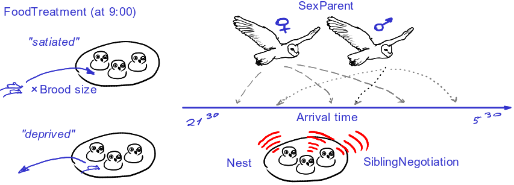

## Вы узнаете

- Как анализировать данные, в которых зависимая переменная - счетная величина, и есть случайные факторы

### Вы сможете

- Построить линейные модели с пуассоновским и отрицательным биномиальным распределением отклика
- Сможете проверить смешанные модели на избыточность дисперсии
- Научитесь проверять наличие нелинейных паттернов в остатках

```{r setup, include = FALSE, cache = FALSE, purl = FALSE}
# output options
options(width = 70, scipen = 6, digits = 3)
library(knitr)
# chunk default options
opts_chunk$set(fig.align='center', tidy = FALSE, fig.width = 7, fig.height = 3, warning = FALSE, message = FALSE, cache = TRUE)
```

# Cмешанные модели для счетных данных

## От чего зависит призывный крик совят? {.smaller}

27 семейств сов в западной Швейцарии наблюдали с июня по август 1997. В день наблюдений совятам либо давали дополнительную подкормку (сытые), либо забирали остатки пищи из гнезда (голодные). Оба варианта манипуляций использовали в каждом из гнезд в случайном порядке. С 21:30 до 5:30 утра записывали звуки и видео.

<div class="columns-2">
   

<small><a href="https://flic.kr/p/66jqtt">Young Barn Owls in Tree Nest</a> by Hunter Desportes on Flickr</small>

Данные из [Roulin & Bersier 2007](https://doc.rero.ch/record/8836/files/bersier_nbo.pdf), пример из кн. Zuur et al., 2007

</div>

<small>Roulin, A. and Bersier, L.F., 2007. Nestling barn owls beg more intensely in the presence of their mother than in the presence of their father. Animal Behaviour, 74(4), pp.1099-1106.</small>

## От чего зависит призывный крик совят? {.smaller}



<div class="columns-2">

- `SiblingNegotiation` --- число звуков в течение 15 минут до прибытия родителя  
- `FoodTreatment` --- сытые или голодные
- `SexParent` --- пол родителя  
- `ArrivalTime` --- время прибытия родителя  
- `Nest` --- гнездо  
</div>

## Знакомство с данными

```{r}
Owls <- read.delim("data/Roulin_Bersier_2007_Owls.csv")
str(Owls)
# SiblingNegotiation - число криков совят - заменим на более короткое название
Owls$NCalls <- Owls$SiblingNegotiation
# Число пропущенных значений
sum(!complete.cases(Owls))
```


## Есть ли выбросы?

```{r dot-plots, tidy=FALSE}
library(ggplot2); library(cowplot); theme_set(theme_bw())
gg_dot <- ggplot(Owls, aes(y = 1:nrow(Owls))) + 
  geom_point(colour = "steelblue")

plot_grid(gg_dot + aes(x = NCalls),
          gg_dot + aes(x = ArrivalTime), nrow = 1)
```

>- Выбросов нет

## Различаются ли гнезда?

```{r NCalls-by-Nest}
ggplot(Owls, aes(x = Nest, y = NCalls)) + geom_boxplot() + 
  theme(axis.text.x = element_text(angle = 45, hjust = 1))
```

> - Гнезд много, они различаются. Можно и нужно учесть как случайный эффект

## Сколько наблюдений в каждом гнезде?

```{r}
table(Owls$Nest)
```

> - Хорошо, что наблюдений в каждом гнезде много. Только в двух по четыре - не очень.

## Отклик --- счетная переменная

```{r NCalls-hist}
ggplot(Owls, aes(x = NCalls)) + 
  geom_histogram(binwidth = 1, fill = "steelblue", colour = "black")
```

Напоминает распределение Пуассона

```{r}
mean(Owls$NCalls == 0) # доля нулей
```

## Какого размера выводки в гнездах?

Это нужно учесть, потому что чем больше выводок, тем больше птенцов будут разговаривать. 

```{r BroodSize-by-Nest}
range(Owls$BroodSize)

ggplot(Owls, aes(x = Nest, y = BroodSize)) + 
  stat_summary(geom = "bar", fun.y = mean, fill = "steelblue") +
  theme(axis.text.x = element_text(angle = 45, hjust = 1))
```

> - Выводки разные. В пуассоновской glmer() это можно откорректировать при помощи offset. Сделаем offset(logBroodSize)

## Может быть есть взаимодействие?

```{r interaction-plot}
ggplot(Owls) + 
  stat_summary(aes(x = FoodTreatment, y = NCalls, colour = SexParent), 
               fun.data = "mean_cl_boot", position = position_dodge(width = 0.2))
```

> - Похоже, что может быть взаимодействие, но не понятно значимое ли.

## Когда орут птенцы?

```{r owls-all, fig.height=5, fig.width=10, echo=FALSE}
ggplot(Owls, aes(x = ArrivalTime, y = NCalls,
                   colour = FoodTreatment, fill = FoodTreatment)) +
  geom_bar(stat = "identity") + 
  facet_grid(FoodTreatment + SexParent ~ Nest) + 
  theme(legend.position = "bottom", 
        axis.text.x = element_text(angle = 90, hjust = 1))
```

> - Птенцы больше орут, если голодали прошлой ночью. И, возможно, орут у самцов (?)

## Код для графика

```{r owls-all, eval=FALSE, purl=FALSE}
```

## Коллинеарность


```{r, R.options=list(digits=5)}
M0 <- lm(NCalls ~ SexParent + FoodTreatment + ArrivalTime, data = Owls)
library(car)
vif(M0)
```

> - ок

# Смешанная линейная модель с пуассоновским распределением остатков

## Линейная модель с пуассоновским распределением остатков {.smaller}

- $NCalls \sim Poisson(\mu_{ij})$  --- отклик подчиняется распределению Пуассона с параметром $\mu$
- $E(NCalls_{ij}) = \mu_{ij}$, $var(NCalls_{ij}) = \mu_{ij}$
- $ln(\mu_{ij}) = \eta_{ij}$  --- функция связи --- логарифм
- $\begin{array}{l}\eta_{ij} = \beta_0 + \beta_{1}SexParentM_{ij} + \beta_{2}FoodTreatmentS_{ij} + \beta_{3}ArrivalTime_{ij} + \\ + \beta_{4} SexParentM_{ij} FoodTreatmentS_{ij} + \beta_{5}SexParentM_{ij}ArrivalTime_{ij} + \\ + log(BroodSize_{i}) + a_{i} \end{array}$

- $a_{i}\sim N(0, \sigma^2_{Nest})$ --- случайный эффект гнезда (intercept)
- $i$ --- гнездо
- $j$ --- наблюдение

## Подберем линейную модель с пуассоновским распределением остатков

```{r warning=TRUE, message=TRUE}
library(lme4)
M1 <- glmer(NCalls ~ SexParent * FoodTreatment +
              SexParent * ArrivalTime + 
              offset(logBroodSize) + (1 | Nest), 
            family = "poisson", data = Owls)
```

Смешанная модель с распределением пуассона не сходится. Один из возможных вариантов выхода - стандартизация предикторов

## Стандартизируем непрерывные предикторы

У нас только один непрерывный предиктор

```{r}
Owls$ArrivalTime_std <- (Owls$ArrivalTime - mean(Owls$ArrivalTime)) /
  sd(Owls$ArrivalTime)

M1 <- glmer(NCalls ~ SexParent * FoodTreatment + 
              SexParent * ArrivalTime_std +
              offset(logBroodSize) + (1 | Nest), 
            family = "poisson", data = Owls)
```

Эта модель сходится

## Задание:

Проверьте модель M1 на избыточность дисперсии

## Избыточность дисперсии (Overdispersion)

Для начала разберемся, как это считать вручную

```{r purl=FALSE}
R_M1 <- resid(M1, type = "pearson") # Пирсоновские остатки
N <- nrow(Owls) # Объем выборки
p <- length(fixef(M1)) + 1# Число параметров (не забудьте сл. эффект!)
df <- (N - p) # число степенейсвободы
overdispersion <- sum(R_M1^2) /df  # во сколько раз var(y) > E(y)
overdispersion
pchisq(sum(R_M1^2), df = df, lower.tail = FALSE)
```

> - Избыточность дисперсии.

## Избыточность дисперсии при помощи готовых функций {.smaller}

```{r purl=FALSE}
# ## Проверка на сверхдисперсию
# Функция для проверки наличия сверхдисперсии в модели (автор Ben Bolker)
# http://bbolker.github.io/mixedmodels-misc/glmmFAQ.html
# Код модифицирован, чтобы учесть дополнительный параметр в NegBin GLMM, подобранных MASS::glm.nb()
overdisp_fun <- function(model) {
  rdf <- df.residual(model)  # Число степеней свободы N - p
  if (any(class(model) == 'negbin')) rdf <- rdf - 1 ## учитываем k в NegBin GLMM
  rp <- residuals(model,type='pearson') # Пирсоновские остатки
  Pearson.chisq <- sum(rp^2) # Сумма квадратов остатков, подчиняется Хи-квадрат распределению
  prat <- Pearson.chisq/rdf  # Отношение суммы квадратов остатков к числу степеней свободы
  pval <- pchisq(Pearson.chisq, df=rdf, lower.tail=FALSE) # Уровень значимости
  c(chisq=Pearson.chisq,ratio=prat,rdf=rdf,p=pval)        # Вывод результатов
}

overdisp_fun(M1)

library(performance)
check_overdispersion(M1)
```

## Почему здесь могла быть избыточность дисперсии?

> - Отскакивающие значения  --> убрать
+ Пропущены ковариаты или взаимодействия предикторов  --> добавить
+ Наличие внутригрупповых корреляций (нарушение независимости выборок)  --> другие случайные эффекты?
+ Нелинейная взаимосвязь между ковариатами и зависимой переменной  --> GAMM
+ Неверно подобрана связывающая функция  --> заменить
+ Количество нулей больше, чем предсказывает распределение Пуассона (Zero inflation)     --> ZIP
+ Просто большая дисперсия? --> NB

## График остатков

```{r M1-resid}
M1_diag <- data.frame(Owls,
                      .fitted = predict(M1, type = "response"),
                      .pears_resid = residuals(M1, type = "pearson"))

gg_resid <- ggplot(M1_diag, aes(x = .fitted, y = .pears_resid, 
                       colour = FoodTreatment)) + 
  geom_point() + 
  facet_grid(SexParent ~ FoodTreatment)
gg_resid
```

> - Есть большие остатки

## Есть ли еще какие-то паттерны в остатках?

```{r M1-resid-spline, fig.height=4.5, fig.width=10}
gg_resid %+% aes(x = ArrivalTime) + geom_smooth(method = "loess")
```

> - Есть намек на нелинейность. Возможно, нужен GAMM

## Проверяем, есть ли нелинейный паттерн в остатках {.smaller .columns-2}

```{r M1-resid-gam, fig.width=4.5, fig.height=4, fig.align='right', tidy.opts=list(width = 50)}
library(mgcv)
nonlin1 <- gam(.pears_resid ~ s(ArrivalTime), 
               data = M1_diag)
summary(nonlin1)
plot(nonlin1)
abline(h = 0, lty = 2)
```

> - Совершенно точно нужен GAMM. Но продолжим с GLMM

# Смешанная линейная модель с отрицательным биномиальным распределением остатков

## У нас была сверхдисперсия. Пробуем NB GLMM {.smaller}

- $NCalls_{ij} \sim NegBin(\mu_{ij}, k)$  --- отклик подчиняется отрицательному биномиальному распределению с параметрами $\mu$ и $k$
- $E(NCalls_{ij}) = \mu_{ij}$, $var(NCalls_{ij}) = \mu_{ij} + \mu^2_{ij} / k$
- $ln(\mu_{ij}) = \eta_{ij}$  --- функция связи --- логарифм
- $\begin{array}{l}\eta_{ij} = \beta_0 + \beta_{1}SexParentM_{ij} + \beta_{2}FoodTreatmentS_{ij} + \beta_{3}ArrivalTime_{ij} + \\ + \beta_{4} SexParentM_{ij} FoodTreatmentS_{ij} + \beta_{5}SexParentM_{ij}ArrivalTime_{ij} + \\+ log(BroodSize_{i}) + a_{i} \end{array}$

- $a_{i}\sim N(0, \sigma^2_{Nest})$ --- случайный эффект гнезда (intercept)

- $i$ --- гнездо
- $j$ --- наблюдение


## Подберем NB GLMM

```{r NB-GLMM}
M2 <- glmer.nb(NCalls ~ SexParent * FoodTreatment + 
                 SexParent * ArrivalTime_std + 
                 offset(logBroodSize) + (1 | Nest), 
               data = Owls)
# # Если эта модель вдруг не сходится, есть обходной маневр. 
# Можно попробовать заранее определить k  при помощи внутренней функции. 
# В lme4 параметр k называется theta
th <- lme4:::est_theta(M1)
M2 <- update(M1, family = negative.binomial(theta=th))
```

## Задание:

Проверьте модель с отрицательным биномиальным распределением отклика 

- на избыточность дисперсии
- наличие паттернов в остатках
- нелинейность паттернов в остатках

## Избыточность дисперсии (Overdispersion)

```{r purl=FALSE}
R_M2 <- resid(M2, type = "pearson") # Пирсоновские остатки
N <- nrow(Owls) # Объем выборки
p <- length(fixef(M2)) + 1 + 1  # Число параметров (Не забудьте сл.эффект и k)
df <- (N - p) # число степенейсвободы
overdispersion <- sum(R_M2^2) /df  # во сколько раз var(y) > E(y)
overdispersion
pchisq(sum(R_M2^2), df = df, lower.tail = FALSE)
```

> - Хорошо.

## Диагностика отр. биномиальной модели

```{r M2-resid}
M2_diag <- data.frame(Owls,
                      .fitted = predict(M2, type = "response"),
                      .pears_resid = residuals(M2, type = "pearson"))
gg_resid <- ggplot(M2_diag, aes(x = .fitted, y = .pears_resid, 
                                colour = FoodTreatment)) + 
  geom_point() + 
  facet_grid(SexParent ~ FoodTreatment)
gg_resid
```

> - Есть большие остатки.

## Есть ли еще какие-то паттерны в остатках?

Может быть паттерны в остатках исчезли от того, что мы использовали другую GLMM?

```{r M2-resid-spline, fig.height=4.5, fig.width=10}
gg_resid %+% aes(x = ArrivalTime) + geom_smooth(method = 'loess')
```

> - Подозрительно. Возможно, нужен GAMM

## Проверяем, есть ли нелинейные паттерны {.smaller .columns-2}

```{r M2-resid-gam, fig.width=4.5, fig.height=4, fig.align='right', tidy.opts=list(width = 50), purl=FALSE}
nonlin2 <- gam(.pears_resid ~ s(ArrivalTime), 
               data = M2_diag)
summary(nonlin2)
plot(nonlin2) 
abline(h = 0)
```

> - Совершенно точно нужен GAMM

# Подбор оптимальной модели

## Подбор оптимальной модели  {.smaller}

Все ли значимо?

```{r}
summary(M2)
```

## Задание

Попробуйте упростить модель M2

## Можно ли что-то выкинуть

```{r purl=FALSE}
drop1(M2, test = "Chi")
```

> - Если выкинуть взаимодействия, модель не станет хуже

## Выкидываем одно взаимодействие

```{r purl=FALSE}
M3 <- update(M2, .~.-SexParent:ArrivalTime_std)
drop1(M3, test = "Chisq")
```

> - теперь можно выкинуть второе

## Выкидываем второе взаимодействие

```{r purl=FALSE}
M4 <- update(M3, .~.-SexParent:FoodTreatment)
drop1(M4, test = "Chisq")
```

> - теперь можно выкинуть пол родителя

## Финальная модель

```{r purl=FALSE}
M5 <- update(M4, .~.-SexParent)
drop1(M5, test = "Chisq")
```

> - это финальная модель

## Второй способ подбора оптимальной модели - AIC

```{r purl=FALSE}
AIC(M2, M3, M4, M5)
```

## Модель изменилась. Нужно повторить диагностику

Избыточность дисперсии (Overdispersion)

```{r}
R_M5 <- resid(M5, type = "pearson") # Пирсоновские остатки
N <- nrow(Owls) # Объем выборки
p <- length(fixef(M5)) + 1 + 1  # Число параметров в модели
df <- (N - p) # число степенейсвободы
overdispersion <- sum(R_M5^2) /df  # во сколько раз var(y) > E(y)
overdispersion
pchisq(sum(R_M5^2), df = df, lower.tail = FALSE)
```

> - Хорошо.

## Диагностика отр. биномиальной модели

```{r M5-resid}
M5_diag <- data.frame(Owls,
                      .fitted <- predict(M5, type = "response"),
                      .pears_resid <- residuals(M5, type = "pearson"))
gg_resid <- ggplot(M5_diag, aes(x = .fitted, y = .pears_resid, 
                                colour = FoodTreatment)) + 
  geom_point() + 
  facet_grid(SexParent ~ FoodTreatment)
gg_resid
```

> - Есть большие остатки

## Есть ли еще какие-то паттерны в остатках?

Может быть паттерны в остатках исчезли от того, что мы использовали другую GLMM?

```{r M5-resid-spline,  fig.height=4.5, fig.width=10}
gg_resid %+% aes(x = ArrivalTime) + geom_smooth(method = "loess")
```

> - Подозрительно. Возможно, нужен GAMM

## Проверяем, есть ли нелинейные паттерны {.smaller .columns-2}

```{r M5-resid-gam, fig.width=4.5, fig.height=4, fig.align='right', tidy.opts=list(width = 50)}
nonlin5 <- gam(.pears_resid ~ s(ArrivalTime), data = M5_diag)
summary(nonlin5)
plot(nonlin5) 
abline(h = 0)
```

> - Совершенно точно нужен GAMM
> - Но мы продолжим

# Представление результатов

## Финальная GLMM, которую мы получили, выглядит так {.smaller}

- $NCalls_{ij} \sim NegBin(\mu_{ij}, k)$  --- отклик подчиняется отрицательному биномиальному распределению с параметрами $\mu$ и $k$
- $E(NCalls_{ij}) = \mu_{ij}$, $var(NCalls_{ij}) = \mu_{ij} + \mu^2_{ij} / k$
- $ln(\mu_{ij}) = \eta_{ij}$  --- функция связи логарифм
- $\begin{array}{l}\eta_{ij} = \beta_0 + \beta_{1}SexParentM_{ij} + \beta_{2}FoodTreatmentS_{ij} + \beta_{3}ArrivalTime_{ij} + \\ + log(BroodSize_{i}) + a_{i} \end{array}$

- $a_{i}\sim N(0, \sigma^2_{Nest})$ --- случайный эффект гнезда (intercept)
- $i$ --- гнездо
- $j$ --- наблюдение


## Готовим данные для графика модели

```{r}
library(dplyr)
NewData <- Owls %>% group_by(FoodTreatment) %>% 
  do(data.frame(ArrivalTime_std = seq(min(.$ArrivalTime_std),  
                                       max(.$ArrivalTime_std), 
                                       length = 100)))
NewData$ArrivalTime <- NewData$ArrivalTime_std * sd(Owls$ArrivalTime) + 
  mean(Owls$ArrivalTime)
```


## Предсказания и ошибки

```{r}
# Модельная матрица
X <- model.matrix(~ FoodTreatment + ArrivalTime_std, data = NewData)
# К предсказанным значениям нужно прибавить оффсет. 
# Мы будем делать предсказания для среднего размера выводка.
# В масштабе функции связи
NewData$fit_eta <- X %*% fixef(M5) + log(mean(Owls$BroodSize))
NewData$SE_eta <- sqrt(diag(X %*% vcov(M5) %*% t(X)))
# В масштабе отклика
NewData$fit_mu <- exp(NewData$fit_eta)
NewData$lwr <- exp(NewData$fit_eta - 2 * NewData$SE_eta)
NewData$upr <- exp(NewData$fit_eta + 2 * NewData$SE_eta)
```

## График предсказанных значений  {.smaller}

```{r owls-pred}
ggplot() + 
  geom_point(data = Owls, aes(x = ArrivalTime, y = NCalls), colour = "steelblue") + 
  geom_ribbon(data = NewData, aes(x = ArrivalTime,  ymax = upr,  ymin = lwr), alpha = 0.3) + 
  geom_line(data = NewData,  aes(x = ArrivalTime, y = fit_mu, group = FoodTreatment)) + 
  facet_wrap(~ FoodTreatment)
```


## Take-home messages

- В случае счетных зависимых перменных (неотрицательных целочисленных величин) применяются модели, основанные на распределении Пуассона или отрицаетльном биномиальном распределении.

- При проверке на избыточность дисперсии таких смешанных линейных моделей, нужно учитывать дополнительные параметры: дисперсию связанную со случайными факторами, и параметр тета для отрицательного биномиального распределения

- Нелинейные паттерны в остатках иногда могут быть причиной избыточности дисперсии.


## Дополнительные ресурсы

- Crawley, M.J. (2007). The R Book (Wiley).
- Zuur, A.F., Ieno, E.N., Walker, N., Saveliev, A.A., and Smith, G.M. (2009). Mixed Effects Models and Extensions in Ecology With R (Springer).

